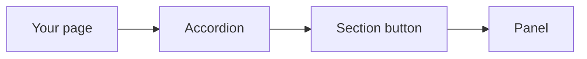
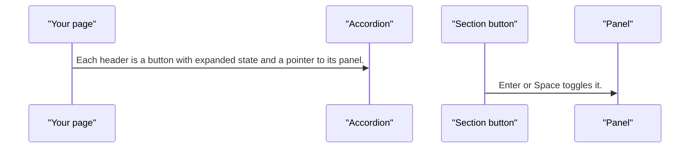
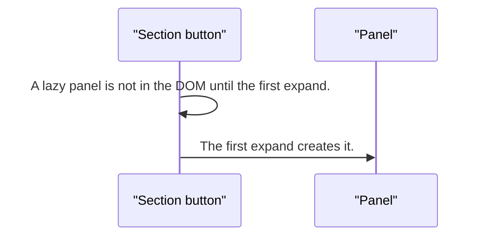

# pixel-accordion — design

This page explains **pixel-accordion** in plain language. The exact input and output names live in [README.md](./README.md). This page does not copy that table.

**Walk through every flow:** open [orchestration.html](./orchestration.html) in a browser (serve the `src/lib` folder so the shared player script can load).

## 1. What this does, and what it does not

Stacked sections. Each header is a button that expands or collapses its panel. Lazy panels are not created until the first expand. Analytics, if on, records the panel id, never the title.

| This piece does | It does not |
| --- | --- |
| Expands and collapses sections | Send the section title to analytics |
| Can keep one section open, or several | Lazy-load JavaScript. Lazy only skips DOM |

## 2. Who talks to whom

## 3. Flows

### Open a section

1. Each header is a button with expanded state and a pointer to its panel.
2. Enter or Space toggles it. Disabled sections do nothing.

### Lazy body

1. A lazy panel is not in the DOM until the first expand.
2. The first expand creates it. Later collapses keep it created. Heavy content should still defer at the page level.

## 4. Step by step

### Open a section

### Lazy body

## 5. States

- Collapsed or expanded, per section.
- Disabled section.
- Lazy body not created yet.

## 6. Easy to get wrong

- Analytics uses the panel id, never the visible title.
- Lazy is not a code split.

## 7. Files

- `pixel-accordion.scss`
- `pixel-accordion.ts`
- `pixel-expansion-panel.scss`
- `pixel-expansion-panel.ts`

The behavior contract stays in [README.md](./README.md). If this page and the README disagree, the README wins. Fix this page.
