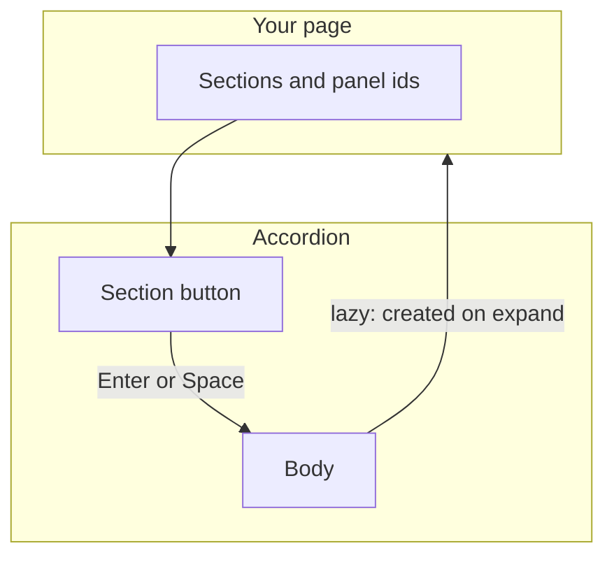
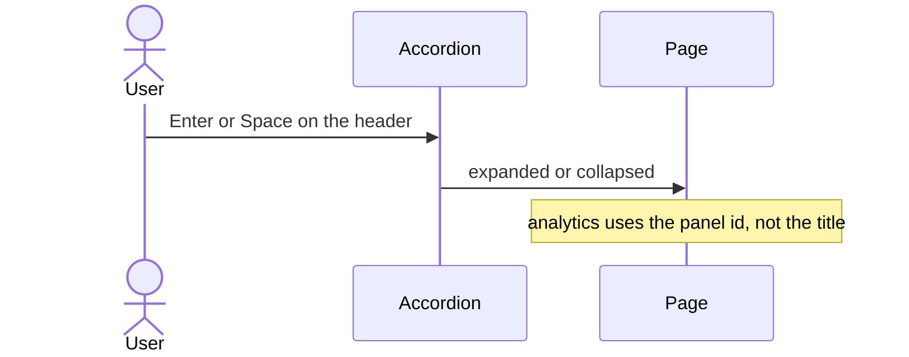
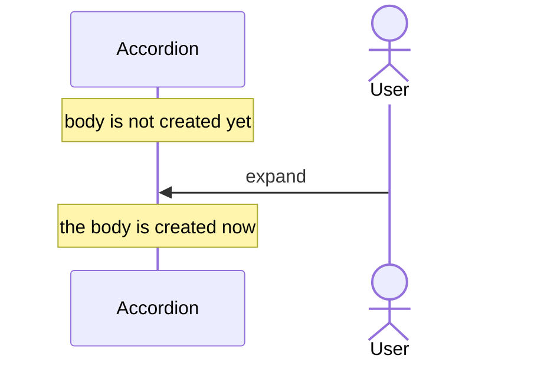

# pixel-accordion — design

This page explains **pixel-accordion** in plain language. The exact input and output names live in [README.md](./README.md). This page does not copy that table.

**Walk through every flow:** open [orchestration.html](./orchestration.html) in a browser (serve the `src/lib` folder so the shared player script can load).

## 1. What this does, and what it does not

Stacked sections. Each header is a button that expands or collapses its panel. Lazy panels are not created until the first expand. Analytics, if on, records the panel id, never the title.

| This piece does | It does not |
| --- | --- |
| Expands and collapses sections | Send the section title to analytics |
| Can keep one section open, or several | Lazy-load JavaScript. Lazy only skips DOM |

## 2. Who talks to whom

Each section header is a button. Enter or Space expands or collapses it. Lazy skips creating the body until the first expand. Analytics records expand or collapse with the panel id, not the title.

**How to read the picture**

- **The header is a button** with expanded state. Do not make the whole card a second button.
- **Lazy** waits to create the body. The header still exists.
- **Analytics** gets the panel id and whether it expanded or collapsed. It does not get the title text.

## 3. Flows

### Open a section

1. Each header is a button with expanded state and a pointer to its panel.
2. Enter or Space toggles it. Disabled sections do nothing.

### Lazy body

1. A lazy panel is not in the DOM until the first expand.
2. The first expand creates it. Later collapses keep it created. Heavy content should still defer at the page level.

## 4. Step by step

Section 3 is the short list. Each picture here is one of those flows, with the branch that changes what the developer must do. Read the note under the picture before copying the pattern.

### Open a section

Give each panel a stable id if you record analytics. The title can change with translation. The id should not.

### Lazy body

Do not expect a lazy body to run its setup before the user opens it.

## 5. States

- Collapsed or expanded, per section.
- Disabled section.
- Lazy body not created yet.

## 6. Easy to get wrong

- Analytics uses the panel id, never the visible title.
- Lazy is not a code split.

## 7. Files

- `pixel-accordion.scss`
- `pixel-accordion.ts`
- `pixel-expansion-panel.scss`
- `pixel-expansion-panel.ts`

The behavior contract stays in [README.md](./README.md). If this page and the README disagree, the README wins. Fix this page.
