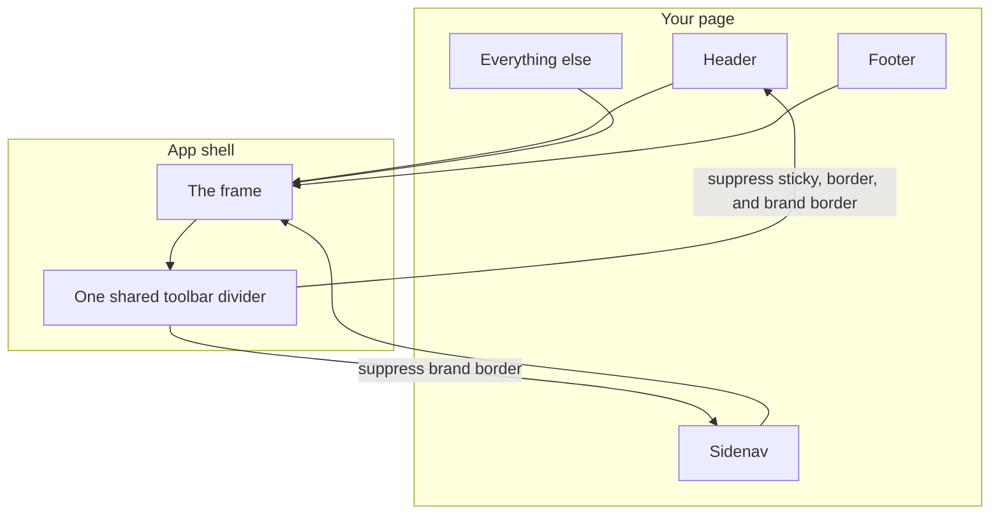
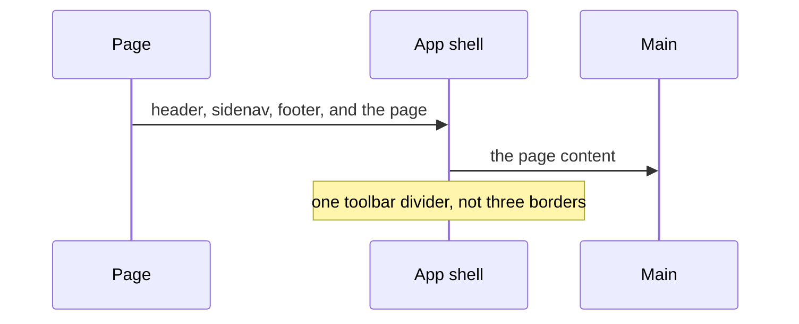
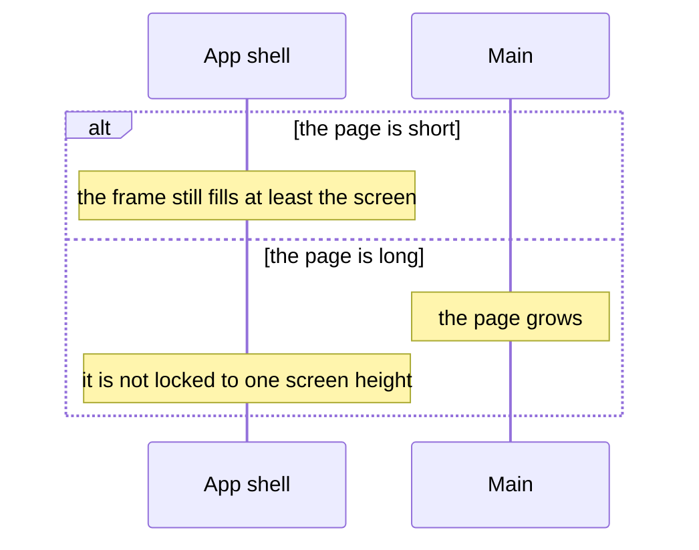

# pixel-app-shell — design

This page explains **pixel-app-shell** in plain language. The exact input and output names live in [README.md](./README.md). This page does not copy that table.

**Walk through every flow:** open [orchestration.html](./orchestration.html) in a browser (serve the `src/lib` folder so the shared player script can load).

## 1. What this does, and what it does not

The page frame. It has no inputs. It places a header, a sidenav, and a footer by their tags, and puts everything else in main. It draws one shared toolbar line and asks the header and sidenav not to draw a second border.

| This piece does | It does not |
| --- | --- |
| Composes header, sidenav, footer, and main | Take configuration inputs of its own |
| Keeps a short page stuck to the footer and a long page scrolling | Fix the shell to the viewport height |

## 2. Who talks to whom

The shell is a frame with no inputs. It finds a header, a sidenav, and a footer by their tags and puts everything else in the main area. It does not decide routes or permissions. It only lines the pieces up and shares one toolbar divider.

**How to read the picture**

- **No inputs.** Compose by putting the pieces inside the shell. Do not pass a config object for the frame.
- **Main is the rest.** Anything that is not the header, sidenav, or footer goes in the main landmark.
- **Shared divider.** Inside the shell, the header drops its own sticky bar and border, and the sidenav drops its brand border, so the frame has one line.
- **Height.** The shell uses a minimum block size. It is not a fixed viewport height, so a long page can grow.

## 3. Flows

### Compose the frame

1. The page projects the four regions. The sidenav spans the shell height. Header and footer sit in the other column.
2. One toolbar divider is drawn. The header drops its own sticky border. The sidenav drops its brand border.

### Short and long pages

1. Use a minimum height, not a fixed height. A short page keeps the footer at the bottom.
2. A long page scrolls the document. The shell does not trap that scroll.

## 4. Step by step

Section 3 is the short list. Each picture here is one of those flows, with the branch that changes what the developer must do. Read the note under the picture before copying the pattern.

### Compose the frame

Put pixel-header, pixel-sidenav, and pixel-footer inside the shell. The shell recognizes them by tag. Do not wrap them in extra divs that hide the tag.

### Short and long pages

Do not set a fixed height on the shell to “make it full screen”. The minimum size already does that, and a fixed height would clip a long page.

## 5. States

- With or without each region. Missing tags simply leave a gap in that slot.
- Toolbar divider measured from the real header height, including a wrapped mobile header.

## 6. Easy to get wrong

- Do not set a fixed height on the shell. Use the minimum height so short and long pages both work.
- Do not turn header sticky or sidenav brand border back on inside the shell. The shell already draws that line.

## 7. Files

- `pixel-app-shell.html`
- `pixel-app-shell.scss`
- `pixel-app-shell.tokens.ts`
- `pixel-app-shell.ts`

The behavior contract stays in [README.md](./README.md). If this page and the README disagree, the README wins. Fix this page.
