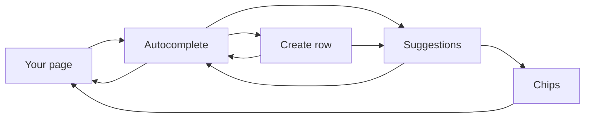
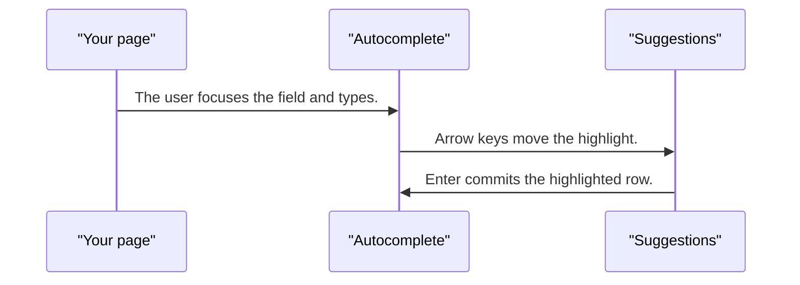
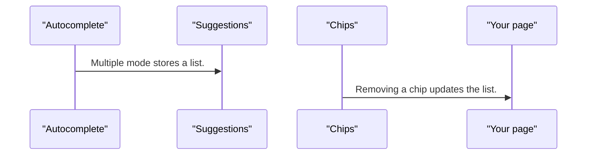

# pixel-autocomplete — design

This page explains **pixel-autocomplete** in plain language. The exact input and output names live in [README.md](./README.md). This page does not copy that table.

**Walk through every flow:** open [orchestration.html](./orchestration.html) in a browser (serve the `src/lib` folder so the shared player script can load).

## 1. What this does, and what it does not

A text field with a suggestion panel. Focus stays in the field. The highlighted row is pointed at with aria-activedescendant. Multiple values become chips and the panel can stay open. A custom value is only for a single field.

| This piece does | It does not |
| --- | --- |
| Filters suggestions as the user types | Move focus into the panel. Focus stays in the input |
| Can add a new row when creatable | Commit a custom value on every keystroke when multiple is on |

## 2. Who talks to whom



## 3. Flows

### Pick a suggestion

1. The user focuses the field and types. Suggestions update.
2. Arrow keys move the highlight. Focus stays in the input. The active row is announced.
3. Enter commits the highlighted row. Escape closes the panel and leaves the text.

### Several values

1. Multiple mode stores a list. Choosing a row adds a chip. The panel stays open.
2. Removing a chip updates the list. The value is a list, not one string.

### Create a value

1. When creatable, a Create row appears for text that is not in the list.
2. Choosing Create commits that text. A custom value on every keystroke is single-value only, not multiple.

## 4. Step by step

### Pick a suggestion



### Several values



### Create a value

```mermaid
sequenceDiagram
  participant field as "Autocomplete"
  participant panel as "Suggestions"
  participant create as "Create row"
  participant page as "Your page"
  field->>create: When creatable, a Create row appears for text that is not in the list.
  create->>field: Choosing Create commits that text.
```

## 5. States

- Closed, open, and highlighted row.
- Single value, or chips for many.
- Create row when the typed text is new and creatable is on.
- Disabled, readonly, and error.

## 6. Easy to get wrong

- Do not move DOM focus into the panel. The input keeps focus.
- allowCustomValue commits as the user types, and only for a single value.
- Multiple mode is a list of values plus chips. The panel stays open after a pick.

## 7. Files

- `pixel-autocomplete.html`
- `pixel-autocomplete.scss`
- `pixel-autocomplete.ts`

The behavior contract stays in [README.md](./README.md). If this page and the README disagree, the README wins. Fix this page.
