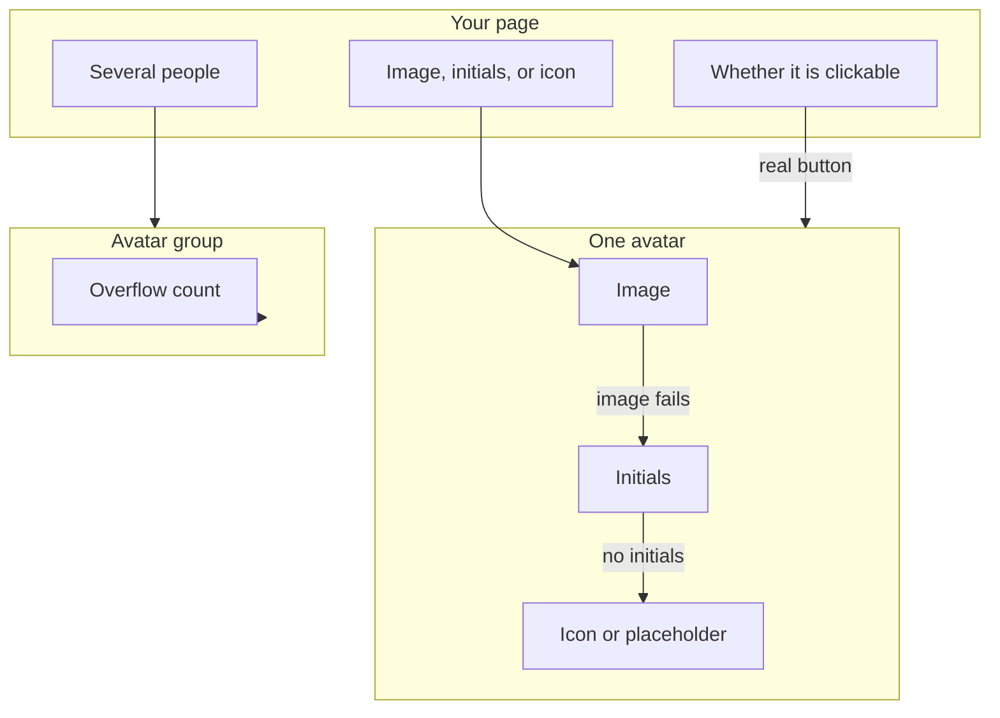
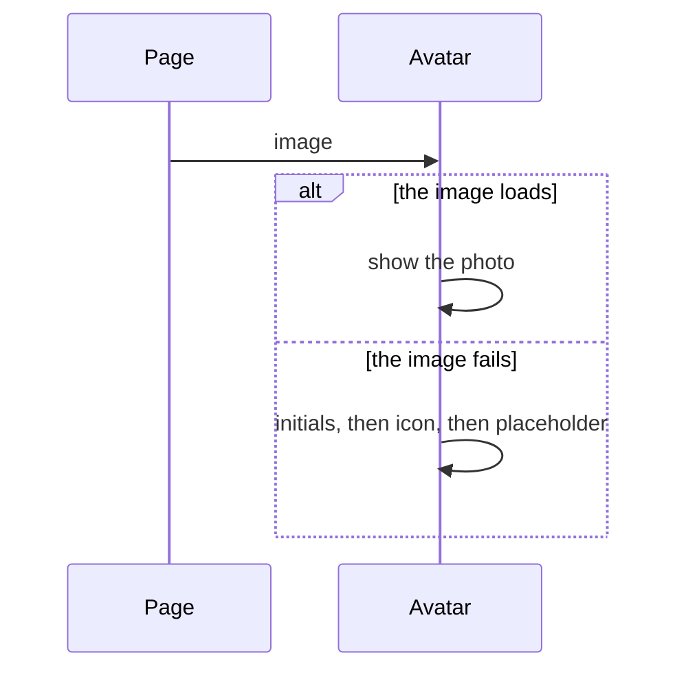
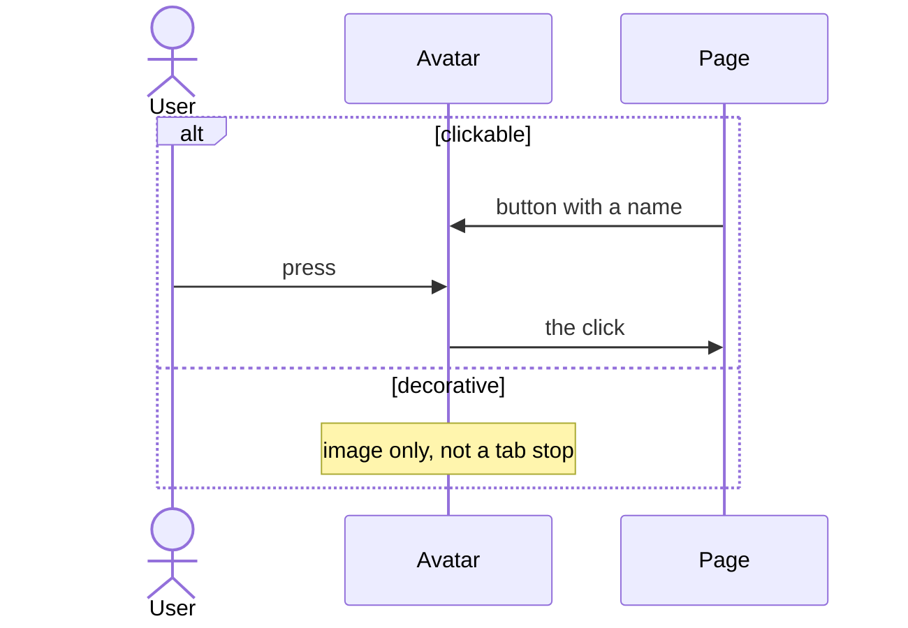
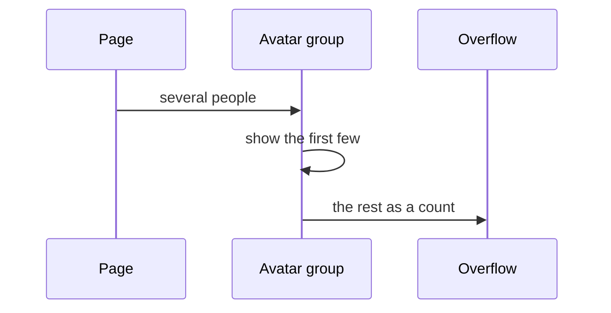

# pixel-avatar — design

This page explains **pixel-avatar** in plain language. The exact input and output names live in [README.md](./README.md). This page does not copy that table.

**Walk through every flow:** open [orchestration.html](./orchestration.html) in a browser (serve the `src/lib` folder so the shared player script can load).

## 1. What this does, and what it does not

A person mark. It tries an image first, then initials, then an icon, then a plain placeholder. A clickable avatar is a real button. A group can show a few people and an overflow count.

| This piece does | It does not |
| --- | --- |
| Shows a person or a group of people | Upload a photo (use pixel-file-upload) |
| Falls back when the image fails | Invent a name |

## 2. Who talks to whom

The avatar tries a photo first, then initials, then an icon, then a plain placeholder. A clickable avatar is a real button. The overflow count belongs to the group, not to one person.

**How to read the picture**

- **Image → initials → icon → placeholder.** The first one that works is shown. A failed image is not a broken layout.
- **Clickable → button.** Give it an accessible name. A decorative avatar is not a tab stop.
- **Group → overflow.** The “and N more” chip is on pixel-avatar-group. Do not put that count on a single avatar.

## 3. Flows

### Photo

1. The page passes an image. The avatar shows it.
2. If the image fails, initials are used. If there are no initials, an icon, then a placeholder.

### Press

1. The page makes it clickable. It renders as a button with an accessible name.
2. The user presses it. A decorative avatar is not a button. It is only an image.

### Group

1. The page passes several people. The group shows the first few avatars.
2. The rest become an overflow chip on the group, not on a single avatar.

## 4. Step by step

Section 3 is the short list. Each picture here is one of those flows, with the branch that changes what the developer must do. Read the note under the picture before copying the pattern.

### Photo

Pass initials when you have a name, so the fallback is readable. Do not invent a name in the avatar.

### Press

A decorative avatar must not be a button. A clickable one must have a name, because the image may not load.

### Group

The overflow chip is part of the group. It is not another person and it is not a badge you add by hand.

## 5. States

- Image, initials, icon, or placeholder — the first one that works.
- Decorative: an image, not a control.
- Clickable: a button.
- Group overflow: a count of people who did not fit.

## 6. Easy to get wrong

- Do not put the overflow count on a single avatar. It belongs to pixel-avatar-group.
- Give a clickable avatar a name. A decorative one should not be a tab stop.

## 7. Files

- `pixel-avatar-group.html`
- `pixel-avatar-group.scss`
- `pixel-avatar-group.ts`
- `pixel-avatar.html`
- `pixel-avatar.scss`
- `pixel-avatar.ts`

The behavior contract stays in [README.md](./README.md). If this page and the README disagree, the README wins. Fix this page.
