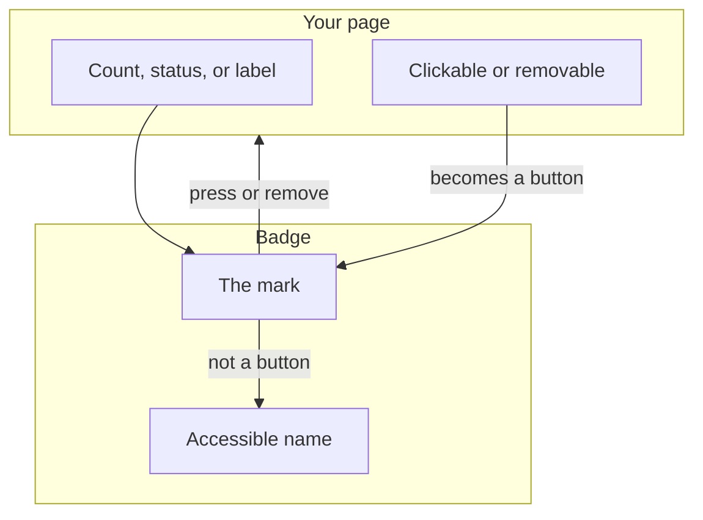
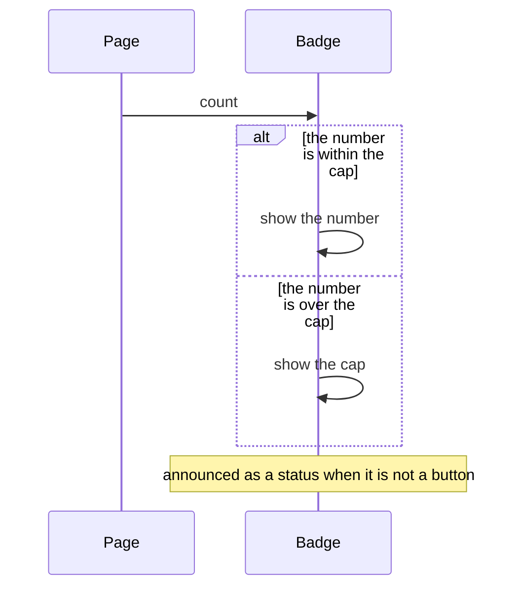
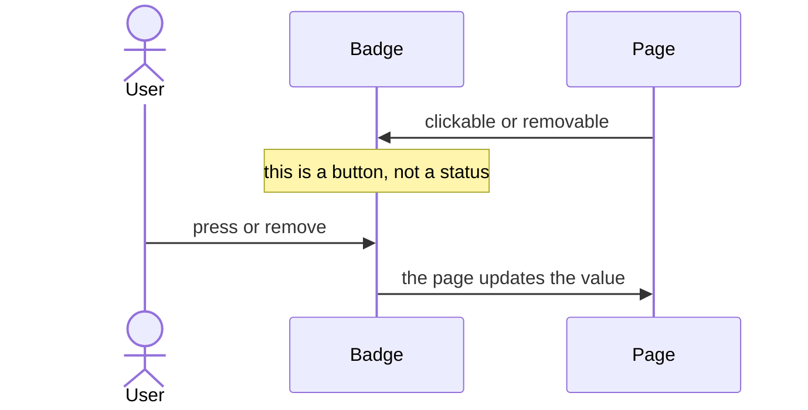

# pixel-badge — design

This page explains **pixel-badge** in plain language. The exact input and output names live in [README.md](./README.md). This page does not copy that table.

**Walk through every flow:** open [orchestration.html](./orchestration.html) in a browser (serve the `src/lib` folder so the shared player script can load).

## 1. What this does, and what it does not

A small status mark: a count, a dot, a status, or a short label. It can be plain text, a button, or a removable chip-like control. The type picks the picture. Clickable and removable pick the behavior.

| This piece does | It does not |
| --- | --- |
| Shows a count, dot, status, or label | Replace a toast or a dialog |
| Can be pressed or removed when asked | Navigate by itself |

## 2. Who talks to whom

The type picks the picture: a count, a dot, a status, or a short label. Clickable and removable are separate flags. They turn the badge into a button. A plain badge is a status, not a control.

**How to read the picture**

- **Type → picture.** Do not use the type string to mean clickable. That is a separate flag.
- **Plain badge → status.** A non-interactive badge is announced as a status. The name is derived, for example “10 notifications”.
- **Clickable or removable → button.** The page hears the press and updates the value. Do not also treat that button as a live status.

## 3. Flows

### Count

1. The page sets a count. The badge shows the number, or a cap when the number is large.
2. If the badge is not a button, it is a status. The name is derived, for example "10 notifications".

### Press or remove

1. The page marks it clickable or removable. It becomes a real button.
2. The user presses it or removes it. The page updates the value. A live status is not used on the button itself.

## 4. Step by step

Section 3 is the short list. Each picture here is one of those flows, with the branch that changes what the developer must do. Read the note under the picture before copying the pattern.

### Count

A static badge should be announced once. Do not wrap it in a second live region that repeats the same number.

### Press or remove

The button needs a name of its own. Removing the badge does not navigate. The page decides what the removal means.

## 5. States

- Count, dot, status, or label — the type chooses the picture.
- Plain: announced as status.
- Clickable or removable: a button, with its own name.

## 6. Easy to get wrong

- Do not use the type string to mean "clickable". Clickable and removable are separate flags.
- Do not announce a static badge twice. The status role is for the non-interactive badge.

## 7. Files

- `pixel-badge.html`
- `pixel-badge.scss`
- `pixel-badge.ts`

The behavior contract stays in [README.md](./README.md). If this page and the README disagree, the README wins. Fix this page.
