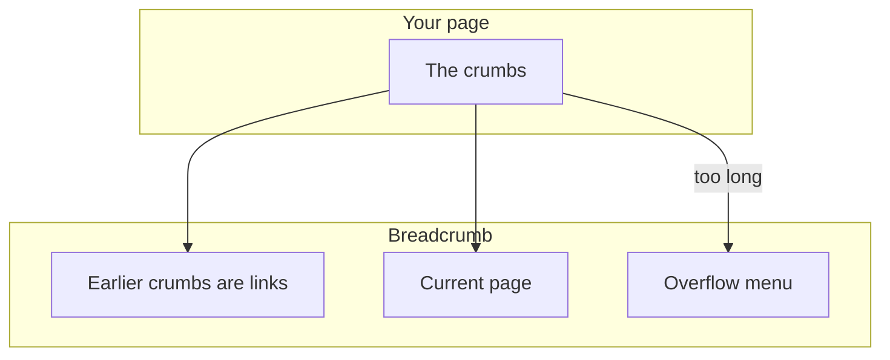
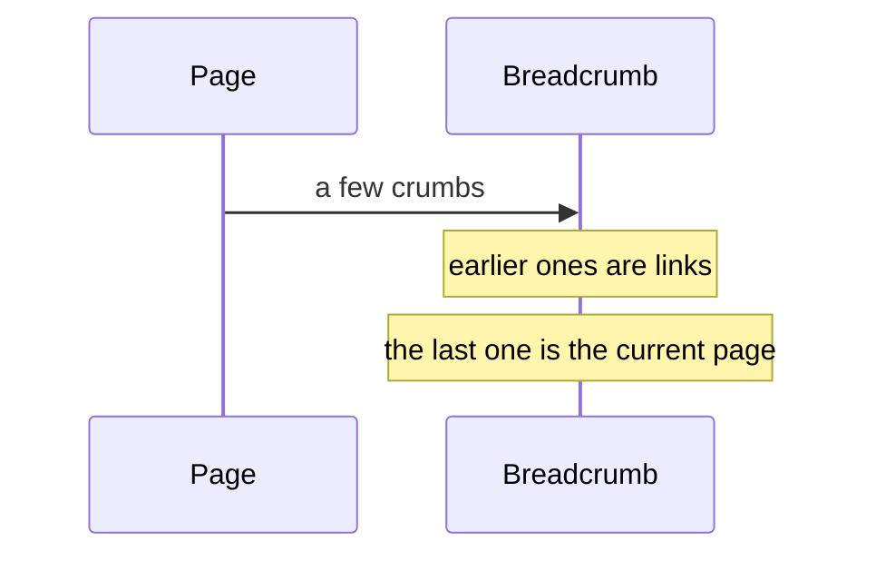
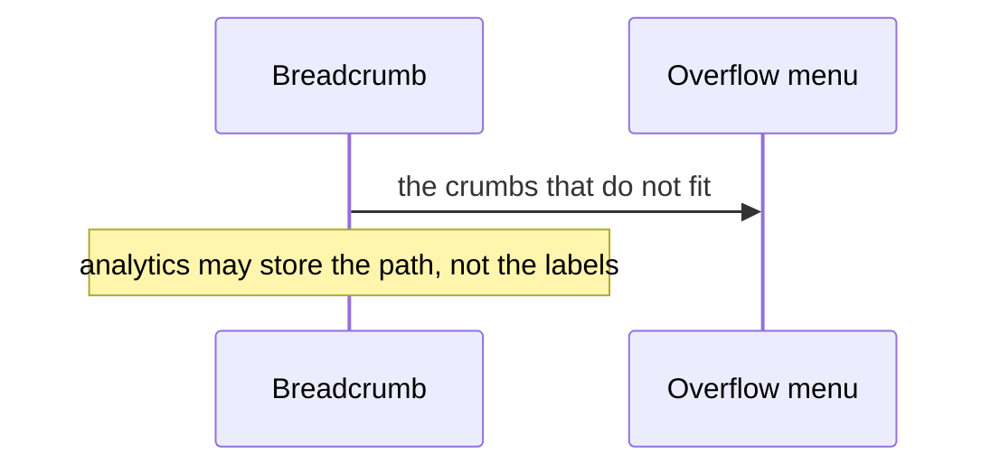

# pixel-breadcrumb — design

This page explains **pixel-breadcrumb** in plain language. The exact input and output names live in [README.md](./README.md). This page does not copy that table.

**Walk through every flow:** open [orchestration.html](./orchestration.html) in a browser (serve the `src/lib` folder so the shared player script can load).

## 1. What this does, and what it does not

The path back up the page. The current page is text, not a link. Separators default to a slash. Icons or a template can replace that. When the path is too long, the hidden crumbs go into a menu. Analytics records the path only, never the labels.

| This piece does | It does not |
| --- | --- |
| Shows the path and links to parents | Link the current page |
| Collapses overflow into a menu | Send crumb labels to analytics |

## 2. Who talks to whom

The breadcrumb is a path. The current page is not a link. The separator defaults to a slash. A long path collapses into a menu. Analytics records the path only, never the labels.

**How to read the picture**

- **Current page** is marked as the current page and is not a link.
- **Separator** defaults to a slash. Change it only when the path needs a different mark.
- **Overflow** is a menu of the hidden crumbs, not a truncated string with no way back.
- **Analytics** may record the href path. It does not record the visible labels.

## 3. Flows

### A short path

1. Parents are links. The current crumb is marked as the current page and is not a link.
2. The user follows a parent. The separator is a slash unless the page sets an icon or a template.

### A long path

1. Crumbs that do not fit move into a menu.
2. The user opens the menu and picks a hidden parent. Analytics, if on, records the path, not the words.

## 4. Step by step

Section 3 is the short list. Each picture here is one of those flows, with the branch that changes what the developer must do. Read the note under the picture before copying the pattern.

### A short path

Do not link the current page to itself.

### A long path

Keep the current page visible. The menu is for the ancestors that were collapsed.

## 5. States

- Full path visible.
- Overflow collapsed into a menu.
- Current page is text.

## 6. Easy to get wrong

- Do not make the current page a link.
- Do not send labels to analytics. Send the path only.

## 7. Files

- `pixel-breadcrumb-item.ts`
- `pixel-breadcrumb.html`
- `pixel-breadcrumb.scss`
- `pixel-breadcrumb.service.ts`
- `pixel-breadcrumb.ts`
- `pixel-breadcrumb.types.ts`

The behavior contract stays in [README.md](./README.md). If this page and the README disagree, the README wins. Fix this page.
