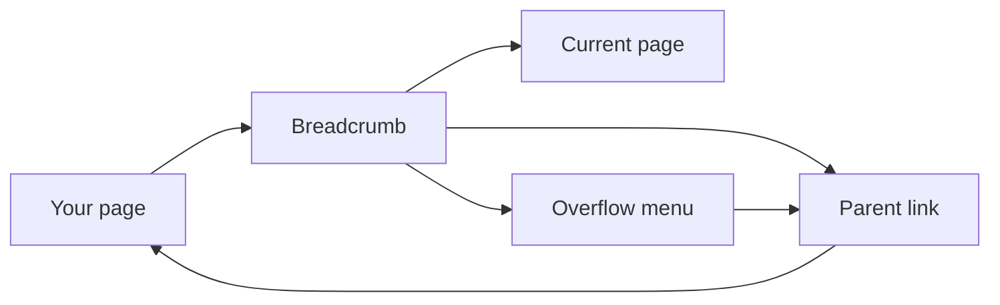

# pixel-breadcrumb — design

This page explains **pixel-breadcrumb** in plain language. The exact input and output names live in [README.md](./README.md). This page does not copy that table.

**Walk through every flow:** open [orchestration.html](./orchestration.html) in a browser (serve the `src/lib` folder so the shared player script can load).

## 1. What this does, and what it does not

The path back up the page. The current page is text, not a link. Separators default to a slash. Icons or a template can replace that. When the path is too long, the hidden crumbs go into a menu. Analytics records the path only, never the labels.

| This piece does | It does not |
| --- | --- |
| Shows the path and links to parents | Link the current page |
| Collapses overflow into a menu | Send crumb labels to analytics |

## 2. Who talks to whom



## 3. Flows

### A short path

1. Parents are links. The current crumb is marked as the current page and is not a link.
2. The user follows a parent. The separator is a slash unless the page sets an icon or a template.

### A long path

1. Crumbs that do not fit move into a menu.
2. The user opens the menu and picks a hidden parent. Analytics, if on, records the path, not the words.

## 4. Step by step

### A short path

```mermaid
sequenceDiagram
  participant page as "Your page"
  participant trail as "Breadcrumb"
  participant link as "Parent link"
  participant here as "Current page"
  page->>trail: Parents are links. The current crumb is marked as the current page and is not a link.
  link->>page: The user follows a parent. The separator is a slash unless the page sets an icon or a temp
```

### A long path

```mermaid
sequenceDiagram
  participant trail as "Breadcrumb"
  participant menu as "Overflow menu"
  participant link as "Parent link"
  trail->>menu: Crumbs that do not fit move into a menu.
  menu->>link: The user opens the menu and picks a hidden parent. Analytics, if on, records the path, not
```

## 5. States

- Full path visible.
- Overflow collapsed into a menu.
- Current page is text.

## 6. Easy to get wrong

- Do not make the current page a link.
- Do not send labels to analytics. Send the path only.

## 7. Files

- `pixel-breadcrumb-item.ts`
- `pixel-breadcrumb.html`
- `pixel-breadcrumb.scss`
- `pixel-breadcrumb.service.ts`
- `pixel-breadcrumb.ts`
- `pixel-breadcrumb.types.ts`

The behavior contract stays in [README.md](./README.md). If this page and the README disagree, the README wins. Fix this page.
