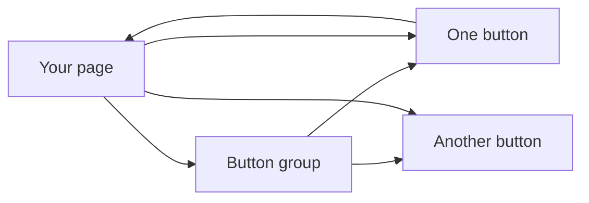
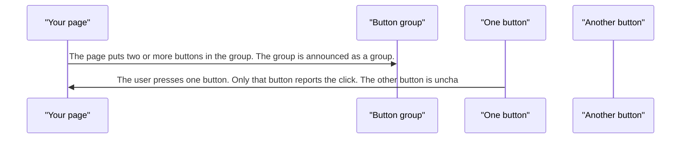
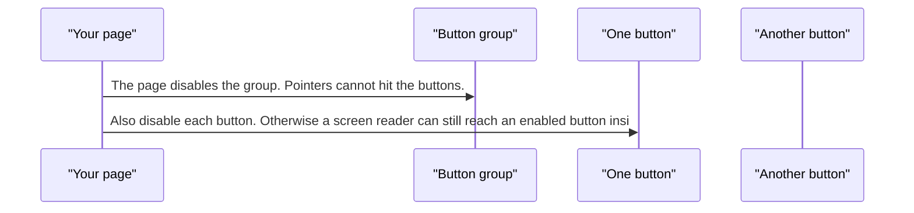

# pixel-button-group — design

This page explains **pixel-button-group** in plain language. The exact input and output names live in [README.md](./README.md). This page does not copy that table.

**Walk through every flow:** open [orchestration.html](./orchestration.html) in a browser (serve the `src/lib` folder so the shared player script can load).

## 1. What this does, and what it does not

A row or column of pixel-button controls that belong together. The group is a label for the set. Each button still owns its own click, loading, and pressed state.

| This piece does | It does not |
| --- | --- |
| Groups related buttons | Replace each button’s own disabled or loading state |
| Can disable the whole group visually | Remove buttons from the accessibility tree by itself |

## 2. Who talks to whom

## 3. Flows

### A set of actions

1. The page puts two or more buttons in the group. The group is announced as a group.
2. The user presses one button. Only that button reports the click. The other button is unchanged.

### Disable the set

1. The page disables the group. Pointers cannot hit the buttons.
2. Also disable each button. Otherwise a screen reader can still reach an enabled button inside a group that only looks off.

## 4. Step by step

### A set of actions

### Disable the set

## 5. States

- Each child button still has its own hover, focus, loading, pressed, and disabled states.
- A disabled group blocks the pointer. Disable the children too so assistive tech matches.

## 6. Easy to get wrong

- Do not rely on the group disabled flag alone for screen readers. Disable each pixel-button as well.
- Do not use the group as one big button. Each action stays its own button.

## 7. Files

- `pixel-button-group.html`
- `pixel-button-group.scss`
- `pixel-button-group.ts`

The behavior contract stays in [README.md](./README.md). If this page and the README disagree, the README wins. Fix this page.
