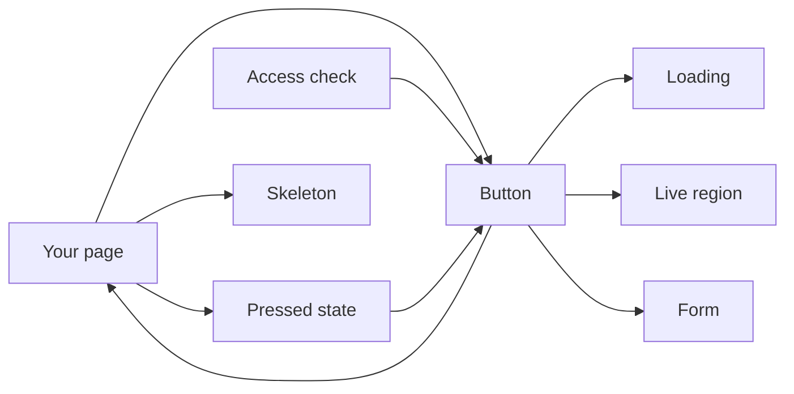
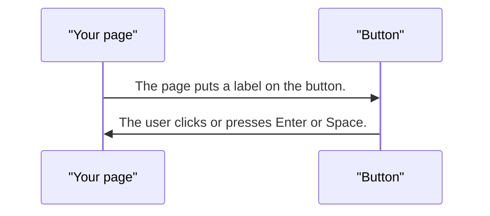
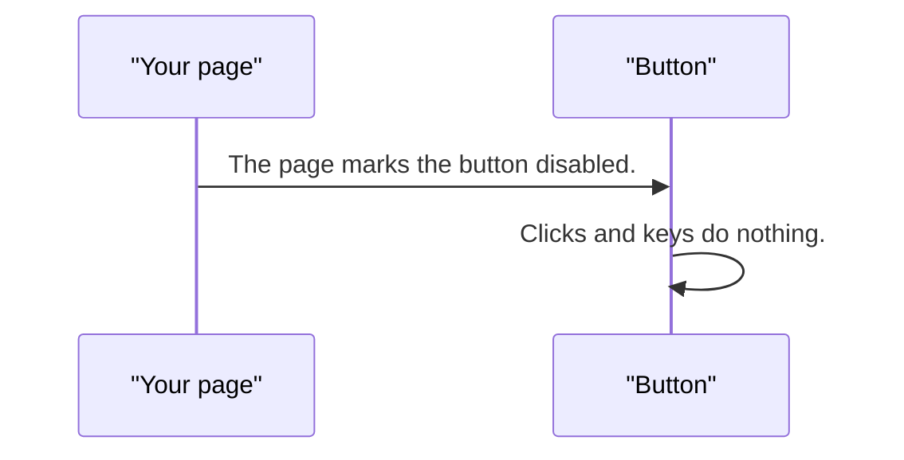
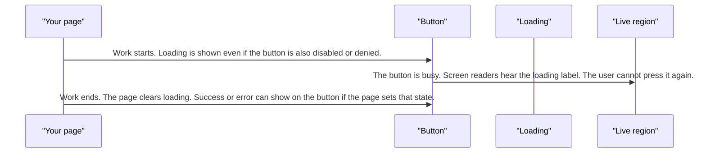
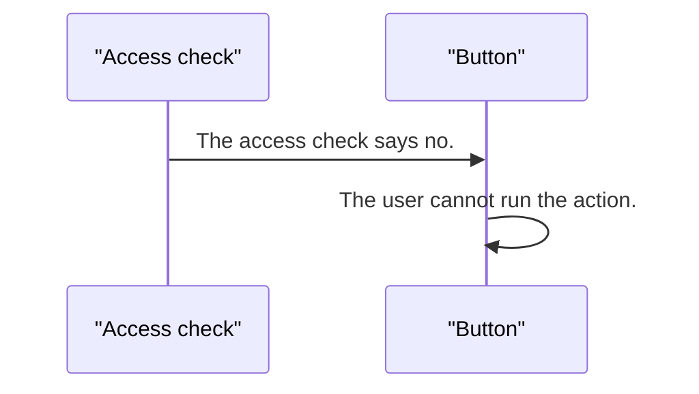
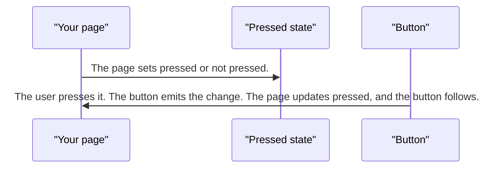
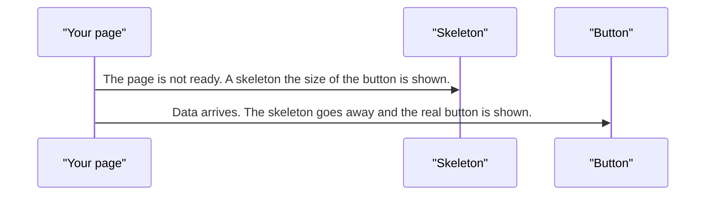
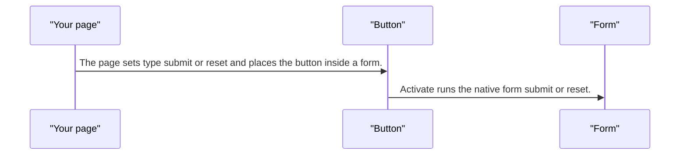

# pixel-button — design

This page explains **pixel-button** in plain language. The exact input and output names live in [README.md](./README.md). This page does not copy that table.

**Walk through every flow:** open [orchestration.html](./orchestration.html) in a browser (serve the `src/lib` folder so the shared player script can load).

## 1. What this does, and what it does not

A button the page uses for an action, a form submit, or a pressed/not-pressed toggle. The page owns the pressed state. The button only reports what the user did.

| This piece does | It does not |
| --- | --- |
| Runs a click, submit, or reset | Open a menu by itself (use pixel-split-button or pixel-menu) |
| Shows loading, success, and error | Decide if the person is allowed to press it (the page or access check does that) |
| Announces loading to screen readers | Send the button label to analytics |

## 2. Who talks to whom

## 3. Flows

### Click

1. The page puts a label on the button. It is a real button, so Enter and Space work.
2. The user clicks or presses Enter or Space. The page hears the click and does the work.

### Disabled

1. The page marks the button disabled.
2. Clicks and keys do nothing. The button stays in the tab order only as a disabled control.

### Loading wins

1. Work starts. Loading is shown even if the button is also disabled or denied.
2. The button is busy. Screen readers hear the loading label. The user cannot press it again.
3. Work ends. The page clears loading. Success or error can show on the button if the page sets that state.

### Access denied

1. The access check says no. This blocks the button when it is not loading.
2. The user cannot run the action. Loading, if it starts later, still wins over this block.

### Toggle

1. The page sets pressed or not pressed. The button does not remember this by itself.
2. The user presses it. The button emits the change. The page updates pressed, and the button follows.

### Skeleton

1. The page is not ready. A skeleton the size of the button is shown.
2. Data arrives. The skeleton goes away and the real button is shown.

### Submit or reset

1. The page sets type submit or reset and places the button inside a form.
2. Activate runs the native form submit or reset. The page still hears the click.

## 4. Step by step

### Click

### Disabled

### Loading wins

### Access denied

### Toggle

### Skeleton

### Submit or reset

## 5. States

- Default, hover, and keyboard focus (a visible focus ring only for the keyboard).
- Pressed, for a toggle.
- Disabled: no action.
- Loading: busy, announced, and not pressable. Loading wins over disabled and over an access denial.
- Success and error: the page sets these after the work.
- Skeleton: a placeholder instead of the button.
- Submit or reset: participates in the surrounding form.

## 6. Easy to get wrong

- Do not treat a toggle as self-managed. Bind pressed, and update it when change fires.
- Do not put another button inside this button.
- Analytics, if turned on, records the action id only. It does not record the label.

## 7. Files

- `_pixel-button-shared.scss`
- `pixel-button.scss`
- `pixel-button.ts`

The behavior contract stays in [README.md](./README.md). If this page and the README disagree, the README wins. Fix this page.
