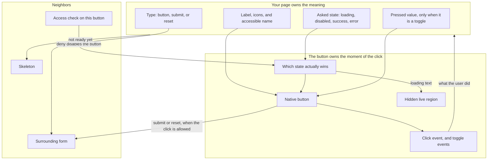
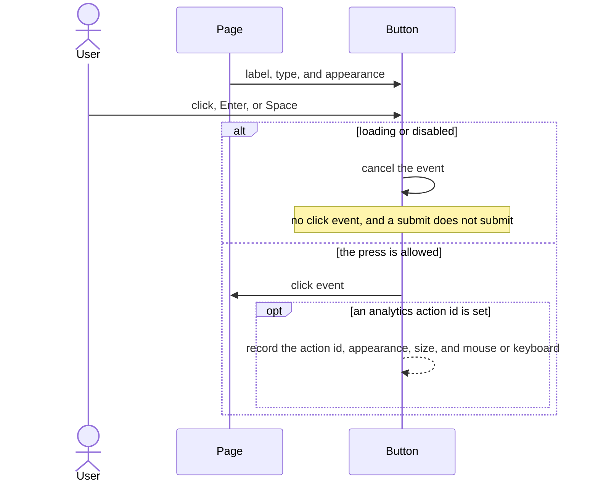
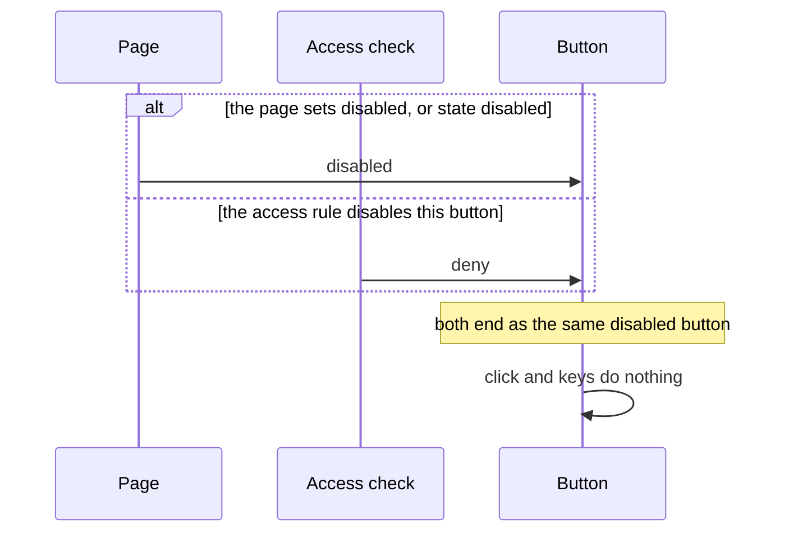
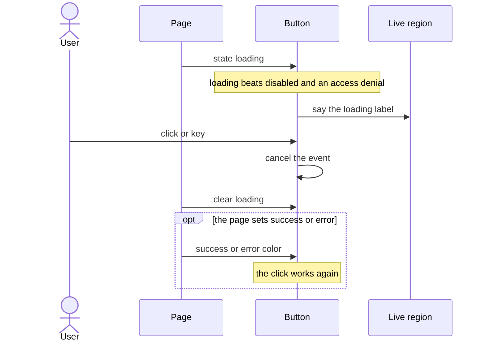
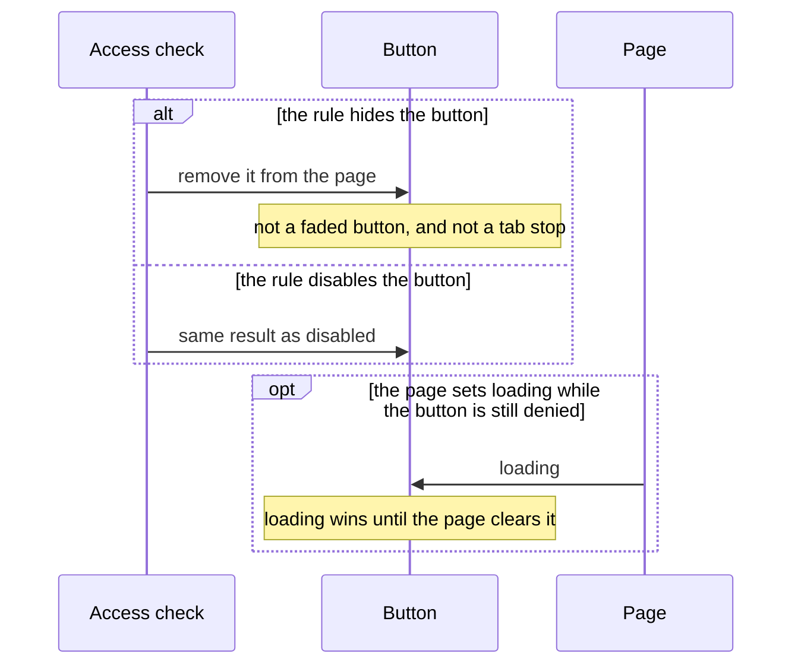
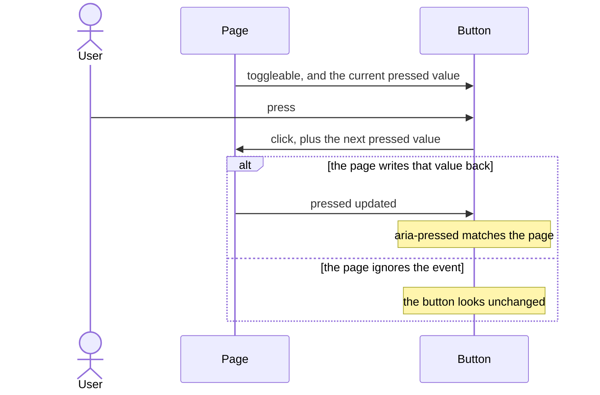
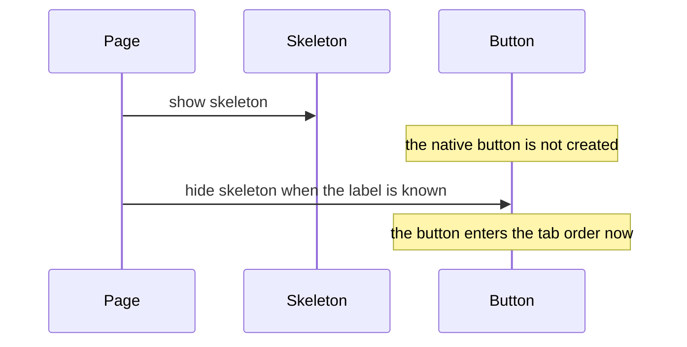
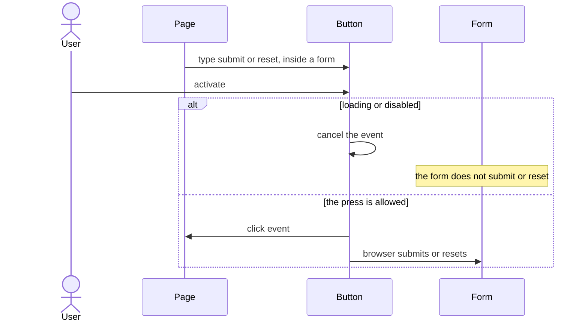

# pixel-button — design

This page explains **pixel-button** in plain language. The exact input and output names live in [README.md](./README.md). This page does not copy that table.

**Walk through every flow:** open [orchestration.html](./orchestration.html) in a browser (serve the `src/lib` folder so the shared player script can load).

## 1. What this does, and what it does not

A button the page uses for an action, a form submit, or a pressed/not-pressed toggle. The page owns the pressed state. The button only reports what the user did.

| This piece does | It does not |
| --- | --- |
| Runs a click, submit, or reset | Open a menu by itself (use pixel-split-button or pixel-menu) |
| Shows loading, success, and error | Decide if the person is allowed to press it (the page or access check does that) |
| Announces loading to screen readers | Send the button label to analytics |

## 2. Who talks to whom

The page decides what the button means. The button decides whether that action is allowed to run right now, then reports what the user did. It does not remember a toggle, and it does not decide permissions.

**How to read the picture**

- **Page → button.** The page passes the label, the type, the asked state, and, for a toggle, the pressed value. Changing those inputs is the only way the button changes its mind.
- **Access check → which state wins.** A rule that disables this button is treated like the disabled input. A rule that hides it removes the button from the page. That hide is the access directive, not a third button style.
- **Which state wins → native button.** Loading is checked first. While loading, the button is busy and cannot be pressed, even if it is also disabled or denied. After that, disabled and an access denial are the same result: the button is off. Success and error are colors the page sets. They do not block the click.
- **Native button → form.** `type="submit"` or `type="reset"` uses the browser’s normal form behavior. Loading or disabled cancels that, so a busy submit button does not submit.
- **Native button → your page.** A successful press emits `click`. A toggle also emits the next pressed value. The button does not store that value. If the page does not write it back, the button stays as it was.
- **Page → skeleton.** While the skeleton is on, the native button is not created. There is no tab stop and no click.

The click does not bubble to a parent. Listen on the button itself.

## 3. Flows

### Click

1. The page puts a label on the button. It is a real button, so Enter and Space work.
2. The user clicks or presses Enter or Space. The page hears the click and does the work.

### Disabled

1. The page marks the button disabled.
2. Clicks and keys do nothing. The button stays in the tab order only as a disabled control.

### Loading wins

1. Work starts. Loading is shown even if the button is also disabled or denied.
2. The button is busy. Screen readers hear the loading label. The user cannot press it again.
3. Work ends. The page clears loading. Success or error can show on the button if the page sets that state.

### Access denied

1. The access check says no. This blocks the button when it is not loading.
2. The user cannot run the action. Loading, if it starts later, still wins over this block.

### Toggle

1. The page sets pressed or not pressed. The button does not remember this by itself.
2. The user presses it. The button emits the change. The page updates pressed, and the button follows.

### Skeleton

1. The page is not ready. A skeleton the size of the button is shown.
2. Data arrives. The skeleton goes away and the real button is shown.

### Submit or reset

1. The page sets type submit or reset and places the button inside a form.
2. Activate runs the native form submit or reset. The page still hears the click.

## 4. Step by step

Section 3 is the short list. Each picture here is one of those flows, with the branch that changes what the developer must do. Read the note under the picture before copying the pattern.

### Click

The button is a real `<button>`, so Enter and Space work without extra key handlers. The focus ring appears for the keyboard, not for a mouse press.

Analytics is off unless the app provides the analytics token and the button has an action id. The event records that id, the appearance, the size, and whether the press came from the mouse or the keyboard. It never records the label. An icon-only button still needs its own accessible name, because the icon is decorative.

### Disabled

Disabled and an access denial look the same on the button: it stays in the tab order, and it does not run. Hiding is different. A hide rule removes the control. It is not a faded button.

The button is still disabled if the page sets the disabled input, or if it sets the state to disabled. Either one is enough.

### Loading wins

Set loading when the work starts, and clear it when the work ends. The button will not clear itself. Success and error are only colors. They do not mean the work is finished, and they do not block the next click.

The live region is hidden text. Screen readers hear the loading label (default “Loading”). The visible button shows a spinner sized to the button.

### Access denied

Use the access check for chrome on this button. A real security decision still belongs on the server. The button only reflects the answer it is given.

### Toggle

This is a controlled toggle. The button calculates the next value and emits it. It never stores it. Bind the pressed input, and update it from the change event.

Do not use a toggle to open a menu. A split button is the control with a main action and a menu.

### Skeleton

The skeleton matches the button’s size: a short bar for a text button, a square for an icon button. It is not a disabled button. Users cannot focus it or press it.

### Submit or reset

The button does not submit the form itself. The browser does, because the native type is submit or reset. That is also why a loading submit button must cancel the event: otherwise the form would send while the work from the previous press is still running.

A button with the default type does not submit. Put the submit type only on the button that should send the form.

## 5. States

- Default, hover, and keyboard focus (a visible focus ring only for the keyboard).
- Pressed, for a toggle.
- Disabled: no action.
- Loading: busy, announced, and not pressable. Loading wins over disabled and over an access denial.
- Success and error: the page sets these after the work.
- Skeleton: a placeholder instead of the button.
- Submit or reset: participates in the surrounding form.

## 6. Easy to get wrong

- Do not treat a toggle as self-managed. Bind pressed, and update it when change fires.
- Do not put another button inside this button.
- Analytics, if turned on, records the action id only. It does not record the label.

## 7. Files

- `_pixel-button-shared.scss`
- `pixel-button.scss`
- `pixel-button.ts`

The behavior contract stays in [README.md](./README.md). If this page and the README disagree, the README wins. Fix this page.
