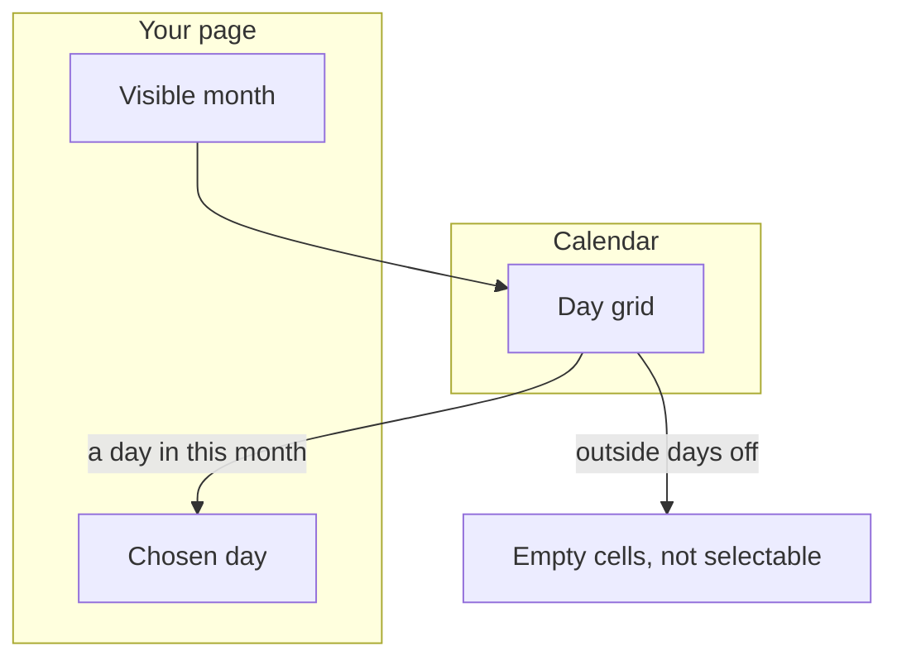
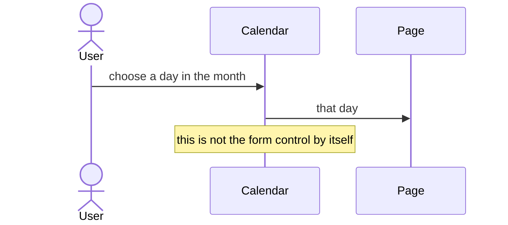
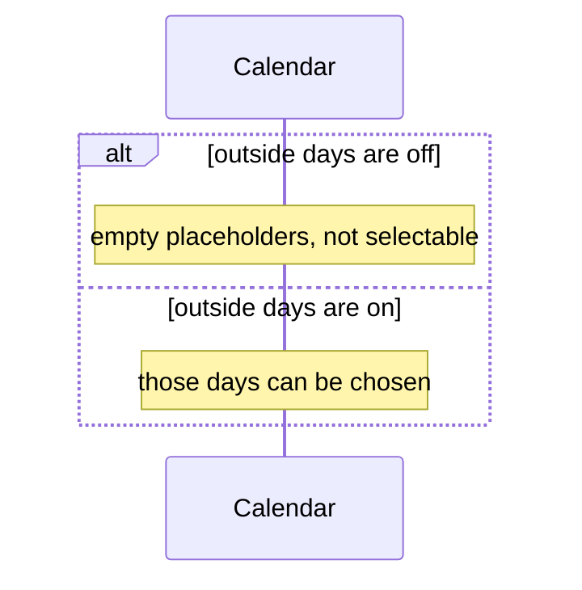

# pixel-calendar — design

This page explains **pixel-calendar** in plain language. The exact input and output names live in [README.md](./README.md). This page does not copy that table.

**Walk through every flow:** open [orchestration.html](./orchestration.html) in a browser (serve the `src/lib` folder so the shared player script can load).

## 1. What this does, and what it does not

A month grid. Days outside the month are hidden by default (empty cells, not selectable). The grid is a grid for screen readers. The host is capped so it does not stretch the page.

| This piece does | It does not |
| --- | --- |
| Lets the user pick a day in a month | Select days that belong to the previous or next month, unless the page shows them |
| Moves with arrow keys | Replace the date field. The field owns the form value |

## 2. Who talks to whom

The calendar paints a month. It does not own the form control. Days outside the month are hidden by default, as empty cells, not as selectable days. The host caps how wide it grows.

**How to read the picture**

- **The page owns the selected day** if this calendar sits inside a datepicker. The grid only reports the click.
- **Outside days default off.** Turn them on only when those days should be selectable.
- **Keyboard.** The grid is a grid. Do not put a separate button on every day unless you are replacing this control.

## 3. Flows

### Pick a day

1. The page shows a month. The user clicks a day or moves with arrows and presses Enter or Space.
2. The chosen day is emitted. The calendar does not own the form control by itself.

### Outside days

1. By default, days from the other months are empty placeholders. They cannot be selected.
2. If the page turns outside days on, those days can be selected and they may change the visible month.

## 4. Step by step

Section 3 is the short list. Each picture here is one of those flows, with the branch that changes what the developer must do. Read the note under the picture before copying the pattern.

### Pick a day

If you need a form value, use the datepicker. The calendar is the grid it opens.

### Outside days

The default is empty cells. Do not style them as disabled days. They are not days in this mode.

## 5. States

- A month with focus on one day.
- Disabled days skipped.
- Outside days hidden, or shown when the page asks.

## 6. Easy to get wrong

- Outside days are off by default. Empty cells are not a broken grid.
- Do not let the calendar grow past its host cap.

## 7. Files

- `pixel-calendar.html`
- `pixel-calendar.scss`
- `pixel-calendar.ts`
- `pixel-calendar.types.ts`

The behavior contract stays in [README.md](./README.md). If this page and the README disagree, the README wins. Fix this page.
