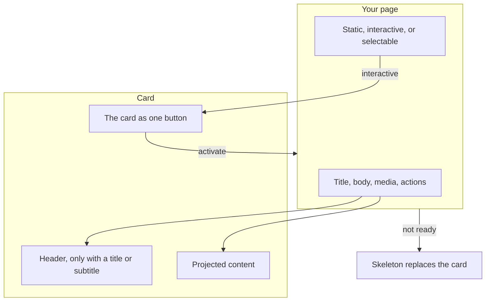
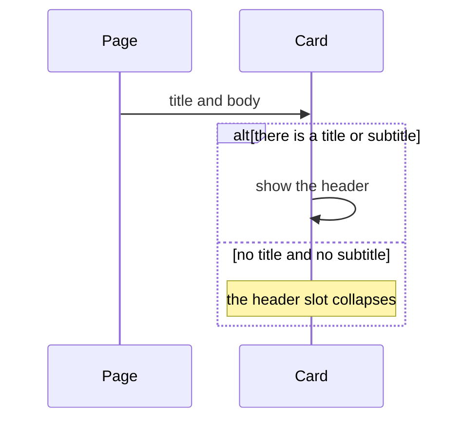
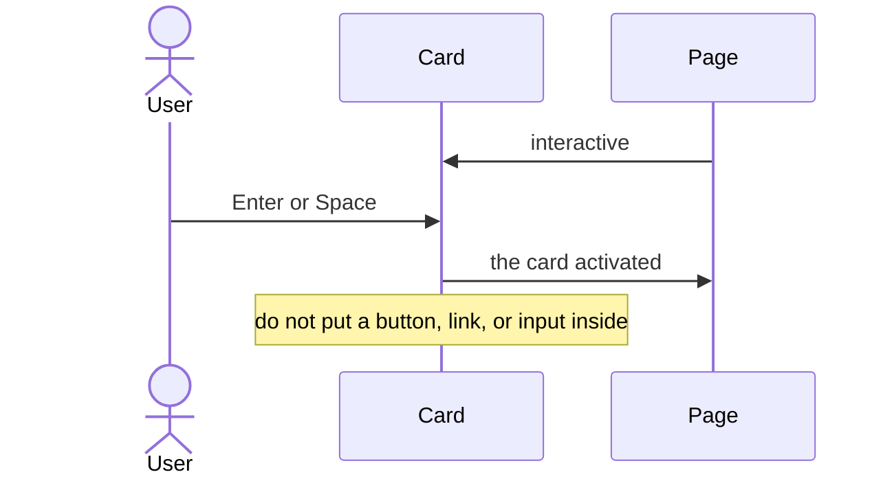
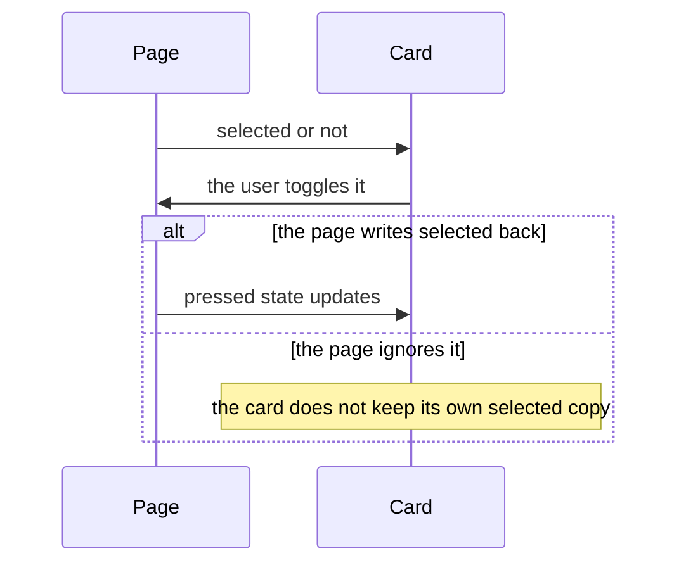
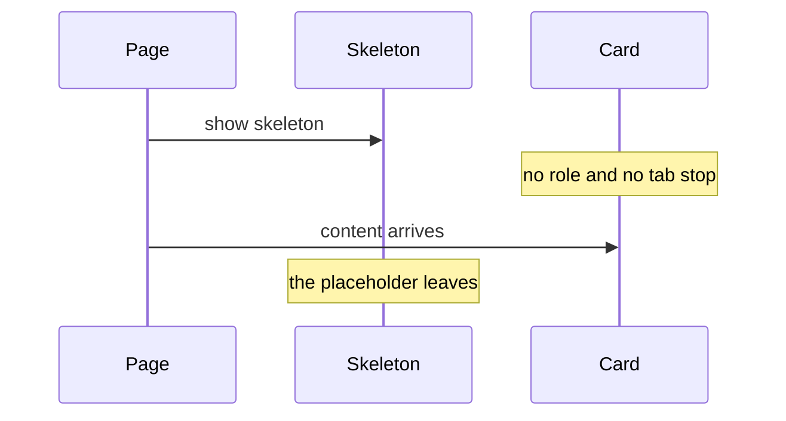

# pixel-card — design

This page explains **pixel-card** in plain language. The exact input and output names live in [README.md](./README.md). This page does not copy that table.

**Walk through every flow:** open [orchestration.html](./orchestration.html) in a browser (serve the `src/lib` folder so the shared player script can load).

## 1. What this does, and what it does not

A surface for a title, text, media, and actions. Empty slots disappear. If the whole card is the action, it behaves like a button. Do not put other buttons inside an interactive card.

| This piece does | It does not |
| --- | --- |
| Groups content on a surface | Trap focus (it is not a dialog) |
| Can be selectable or fully clickable | Keep showing a header when there is no title |

## 2. Who talks to whom

A card is a surface. Empty slots disappear. If the whole card is the action, it is the button, and you must not put another button, link, or input inside it.

**How to read the picture**

- **Empty slots collapse.** A header appears only when there is a title or a subtitle.
- **Interactive card.** Enter on key down and Space on key up activate it, like a button. Do not nest another control inside it.
- **Selectable.** The page stores selected. Together with interactive, the card exposes a pressed state.
- **Skeleton.** The card is not a button and has no tab stop until the content is ready.

## 3. Flows

### Read-only card

1. The page sets a title and body. The header appears only when there is a title or subtitle.
2. Empty slots collapse. Actions in the card are their own buttons.

### The card is the action

1. The page marks the card interactive. Enter on keydown and Space on keyup activate it, like a button.
2. The user activates it. Do not nest another button, link, or input inside this card.

### Selectable

1. Selectable and interactive together use a pressed state so the user can tell it is on.
2. The page stores selected. The card does not keep a private copy.

### Skeleton

1. While loading, the skeleton replaces the card. The card is not a button and has no tab stop.
2. Content arrives. The skeleton leaves and the card returns.

## 4. Step by step

Section 3 is the short list. Each picture here is one of those flows, with the branch that changes what the developer must do. Read the note under the picture before copying the pattern.

### Read-only card

Actions in a static card are their own buttons. The card surface itself is not one of them.

### The card is the action

The card is already the control. A nested button steals the click and breaks the keyboard behavior.

### Selectable

Selectable is controlled. The card shows pressed when the page says it is selected. It does not store that on its own.

### Skeleton

Do not leave the interactive role on while the skeleton is showing. The skeleton replaces the card.

## 5. States

- Static surface with only the slots that have content.
- Interactive: one button for the whole card.
- Selectable: pressed when the page says it is selected.
- Skeleton: no role and no tab stop until content is ready.

## 6. Easy to get wrong

- Never nest a button, link, or input inside an interactive card. The card already is the control.
- Do not show a header for a card with no title and no subtitle.

## 7. Files

- `pixel-card.html`
- `pixel-card.scss`
- `pixel-card.ts`

The behavior contract stays in [README.md](./README.md). If this page and the README disagree, the README wins. Fix this page.
