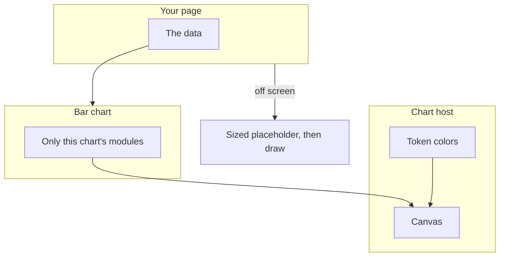
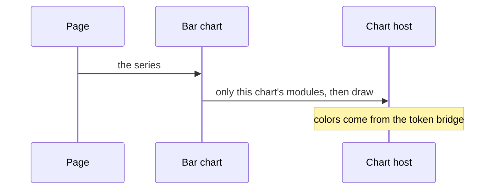
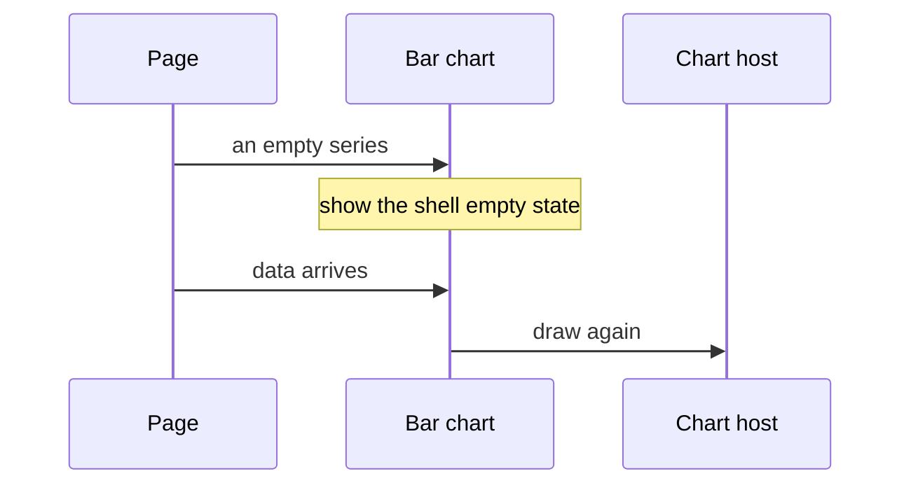
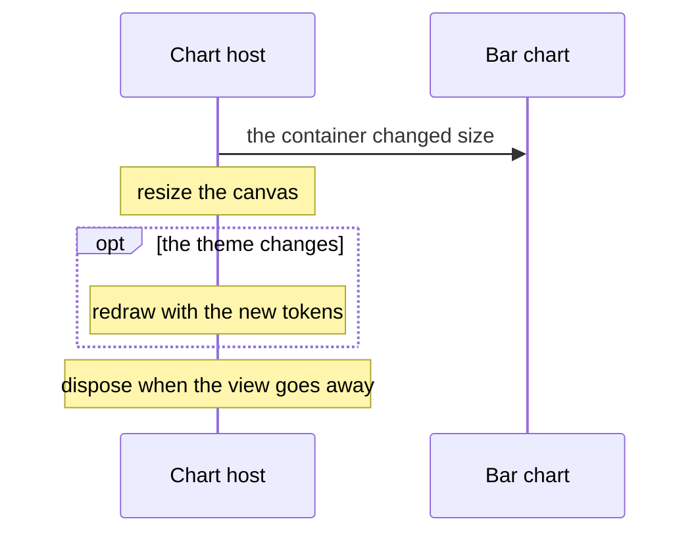
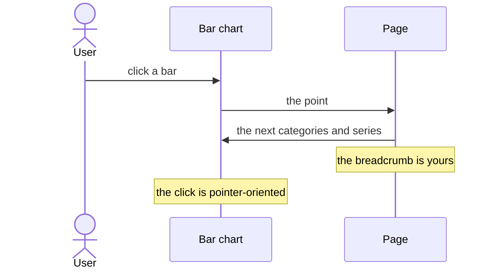

# pixel-chart-bar — design

This page explains **pixel-chart-bar** in plain language. The exact input and output names live in [README.md](./README.md). This page does not copy that table.

**Walk through every flow:** open [orchestration.html](./orchestration.html) in a browser (serve the `src/lib` folder so the shared player script can load).

## 1. What this does, and what it does not

Columns or horizontal bars for categories. Modes are single, grouped, stacked, and 100 percent stacked. Value labels hide automatically when there are too many cells. Drill-down is owned by the page: the chart only reports the click.

| This piece does | It does not |
| --- | --- |
| Draws its series through the shared chart host | Ship inside the main barrel. Import from pixel-ui/charts |
| Compares categories | Navigate to the next drill level. The page does that |

## 2. Who talks to whom

Bar chart does not draw itself. It registers only its own chart modules, then the shared host creates the canvas, applies the theme, resizes, and disposes. Import it from pixel-ui/charts. Colors come from the design tokens. A chart that starts below the fold should wait until it is near the screen, inside a placeholder that already has a size.

**How to read the picture**

- **Page → Bar chart.** The page owns the rows. The plot does not fetch them.
- **Plot → host.** The host is the only place that creates, resizes, and destroys the canvas.
- **Theme → canvas.** Light and dark follow the page tokens. Do not hardcode series colors.
- **Empty data** should be the shell’s empty state, not a blank card.
- **Modes** are single, grouped, stacked, and 100 percent stacked. Value labels hide when the grid is too dense.
- **A click reports the point.** The page owns drill-down. The chart does not navigate.

## 3. Flows

### Draw

1. The page passes data. The plot registers only its chart modules, then the host draws.
2. Colors come from the theme bridge, so light and dark follow the page tokens.

### No data

1. An empty series should show the shell empty state, not a blank card.
2. When data arrives, the host draws again.

### Resize

1. The container changes size. The host resizes the canvas. Below-the-fold charts should defer until they are near the screen, with a sized placeholder.
2. A theme change redraws with the new tokens. Dispose happens when the view goes away.

### Drill-down

1. A click reports the point. The page pushes a drill level and rebinds categories and series.
2. The breadcrumb lives in the chart header slot. Hide it at the root. Keyboard users use the shell table path. The click is pointer-oriented.

## 4. Step by step

Section 3 is the short list. Each picture here is one of those flows, with the branch that changes what the developer must do. Read the note under the picture before copying the pattern.

### Draw

Import Bar chart from pixel-ui/charts. Do not pull the canvas library through the main component barrel.

### No data

Do not leave a blank card. The shell already has the empty state. When rows arrive, the host draws. It does not need a new component.

### Resize

A chart below the fold should be deferred by the page until it is near the screen. Give the placeholder a size so the page does not jump when the canvas appears.

### Drill-down

Put the breadcrumb in the chart header and hide it at the root. Keyboard users reach the numbers through the shell, not through the canvas. Analytics for the click is ids and indexes, not a raw coordinate dump.

## 5. States

- Loading or skeleton, usually from the shell.
- Empty.
- Drawn.
- Resized or themed again.
- Stacked or percent mode.
- Value labels hidden when the grid is dense.

## 6. Easy to get wrong

- Import from pixel-ui/charts.
- Defer charts that start off screen. Give the placeholder a size so the page does not jump.
- Do not let the chart own navigation. Handle the click in the page.
- A hidden series keeps its color. Do not recolor the remaining bars.

## 7. Files

- `pixel-chart-bar.html`
- `pixel-chart-bar.scss`
- `pixel-chart-bar.ts`

The behavior contract stays in [README.md](./README.md). If this page and the README disagree, the README wins. Fix this page.
