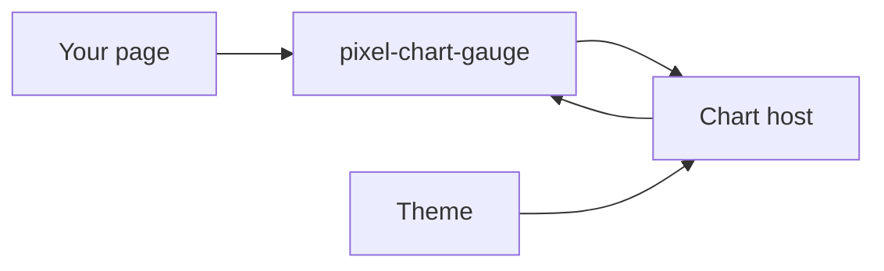
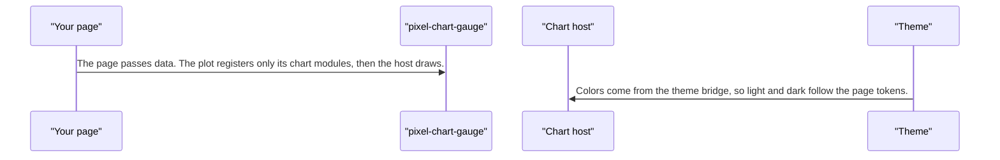
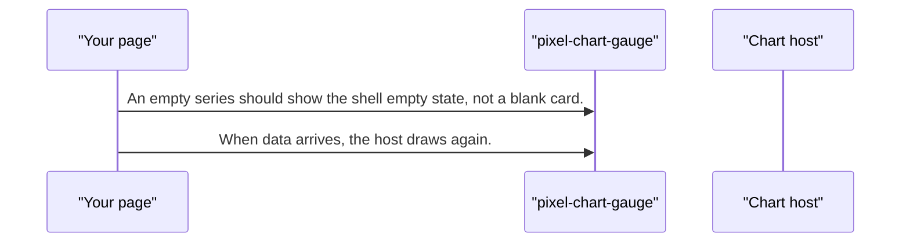
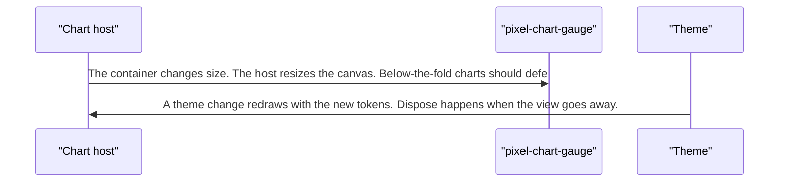
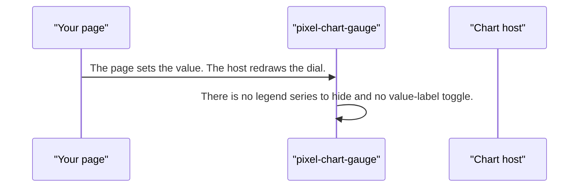

# pixel-chart-gauge — design

This page explains **pixel-chart-gauge** in plain language. The exact input and output names live in [README.md](./README.md). This page does not copy that table.

**Walk through every flow:** open [orchestration.html](./orchestration.html) in a browser (serve the `src/lib` folder so the shared player script can load).

## 1. What this does, and what it does not

One value on a dial, between a min and a max. It does not use the shell "show values" toggle. The meaning of the number is the page’s label, not a second series.

| This piece does | It does not |
| --- | --- |
| Draws its series through the shared chart host | Ship inside the main barrel. Import from pixel-ui/charts |
| Shows one measure on a dial | Use the values toggle from the shell |

## 2. Who talks to whom

## 3. Flows

### Draw

1. The page passes data. The plot registers only its chart modules, then the host draws.
2. Colors come from the theme bridge, so light and dark follow the page tokens.

### No data

1. An empty series should show the shell empty state, not a blank card.
2. When data arrives, the host draws again.

### Resize

1. The container changes size. The host resizes the canvas. Below-the-fold charts should defer until they are near the screen, with a sized placeholder.
2. A theme change redraws with the new tokens. Dispose happens when the view goes away.

### Update the value

1. The page sets the value. The host redraws the dial.
2. There is no legend series to hide and no value-label toggle.

## 4. Step by step

### Draw

### No data

### Resize

### Update the value

## 5. States

- Loading or skeleton, usually from the shell.
- Empty.
- Drawn.
- Resized or themed again.
- A single value, not a series list.

## 6. Easy to get wrong

- Import from pixel-ui/charts.
- Defer charts that start off screen. Give the placeholder a size so the page does not jump.
- Do not bind the shell show-values toggle to a gauge.

## 7. Files

- `pixel-chart-gauge.html`
- `pixel-chart-gauge.scss`
- `pixel-chart-gauge.ts`

The behavior contract stays in [README.md](./README.md). If this page and the README disagree, the README wins. Fix this page.
