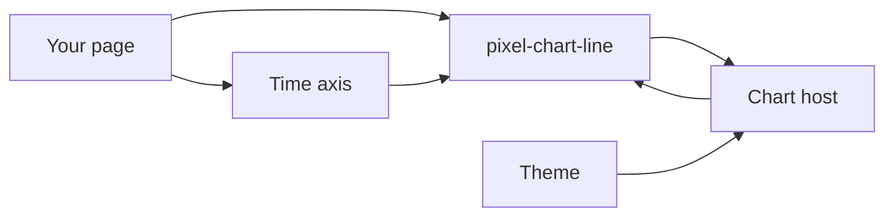
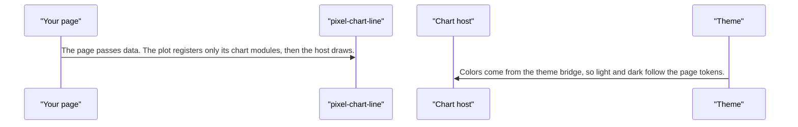
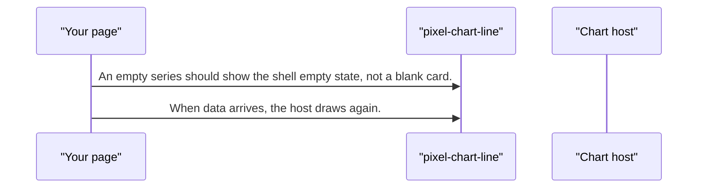
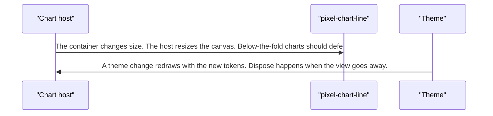
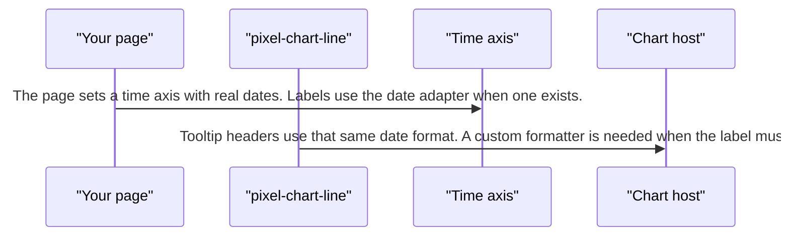

# pixel-chart-line — design

This page explains **pixel-chart-line** in plain language. The exact input and output names live in [README.md](./README.md). This page does not copy that table.

**Walk through every flow:** open [orchestration.html](./orchestration.html) in a browser (serve the `src/lib` folder so the shared player script can load).

## 1. What this does, and what it does not

A line of points, including a time axis. Large series can sample or draw progressively. Point clicks are for the pointer. Keyboard access to the numbers is the shell, not the canvas.

| This piece does | It does not |
| --- | --- |
| Draws its series through the shared chart host | Ship inside the main barrel. Import from pixel-ui/charts |
| Shows a trend, including time | Sample a small series. Sampling starts at the documented threshold |

## 2. Who talks to whom

## 3. Flows

### Draw

1. The page passes data. The plot registers only its chart modules, then the host draws.
2. Colors come from the theme bridge, so light and dark follow the page tokens.

### No data

1. An empty series should show the shell empty state, not a blank card.
2. When data arrives, the host draws again.

### Resize

1. The container changes size. The host resizes the canvas. Below-the-fold charts should defer until they are near the screen, with a sized placeholder.
2. A theme change redraws with the new tokens. Dispose happens when the view goes away.

### Time axis

1. The page sets a time axis with real dates. Labels use the date adapter when one exists.
2. Tooltip headers use that same date format. A custom formatter is needed when the label must include the clock time.

## 4. Step by step

### Draw

### No data

### Resize

### Time axis

## 5. States

- Loading or skeleton, usually from the shell.
- Empty.
- Drawn.
- Resized or themed again.
- Progressive or sampled when the point count is high.

## 6. Easy to get wrong

- Import from pixel-ui/charts.
- Defer charts that start off screen. Give the placeholder a size so the page does not jump.
- Free-text categories are not dates. Leave them unchanged.
- Do not pass an Angular named date format.

## 7. Files

- `pixel-chart-line.html`
- `pixel-chart-line.scss`
- `pixel-chart-line.ts`

The behavior contract stays in [README.md](./README.md). If this page and the README disagree, the README wins. Fix this page.
