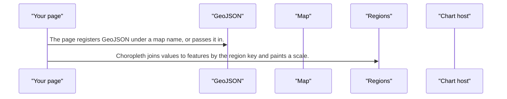
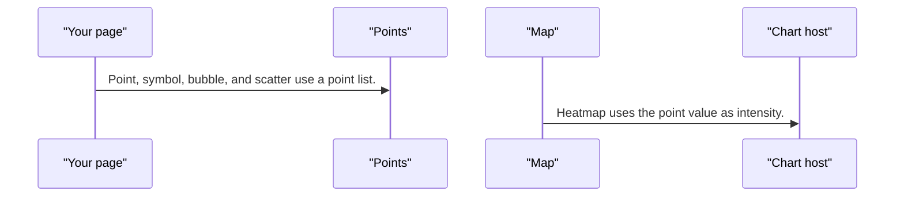
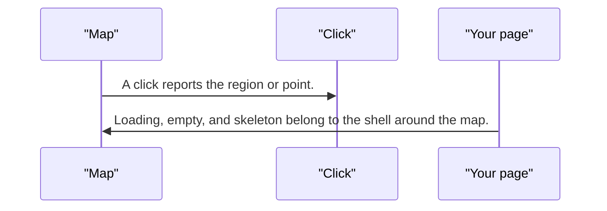

# pixel-chart-map — design

This page explains **pixel-chart-map** in plain language. The exact input and output names live in [README.md](./README.md). This page does not copy that table.

**Walk through every flow:** open [orchestration.html](./orchestration.html) in a browser (serve the `src/lib` folder so the shared player script can load).

## 1. What this does, and what it does not

A geographic map. The library does not ship a world atlas. The page registers GeoJSON, then binds values. Variants are choropleth, area, point, bubble, scatter, symbol, heatmap, route, and flow. A click does not navigate. The page owns drill-down.

| This piece does | It does not |
| --- | --- |
| Draws a map from GeoJSON the page supplies | Ship a world atlas or geocode addresses |
| Colors regions, plots points, or draws routes | Change the route when a region is clicked |

## 2. Who talks to whom

```mermaid
flowchart LR
  page["Your page"]
  plot["Map"]
  geo["GeoJSON"]
  host["Chart host"]
  region["Regions"]
  points["Points"]
  links["Routes"]
  click["Click"]
  page --> geo
  geo --> plot
  page --> region
  region --> plot
  plot --> host
  page --> points
  points --> plot
  page --> links
  links --> plot
  plot --> click
  click --> page
  page --> plot
```

## 3. Flows

### Regions

1. The page registers GeoJSON under a map name, or passes it in. There is no built-in atlas.
2. Choropleth joins values to features by the region key and paints a scale. Area mode uses category colors and the shell legend.

### Points and heat

1. Point, symbol, bubble, and scatter use a point list. Bubble and scatter size comes from the point size, or the value if size is missing.
2. Heatmap uses the point value as intensity. Labels hide automatically when there are many points. Pan and zoom are pointer actions, not keyboard actions.

### Routes

1. Route and flow use links. Each link has a from and a to, as coordinates or point ids, and may include waypoints.
2. Flow line width follows the link value. Arrows show direction.

### Click

1. A click reports the region or point. The page may filter or drill. The map does not change the route.
2. Loading, empty, and skeleton belong to the shell around the map. Export PNG, SVG, or CSV from that shell.

## 4. Step by step

### Regions



### Points and heat



### Routes

```mermaid
sequenceDiagram
  participant page as "Your page"
  participant links as "Routes"
  participant plot as "Map"
  participant host as "Chart host"
  page->>links: Route and flow use links.
  plot->>host: Flow line width follows the link value.
```

### Click



## 5. States

- No GeoJSON yet: nothing geographic to draw.
- Regions, points, heat, or links drawn.
- Roaming with the pointer.
- Empty or loading, from the shell.

## 6. Easy to get wrong

- Import from pixel-ui/charts. Register GeoJSON yourself. The library does not include a world map.
- Join region data with the region key. The default key is the feature name.
- Do not navigate inside the map. Drill-down stays in the page.
- Pan and zoom are pointer-only. Do not expect arrow keys to roam.

## 7. Files

- `pixel-chart-map.html`
- `pixel-chart-map.scss`
- `pixel-chart-map.ts`

The behavior contract stays in [README.md](./README.md). If this page and the README disagree, the README wins. Fix this page.
