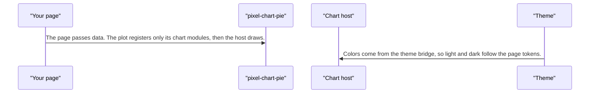
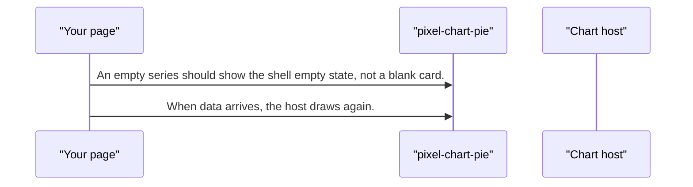
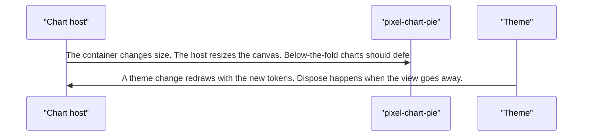
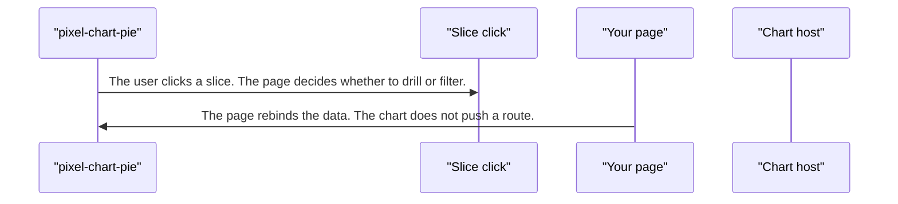

# pixel-chart-pie — design

This page explains **pixel-chart-pie** in plain language. The exact input and output names live in [README.md](./README.md). This page does not copy that table.

**Walk through every flow:** open [orchestration.html](./orchestration.html) in a browser (serve the `src/lib` folder so the shared player script can load).

## 1. What this does, and what it does not

Slices of a whole. A click reports the slice so the page can drill. The shell legend can hide a slice. Colors stay tied to the full series when slices are hidden.

| This piece does | It does not |
| --- | --- |
| Draws its series through the shared chart host | Ship inside the main barrel. Import from pixel-ui/charts |
| Shows parts of a whole | Drill by itself |

## 2. Who talks to whom

```mermaid
flowchart LR
  page["Your page"]
  plot["pixel-chart-pie"]
  host["Chart host"]
  theme["Theme"]
  click["Slice click"]
  page --> plot
  plot --> host
  theme --> host
  host --> plot
  plot --> click
  click --> page
```

## 3. Flows

### Draw

1. The page passes data. The plot registers only its chart modules, then the host draws.
2. Colors come from the theme bridge, so light and dark follow the page tokens.

### No data

1. An empty series should show the shell empty state, not a blank card.
2. When data arrives, the host draws again.

### Resize

1. The container changes size. The host resizes the canvas. Below-the-fold charts should defer until they are near the screen, with a sized placeholder.
2. A theme change redraws with the new tokens. Dispose happens when the view goes away.

### Slice click

1. The user clicks a slice. The page decides whether to drill or filter.
2. The page rebinds the data. The chart does not push a route.

## 4. Step by step

### Draw



### No data



### Resize



### Slice click



## 5. States

- Loading or skeleton, usually from the shell.
- Empty.
- Drawn.
- Resized or themed again.

## 6. Easy to get wrong

- Import from pixel-ui/charts.
- Defer charts that start off screen. Give the placeholder a size so the page does not jump.
- Do not navigate inside the pie. The page owns the next view.

## 7. Files

- `pixel-chart-pie.html`
- `pixel-chart-pie.scss`
- `pixel-chart-pie.ts`

The behavior contract stays in [README.md](./README.md). If this page and the README disagree, the README wins. Fix this page.
