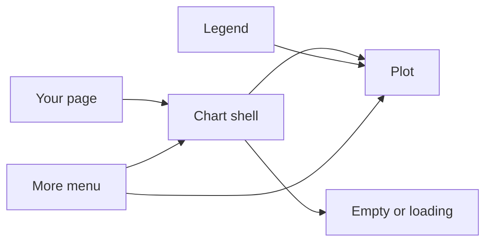
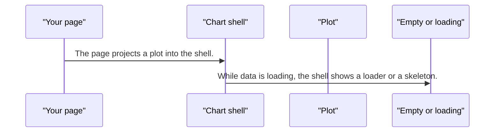
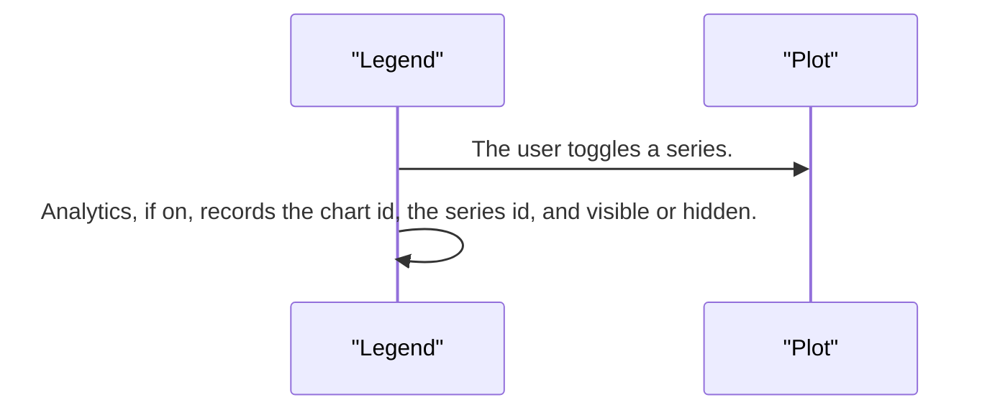
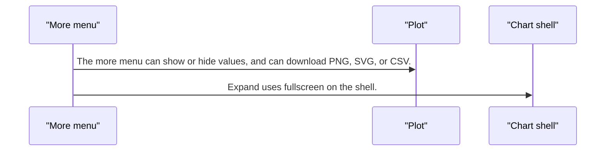

# pixel-chart-shell — design

This page explains **pixel-chart-shell** in plain language. The exact input and output names live in [README.md](./README.md). This page does not copy that table.

**Walk through every flow:** open [orchestration.html](./orchestration.html) in a browser (serve the `src/lib` folder so the shared player script can load).

## 1. What this does, and what it does not

The card around a chart: title, description, legend, export, and fullscreen. The card itself is not clickable, because the shell already contains buttons. There is no inline data table. CSV is a download. Loading, skeleton, and empty states live here. The plot (bar, line, and the rest) is projected inside.

| This piece does | It does not |
| --- | --- |
| Wraps a projected plot with title, legend, and export | Draw the series. The plot does that |
| Toggles series and can expand to fullscreen | Show an inline data table |
| Shows loading, skeleton, and empty | Use the values toggle on a gauge or a sparkline |

## 2. Who talks to whom

## 3. Flows

### Show a chart

1. The page projects a plot into the shell. The shell card stays non-interactive so its buttons and menus work.
2. While data is loading, the shell shows a loader or a skeleton. An empty series shows the empty state, not a blank card.

### Legend

1. The user toggles a series. The plot hides it. Colors stay tied to the original series list.
2. Analytics, if on, records the chart id, the series id, and visible or hidden. It does not record the series name.

### Export and expand

1. The more menu can show or hide values, and can download PNG, SVG, or CSV. Gauge and sparkline do not use the values toggle.
2. Expand uses fullscreen on the shell. Escape leaves it. Menus remount inside the fullscreen element so they stay visible.

## 4. Step by step

### Show a chart

### Legend

### Export and expand

## 5. States

- Loading or skeleton.
- Empty.
- Drawn, with legend items shown or hidden.
- Fullscreen.

## 6. Easy to get wrong

- Import from pixel-ui/charts.
- The shell card is not clickable. Do not make the card the button.
- Bind show-values on the shell to the same input on the plot. Skip that bind for gauge and sparkline.
- There is no inline table. CSV is a download.

## 7. Files

- `pixel-chart-shell.html`
- `pixel-chart-shell.scss`
- `pixel-chart-shell.ts`

The behavior contract stays in [README.md](./README.md). If this page and the README disagree, the README wins. Fix this page.
