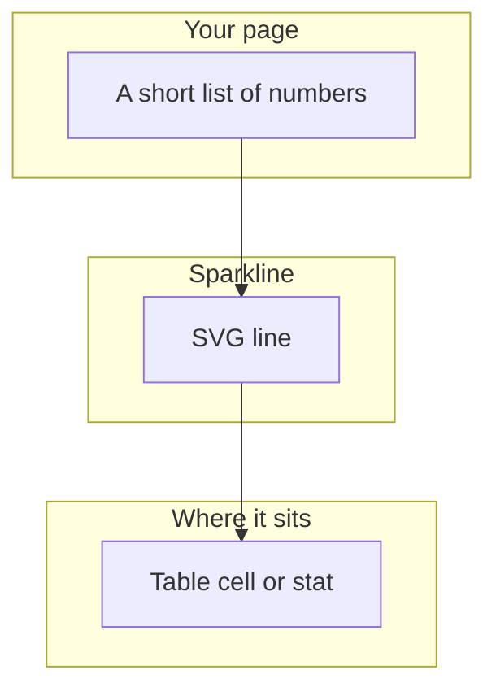
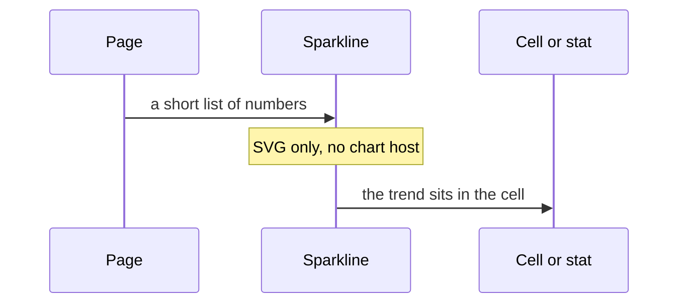
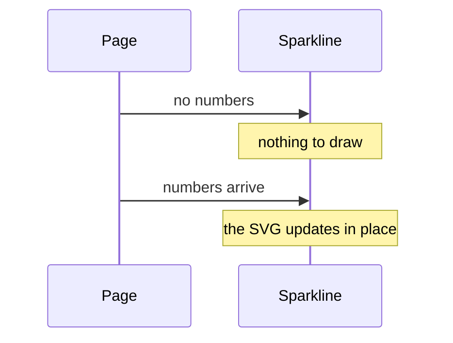

# pixel-chart-sparkline — design

This page explains **pixel-chart-sparkline** in plain language. The exact input and output names live in [README.md](./README.md). This page does not copy that table.

**Walk through every flow:** open [orchestration.html](./orchestration.html) in a browser (serve the `src/lib` folder so the shared player script can load).

## 1. What this does, and what it does not

A tiny trend with no axes, drawn as SVG. It does not use the ECharts host and does not need the ECharts package. It does not use the shell values toggle.

| This piece does | It does not |
| --- | --- |
| Draws a compact SVG trend | Use the canvas host or ECharts |
| Fits in a table cell or a stat | Show a legend, axes, or the values toggle |

## 2. Who talks to whom

A sparkline is a short SVG trend with no axes, no legend, and no values toggle. It does not create the chart host and it does not load the canvas library. Put it in a table cell or a compact stat.

**How to read the picture**

- **No host.** Do not wrap it in the canvas lifecycle.
- **No chrome.** No axes, no legend, no values toggle.
- **No points** means there is no line. Do not load the canvas library to show nothing.

## 3. Flows

### Draw

1. The page passes a short list of numbers. The sparkline draws SVG. No chart host is created.
2. Put it in a table cell or a compact stat. There is no legend and no values toggle.

### No points

1. With no numbers, there is no line to draw. Do not load ECharts to show an empty trend.
2. When numbers arrive, the SVG updates in place.

## 4. Step by step

Section 3 is the short list. Each picture here is one of those flows, with the branch that changes what the developer must do. Read the note under the picture before copying the pattern.

### Draw

Import it from pixel-ui/charts with the other charts, and stop there. Do not add a legend or the shell values toggle.

### No points

An empty sparkline is an absence of a line. It is not a reason to mount the chart host.

## 5. States

- Empty.
- A single SVG trend.

## 6. Easy to get wrong

- Import from pixel-ui/charts.
- Do not wrap a sparkline in the shell values toggle.
- Do not load ECharts for a sparkline.

## 7. Files

- `pixel-chart-sparkline.scss`
- `pixel-chart-sparkline.ts`

The behavior contract stays in [README.md](./README.md). If this page and the README disagree, the README wins. Fix this page.
