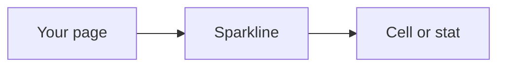
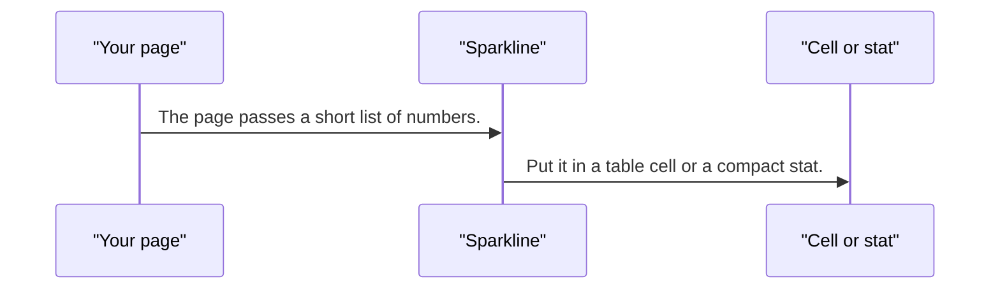
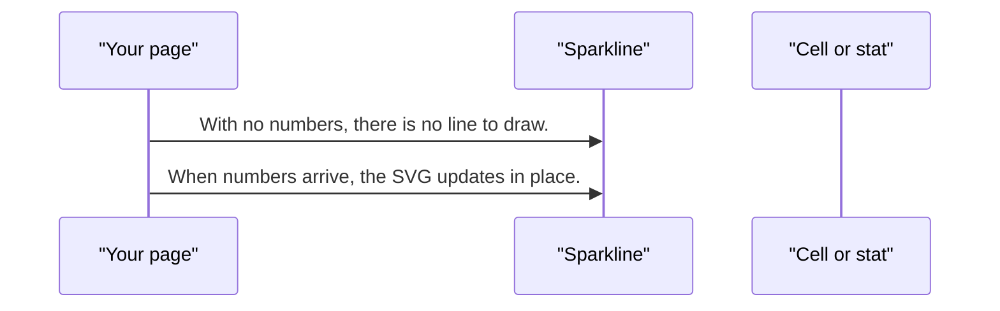

# pixel-chart-sparkline — design

This page explains **pixel-chart-sparkline** in plain language. The exact input and output names live in [README.md](./README.md). This page does not copy that table.

**Walk through every flow:** open [orchestration.html](./orchestration.html) in a browser (serve the `src/lib` folder so the shared player script can load).

## 1. What this does, and what it does not

A tiny trend with no axes, drawn as SVG. It does not use the ECharts host and does not need the ECharts package. It does not use the shell values toggle.

| This piece does | It does not |
| --- | --- |
| Draws a compact SVG trend | Use the canvas host or ECharts |
| Fits in a table cell or a stat | Show a legend, axes, or the values toggle |

## 2. Who talks to whom

## 3. Flows

### Draw

1. The page passes a short list of numbers. The sparkline draws SVG. No chart host is created.
2. Put it in a table cell or a compact stat. There is no legend and no values toggle.

### No points

1. With no numbers, there is no line to draw. Do not load ECharts to show an empty trend.
2. When numbers arrive, the SVG updates in place.

## 4. Step by step

### Draw

### No points

## 5. States

- Empty.
- A single SVG trend.

## 6. Easy to get wrong

- Import from pixel-ui/charts.
- Do not wrap a sparkline in the shell values toggle.
- Do not load ECharts for a sparkline.

## 7. Files

- `pixel-chart-sparkline.scss`
- `pixel-chart-sparkline.ts`

The behavior contract stays in [README.md](./README.md). If this page and the README disagree, the README wins. Fix this page.
