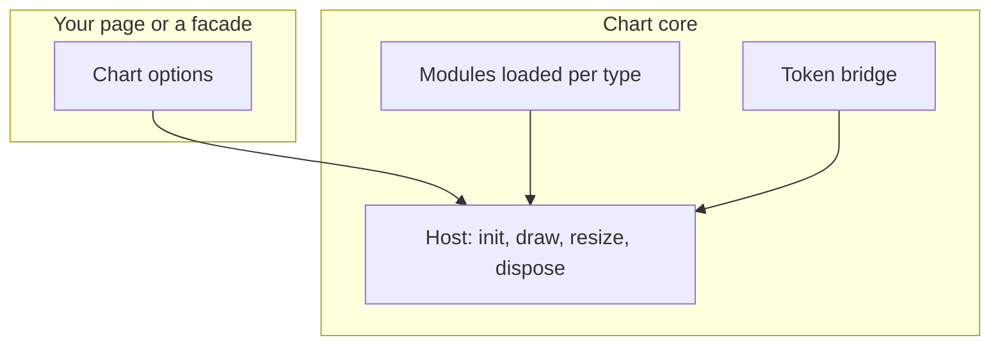
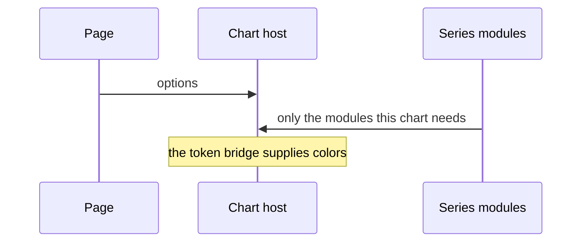
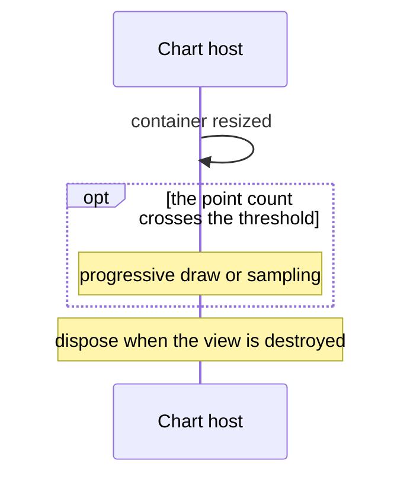
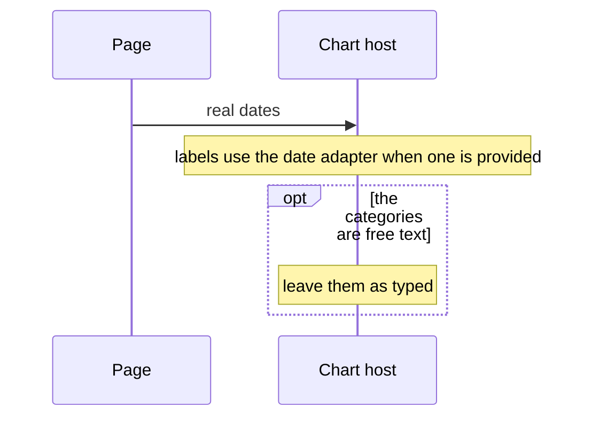

# pixel-chart — design

This page explains **pixel-chart** in plain language. The exact input and output names live in [README.md](./README.md). This page does not copy that table.

**Walk through every flow:** open [orchestration.html](./orchestration.html) in a browser (serve the `src/lib` folder so the shared player script can load).

## 1. What this does, and what it does not

The shared chart core: a host that creates and destroys the canvas, a theme bridge from the design tokens, and register functions so each chart type loads only its own modules. Facades such as bar and line sit on top of this. Sparkline does not use this canvas.

| This piece does | It does not |
| --- | --- |
| Hosts the canvas, theme, and resize lifecycle | Render a sparkline. That one is custom SVG |
| Registers series modules on demand | Import ECharts from the main component barrel as the preferred path |

## 2. Who talks to whom

This is the shared core, not a chart the page usually drops in. A facade such as bar or line registers the modules it needs. The host creates the canvas, draws, resizes, and disposes it. The theme bridge maps design tokens to chart colors. Sparkline does not use this canvas. It is SVG.

**How to read the picture**

- **The host owns the canvas lifecycle.** Facades must not create a second canvas.
- **Modules load per chart type.** A bar chart does not load the map.
- **A large series** can switch to progressive draw or sampling after the documented thresholds.
- **Time labels** use a pattern, Intl options, a function, or null. Angular names such as mediumDate are not a format here.
- **Sparkline is not this host.**

## 3. Flows

### Draw

1. A facade or the page registers the modules it needs, then the host draws the options.
2. The theme bridge maps the system tokens. Light and dark come from those tokens.

### Resize and dispose

1. The container changes size. The host resizes. A large series can switch to progressive draw or sampling when it crosses the thresholds.
2. When the view is destroyed, the host disposes the canvas. A chart below the fold should wait until it is near the screen.

### Time axis

1. A line can use a time axis with real dates. Labels use the date adapter when one is provided.
2. Free-text categories such as "Q1" stay as typed. Do not pass Angular format names like mediumDate. Use a pattern, Intl options, a function, or null.

## 4. Step by step

Section 3 is the short list. Each picture here is one of those flows, with the branch that changes what the developer must do. Read the note under the picture before copying the pattern.

### Draw

Prefer the facades. Reach for the host when you are building a new series, and register only the modules that series needs.

### Resize and dispose

Dispose is required. A chart that stays allocated after the view is gone will keep the canvas. Defer off-screen charts in the page, with a sized placeholder.

### Time axis

Do not pass an Angular named format. Use a pattern, Intl options, a function, or null. Free-text categories such as a quarter label are not dates.

## 5. States

- Not created yet.
- Drawn.
- Progressive or sampled when the point count is high.
- Disposed.

## 6. Easy to get wrong

- Prefer import from pixel-ui/charts.
- Sparkline is SVG and does not use this host.
- Do not pass Angular named date formats to the axis.

## 7. Files

- `a11y`
- `builders`
- `export`
- `pixel-chart-analytics.ts`
- `pixel-chart-host.html`
- `pixel-chart-host.scss`
- `pixel-chart-host.ts`
- `pixel-chart-theme.ts`
- `pixel-chart.types.ts`
- `public-api.ts`
- `register`
- `sync`

The behavior contract stays in [README.md](./README.md). If this page and the README disagree, the README wins. Fix this page.
