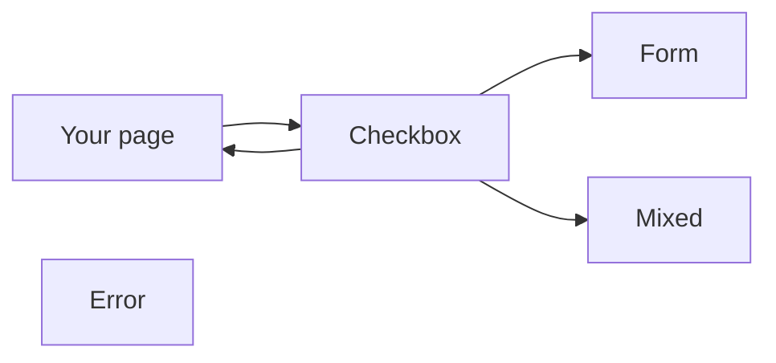

# pixel-checkbox — design

This page explains **pixel-checkbox** in plain language. The exact input and output names live in [README.md](./README.md). This page does not copy that table.

**Walk through every flow:** open [orchestration.html](./orchestration.html) in a browser (serve the `src/lib` folder so the shared player script can load).

## 1. What this does, and what it does not

A checked, unchecked, or mixed checkbox. The page can bind checked, or the form can own it. Mixed (indeterminate) clears the next time the user toggles.

| This piece does | It does not |
| --- | --- |
| Toggles a boolean, or shows a mixed state | Choose one of many (use pixel-radio) |
| Works with forms | Change the value while readonly |

## 2. Who talks to whom



## 3. Flows

### Check

1. The page binds checked, or the form writes the value. The box shows the current state.
2. The user toggles with click, Enter, or Space. The new checked value is emitted.

### Mixed

1. The page sets indeterminate for a parent of a partial group.
2. The next user toggle clears mixed and sets a real checked or unchecked value.

### Readonly or disabled

1. Readonly can be focused but does not change. Disabled cannot be used.
2. No change event. An error override from the page can still show an error.

## 4. Step by step

### Check

```mermaid
sequenceDiagram
  participant page as "Your page"
  participant box as "Checkbox"
  participant form as "Form"
  page->>box: The page binds checked, or the form writes the value. The box shows the current state.
  box->>page: The user toggles with click, Enter, or Space. The new checked value is emitted.
```

### Mixed

```mermaid
sequenceDiagram
  participant page as "Your page"
  participant box as "Checkbox"
  participant mixed as "Mixed"
  page->>box: The page sets indeterminate for a parent of a partial group.
  box->>page: The next user toggle clears mixed and sets a real checked or unchecked value.
```

### Readonly or disabled

```mermaid
sequenceDiagram
  participant page as "Your page"
  participant box as "Checkbox"
  page->>box: Readonly can be focused but does not change. Disabled cannot be used.
  box->>box: No change event. An error override from the page can still show an error.
```

## 5. States

- Unchecked, checked, and mixed.
- Disabled: unavailable.
- Readonly: focusable, no change.
- Error, including a page-forced error.
- Full width is the default.

## 6. Easy to get wrong

- Mixed is not a third saved value. The next user toggle clears it.
- Readonly is not disabled. The user can still tab to it.

## 7. Files

- `pixel-checkbox.scss`
- `pixel-checkbox.ts`

The behavior contract stays in [README.md](./README.md). If this page and the README disagree, the README wins. Fix this page.
