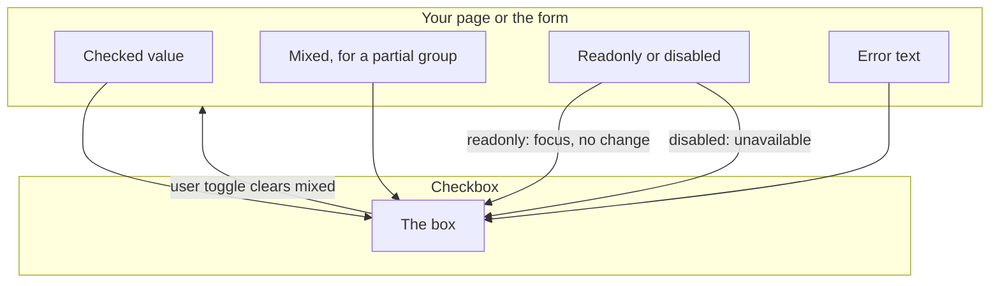

# pixel-checkbox — design

This page explains **pixel-checkbox** in plain language. The exact input and output names live in [README.md](./README.md). This page does not copy that table.

**Walk through every flow:** open [orchestration.html](./orchestration.html) in a browser (serve the `src/lib` folder so the shared player script can load).

## 1. What this does, and what it does not

A checked, unchecked, or mixed checkbox. The page can bind checked, or the form can own it. Mixed (indeterminate) clears the next time the user toggles.

| This piece does | It does not |
| --- | --- |
| Toggles a boolean, or shows a mixed state | Choose one of many (use pixel-radio) |
| Works with forms | Change the value while readonly |

## 2. Who talks to whom

The page or the form owns checked. Mixed is a temporary picture for a partial group. The next user toggle clears mixed and writes a real checked or unchecked value. Readonly can be focused and does not change. Disabled cannot be used.



**How to read the picture**

- **Checked is controlled.** Bind checked, or let the form write it. The box emits the next value.
- **Mixed is not a third saved value.** The next user toggle clears it.
- **Readonly stays in the tab order.** Disabled does not act. An error does not lock the box.
- **Error.** The page can force the error text, or the form can mark the control invalid.

## 3. Flows

### Check

1. The page binds checked, or the form writes the value. The box shows the current state.
2. The user toggles with click, Enter, or Space. The new checked value is emitted.

### Mixed

1. The page sets indeterminate for a parent of a partial group.
2. The next user toggle clears mixed and sets a real checked or unchecked value.

### Readonly or disabled

1. Readonly can be focused but does not change. Disabled cannot be used.
2. No change event while locked.

### Error

1. The page forces an error, or the form marks the control invalid.
2. The checkbox shows the error. The user can still change it, unless it is also disabled or readonly.

## 4. Step by step

Section 3 is the short list. Each picture here is one of those flows, with the branch that changes what the developer must do. Read the note under the picture before copying the pattern.

### Check

```mermaid
sequenceDiagram
  actor User
  participant Box as Checkbox
  participant Page
  Page->>Box: checked or not
  User->>Box: click, Enter, or Space
  Box->>Page: the new checked value
```

Update the bound value from that event. The box does not keep a private copy.

### Mixed

```mermaid
sequenceDiagram
  participant Page
  participant Box as Checkbox
  Page->>Box: mixed, some children are checked
  actor User
  User->>Box: toggle
  Box->>Page: mixed is cleared, and the value is really checked or not
```

Use mixed for a parent of a partial group. Do not save mixed as the form value. The next toggle replaces it.

### Readonly or disabled

```mermaid
sequenceDiagram
  participant Page
  participant Box as Checkbox
  alt readonly
    Page->>Box: focusable, no change
  else disabled
    Page->>Box: unavailable
  end
  Note over Box: no change event
```

Readonly is not disabled. The user can still tab to it and hear the current value.

### Error

```mermaid
sequenceDiagram
  participant Page
  participant Box as Checkbox
  Page->>Box: forced error, or the form is invalid
  Note over Box: the error shows
  alt also disabled or readonly
    Note over Box: the value does not change
  else the box is editable
    Note over Box: the user can still toggle it
  end
```

An error is a message. It does not block the toggle. Disabled and readonly do.

## 5. States

- Unchecked, checked, and mixed.
- Disabled: unavailable.
- Readonly: focusable, no change.
- Error, including a page-forced error.
- Full width is the default.

## 6. Easy to get wrong

- Mixed is not a third saved value. The next user toggle clears it.
- Readonly is not disabled. The user can still tab to it.

## 7. Files

- `pixel-checkbox.scss`
- `pixel-checkbox.ts`

The behavior contract stays in [README.md](./README.md). If this page and the README disagree, the README wins. Fix this page.
