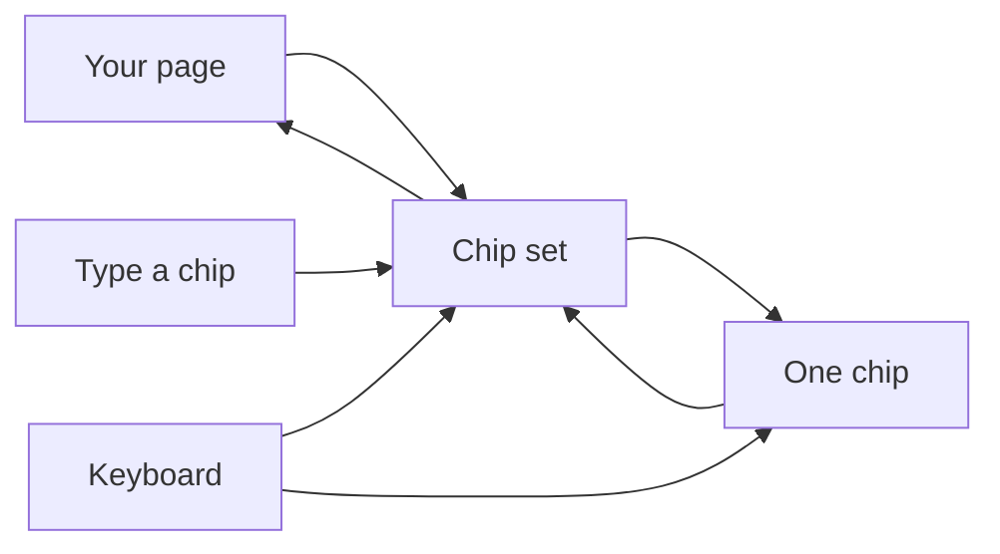
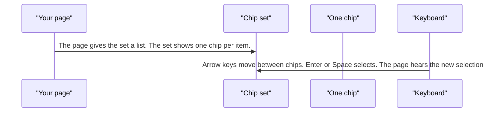
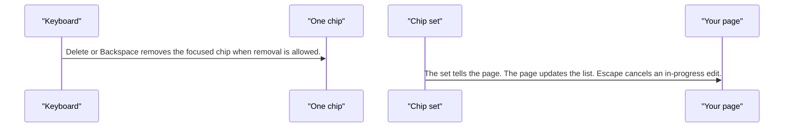
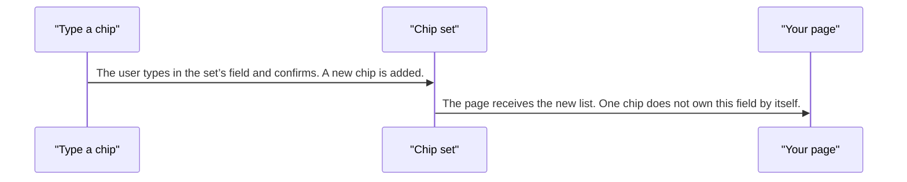

# pixel-chip — design

This page explains **pixel-chip** in plain language. The exact input and output names live in [README.md](./README.md). This page does not copy that table.

**Walk through every flow:** open [orchestration.html](./orchestration.html) in a browser (serve the `src/lib` folder so the shared player script can load).

## 1. What this does, and what it does not

A compact token for a filter, a person, or a typed value. A single chip can be selected, removed, or dragged when those flags are on. A chip set owns a list: selection, overflow, typing a new chip, and reorder.

| This piece does | It does not |
| --- | --- |
| Shows one token, or a set of them | Act as a select menu (use pixel-select) |
| Lets the set handle arrows, delete, and typing | Store the list inside one chip |

## 2. Who talks to whom

## 3. Flows

### Select chips

1. The page gives the set a list. The set shows one chip per item.
2. Arrow keys move between chips. Enter or Space selects. The page hears the new selection.

### Remove

1. Delete or Backspace removes the focused chip when removal is allowed.
2. The set tells the page. The page updates the list. Escape cancels an in-progress edit.

### Type a new chip

1. The user types in the set’s field and confirms. A new chip is added.
2. The page receives the new list. One chip does not own this field by itself.

## 4. Step by step

### Select chips

### Remove

### Type a new chip

## 5. States

- Default, selected, disabled, and removable.
- Overflow: extra chips collapse into a summary the set controls.
- Editing: the set’s input is active. Escape leaves it.

## 6. Easy to get wrong

- Capabilities are booleans (selectable, removable, draggable). They are not the chip type string.
- Put selection, overflow, typing, and reorder on the chip set, not on a lone chip.

## 7. Files

- `pixel-chip-set.html`
- `pixel-chip-set.ts`
- `pixel-chip.html`
- `pixel-chip.scss`
- `pixel-chip.ts`

The behavior contract stays in [README.md](./README.md). If this page and the README disagree, the README wins. Fix this page.
