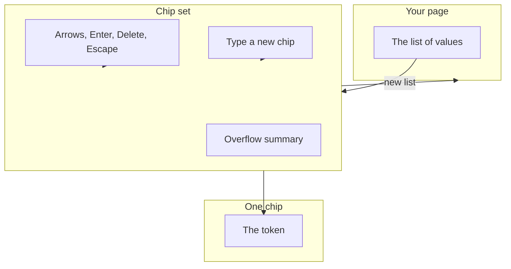
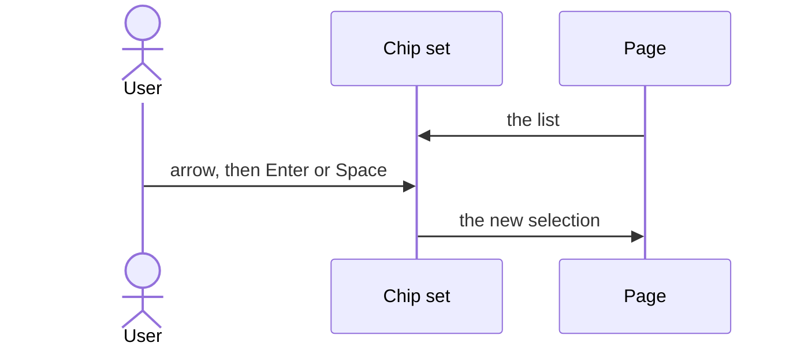
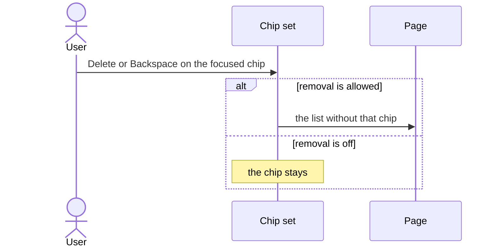
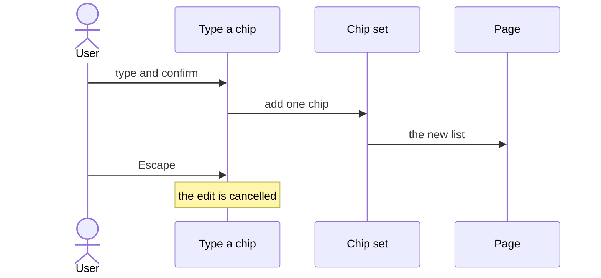

# pixel-chip — design

This page explains **pixel-chip** in plain language. The exact input and output names live in [README.md](./README.md). This page does not copy that table.

**Walk through every flow:** open [orchestration.html](./orchestration.html) in a browser (serve the `src/lib` folder so the shared player script can load).

## 1. What this does, and what it does not

A compact token for a filter, a person, or a typed value. A single chip can be selected, removed, or dragged when those flags are on. A chip set owns a list: selection, overflow, typing a new chip, and reorder.

| This piece does | It does not |
| --- | --- |
| Shows one token, or a set of them | Act as a select menu (use pixel-select) |
| Lets the set handle arrows, delete, and typing | Store the list inside one chip |

## 2. Who talks to whom

One chip is a token. The chip set owns the list: which chips are selected, which are hidden in the overflow, typing a new chip, and reorder. Do not put that list behavior on a single chip.

**How to read the picture**

- **Page → set.** The page owns the array. The set renders it.
- **Keys → set.** Arrows move. Enter or Space selects. Delete or Backspace removes when removal is allowed. Escape cancels an edit.
- **Type-a-chip field.** That field belongs to the set. A lone chip does not have it.
- **Flags, not the type string.** Selectable, removable, and draggable are booleans.

## 3. Flows

### Select chips

1. The page gives the set a list. The set shows one chip per item.
2. Arrow keys move between chips. Enter or Space selects. The page hears the new selection.

### Remove

1. Delete or Backspace removes the focused chip when removal is allowed.
2. The set tells the page. The page updates the list. Escape cancels an in-progress edit.

### Type a new chip

1. The user types in the set’s field and confirms. A new chip is added.
2. The page receives the new list. One chip does not own this field by itself.

## 4. Step by step

Section 3 is the short list. Each picture here is one of those flows, with the branch that changes what the developer must do. Read the note under the picture before copying the pattern.

### Select chips

Selection lives on the set. One chip only shows whether it is in that selection.

### Remove

Do not remove a chip from inside the chip component’s own click if the set is managing the list. Let the set report the new array.

### Type a new chip

The input is part of the set. Confirming adds a chip. Escape leaves the edit without adding one.

## 5. States

- Default, selected, disabled, and removable.
- Overflow: extra chips collapse into a summary the set controls.
- Editing: the set’s input is active. Escape leaves it.

## 6. Easy to get wrong

- Capabilities are booleans (selectable, removable, draggable). They are not the chip type string.
- Put selection, overflow, typing, and reorder on the chip set, not on a lone chip.

## 7. Files

- `pixel-chip-set.html`
- `pixel-chip-set.ts`
- `pixel-chip.html`
- `pixel-chip.scss`
- `pixel-chip.ts`

The behavior contract stays in [README.md](./README.md). If this page and the README disagree, the README wins. Fix this page.
