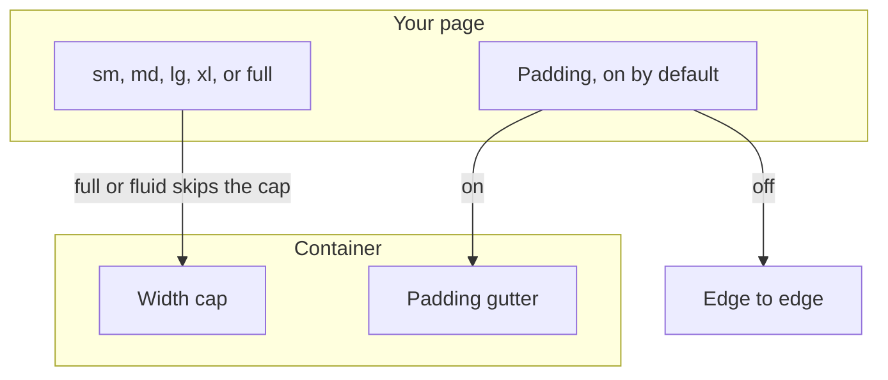

# pixel-container — design

This page explains **pixel-container** in plain language. The exact input and output names live in [README.md](./README.md). This page does not copy that table.

**Walk through every flow:** open [orchestration.html](./orchestration.html) in a browser (serve the `src/lib` folder so the shared player script can load).

## 1. What this does, and what it does not

A width constraint for page content. It is not a landmark. Max width steps from small to full, plus a fluid option. Padding gutters are optional.

| This piece does | It does not |
| --- | --- |
| Caps the content width and can add gutters | Create a header, nav, or main landmark |
| Centers a column in the page | Replace the app shell |

## 2. Who talks to whom

The container caps how wide the content grows and, by default, adds padding. It is not a landmark. Full width, or fluid, skips the cap. Turn padding off when the content must run edge to edge.



**How to read the picture**

- **Padding defaults on.** You turn it off. You do not turn it on.
- **Max width** is a named size. Full and fluid both skip the cap.
- **Not a landmark.** Do not use it as main, nav, or banner. Put those elements inside or around it.

## 3. Flows

### Cap the width

1. The page picks a max width. The content stays in that column on a wide screen.
2. Full, or fluid, skips the width cap. The container has no landmark role.

### Padding gutter

1. Padding is on by default. Content sits inside the side gutter.
2. Turn padding off when the content should run edge to edge. The width cap stays.

## 4. Step by step

Section 3 is the short list. Each picture here is one of those flows, with the branch that changes what the developer must do. Read the note under the picture before copying the pattern.

### Cap the width

```mermaid
sequenceDiagram
  participant Page
  participant Box as Container
  Page->>Box: a max width
  alt full or fluid
    Note over Box: no width cap
  else a named size
    Note over Box: content stops at that width
  end
```

Use a named size for a reading column. Use full or fluid when the content should use the whole frame.

### Padding gutter

```mermaid
sequenceDiagram
  participant Page
  participant Box as Container
  alt padding left on
    Note over Box: the default gutter
  else the page turns padding off
    Note over Box: edge to edge
  end
```

Turn padding off for a full-bleed map or a table that should touch the edges. Leave it on for text.

## 5. States

- Max width from small through extra-large, full, or fluid.
- Padded or edge to edge.

## 6. Easy to get wrong

- Do not use this as main or nav. Put landmarks in the shell, header, sidenav, and footer.
- Do not invent a custom width. Use the documented steps.

## 7. Files

- `pixel-container.scss`
- `pixel-container.ts`

The behavior contract stays in [README.md](./README.md). If this page and the README disagree, the README wins. Fix this page.
