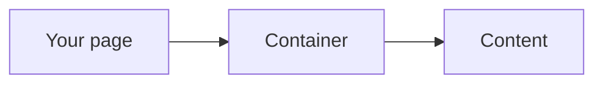

# pixel-container — design

This page explains **pixel-container** in plain language. The exact input and output names live in [README.md](./README.md). This page does not copy that table.

**Walk through every flow:** open [orchestration.html](./orchestration.html) in a browser (serve the `src/lib` folder so the shared player script can load).

## 1. What this does, and what it does not

A width constraint for page content. It is not a landmark. Max width steps from small to full, plus a fluid option. Padding gutters are optional.

| This piece does | It does not |
| --- | --- |
| Caps the content width and can add gutters | Create a header, nav, or main landmark |
| Centers a column in the page | Replace the app shell |

## 2. Who talks to whom



## 3. Flows

### Cap the width

1. The page picks a max width. The content stays in that column on a wide screen.
2. Full and fluid are the wide options. Padding adds the gutter. The container has no landmark role.

## 4. Step by step

### Cap the width

```mermaid
sequenceDiagram
  participant page as "Your page"
  participant box as "Container"
  participant content as "Content"
  page->>box: The page picks a max width. The content stays in that column on a wide screen.
  box->>box: Full and fluid are the wide options. Padding adds the gutter. The container has no landmar
```

## 5. States

- Max width from small through extra-large, full, or fluid.
- Padded or edge to edge.

## 6. Easy to get wrong

- Do not use this as main or nav. Put landmarks in the shell, header, sidenav, and footer.
- Do not invent a custom width. Use the documented steps.

## 7. Files

- `pixel-container.scss`
- `pixel-container.ts`

The behavior contract stays in [README.md](./README.md). If this page and the README disagree, the README wins. Fix this page.
