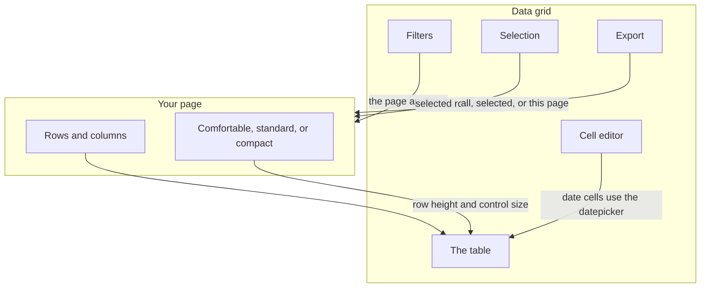
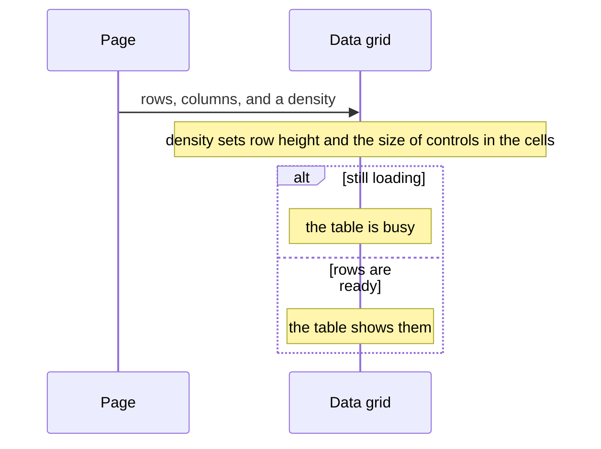
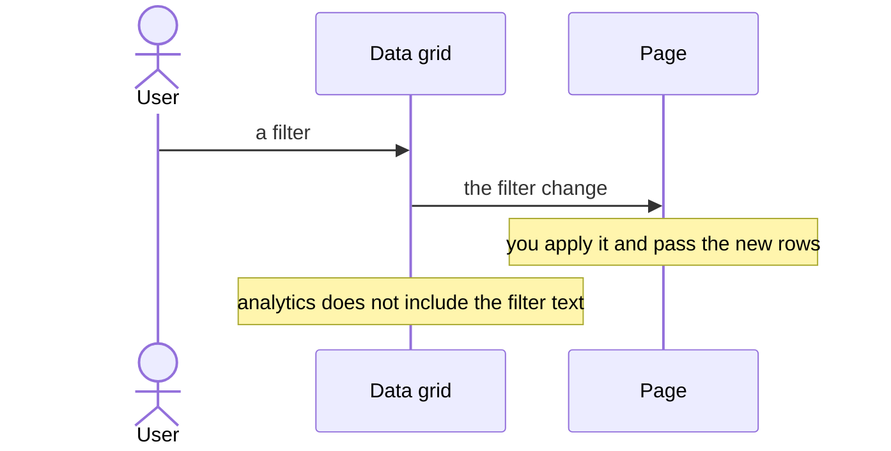
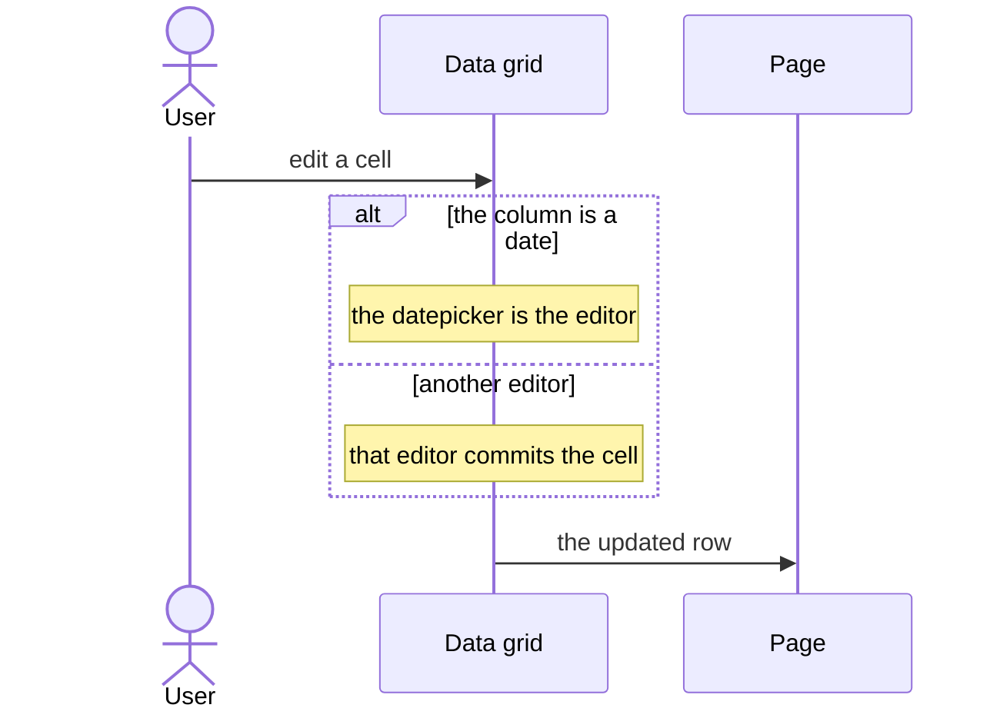
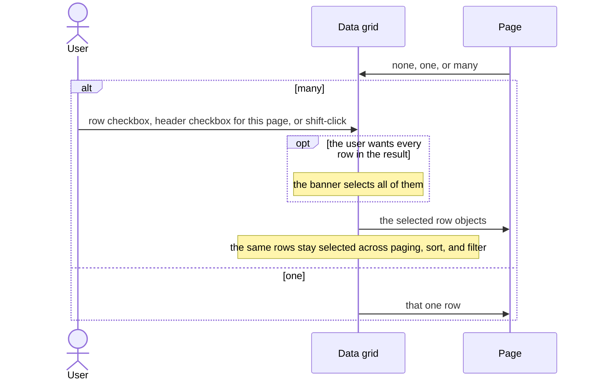
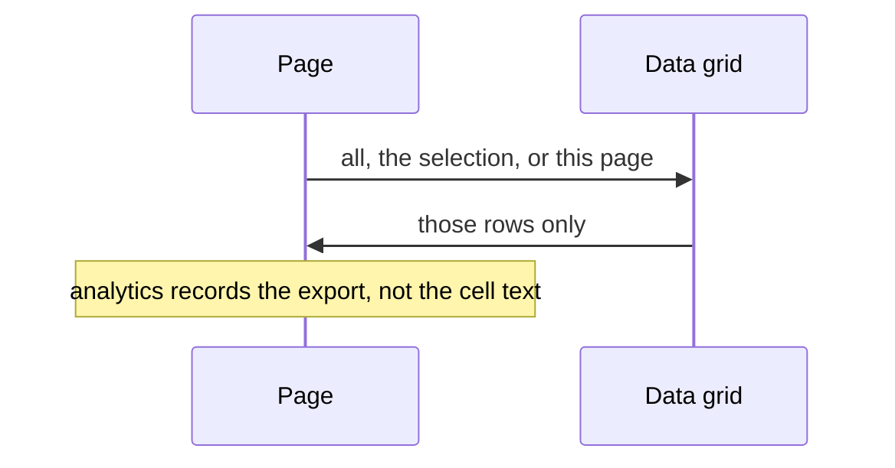

# pixel-data-grid — design

This page explains **pixel-data-grid** in plain language. The exact input and output names live in [README.md](./README.md). This page does not copy that table.

**Walk through every flow:** open [orchestration.html](./orchestration.html) in a browser (serve the `src/lib` folder so the shared player script can load).

## 1. What this does, and what it does not

A table for rows the page owns. Density picks the row height and the size of editors inside the cells. Do not pass a separate control size. Date filters and date editors use the date picker. Analytics records table events and export events, never the raw filter text.

| This piece does | It does not |
| --- | --- |
| Shows, sorts, filters, and edits rows | Send filter text or query text to analytics |
| Exports through the export service when the toolbar asks | Pick its own density and a second control size |

## 2. Who talks to whom

The grid shows rows the page gives it. Density picks the row height and the size of the controls inside the cells. Do not pass a separate size. Filters, cell editors, and selection are controlled by the page. Analytics records table and export events without the raw filter text.

**How to read the picture**

- **Density** is comfortable, standard, or compact. That sets the row height and the embedded control size. There is no extra size input.
- **The grid is a table.** It is busy while loading.
- **Date filters and date editors** use the datepicker. Do not put a plain text date in those cells.
- **Selection** is none, one row, or many. Many uses a checkbox column, a header checkbox for the current page, shift-click for a range, then a banner to select every row in the result. The value is the row objects, kept across paging, sort, and filter. The change event emits those rows.
- **Export** can be all rows, the selection, or the current page. Analytics never includes the raw query or the filter values.

## 3. Flows

### Show rows

1. The page passes rows and columns. The grid is a table. Density sets comfortable, standard, or compact rows.
2. While rows load, the table is busy. When the list is empty, show an empty state the page provides, not a blank body.

### Filter

1. The user filters. A date filter opens the date picker. The page applies the filter to the rows.
2. Analytics may record that a filter changed. It does not record the typed value.

### Edit a cell

1. The user edits a cell. A date cell uses the date picker. The control size follows density. Do not pass another size.
2. The page saves the new value. Sort and page changes keep using the page’s row list.

### Select rows

1. The page turns selection on. Single mode picks one row. Multiple mode adds checkboxes, a header select-all for this page, and shift-click range. A banner can then select every row.
2. The page keeps the selected rows. They stay selected across paging, sort, and filter. Export can be limited to that selection.

### Export

1. The export toolbar builds a file through the export service. Columns the user is not allowed to see stay out.
2. The file downloads. Analytics records the export event, not the cell text.

## 4. Step by step

Section 3 is the short list. Each picture here is one of those flows, with the branch that changes what the developer must do. Read the note under the picture before copying the pattern.

### Show rows

Do not pass a separate size for buttons inside the grid. Change the density.

### Filter

A date filter uses the datepicker. The grid does not query your API by itself.

### Edit a cell

Write the edited row back from the page. The grid shows what you pass in.

### Select rows

The selection is the row objects, keyed so they survive paging. It is not a list of ids, and the grid does not invent bulk actions. If you need an action on the selection, put that action in the page.

### Export

“Only selected” uses the current selection. Filter the columns before you export if some columns must not leave the page. The grid does not upload the file.

## 5. States

- Loading: the table is busy.
- Empty: the page shows an empty state.
- Density: comfortable, standard, or compact, which also sizes cell editors.
- Filtered, sorted, and paged.
- Row selection: none, one row, this page, or every row. The page holds the row objects.
- Cell editing.

## 6. Easy to get wrong

- Do not pass a separate size for inputs inside cells. Density already chooses md, sm, or xs.
- Do not put raw filter or query text in analytics.
- Date cells use pixel-datepicker. Do not invent a second date field.

## 7. Files

- `pixel-data-grid-cell-overflow.directive.ts`
- `pixel-data-grid-cell-row.directive.ts`
- `pixel-data-grid-cell.directive.ts`
- `pixel-data-grid-column-layout.ts`
- `pixel-data-grid-columns-panel.html`
- `pixel-data-grid-columns-panel.scss`
- `pixel-data-grid-columns-panel.ts`
- `pixel-data-grid-detail.directive.ts`
- `pixel-data-grid-drag-preview.ts`
- `pixel-data-grid-editor.directive.ts`
- `pixel-data-grid-header-min-width.ts`
- `pixel-data-grid-row-actions.directive.ts`
- `pixel-data-grid.html`
- `pixel-data-grid.scss`
- `pixel-data-grid.store.ts`
- `pixel-data-grid.ts`
- `pixel-data-grid.types.ts`
- `pixel-data-grid.utils.ts`

The behavior contract stays in [README.md](./README.md). If this page and the README disagree, the README wins. Fix this page.
