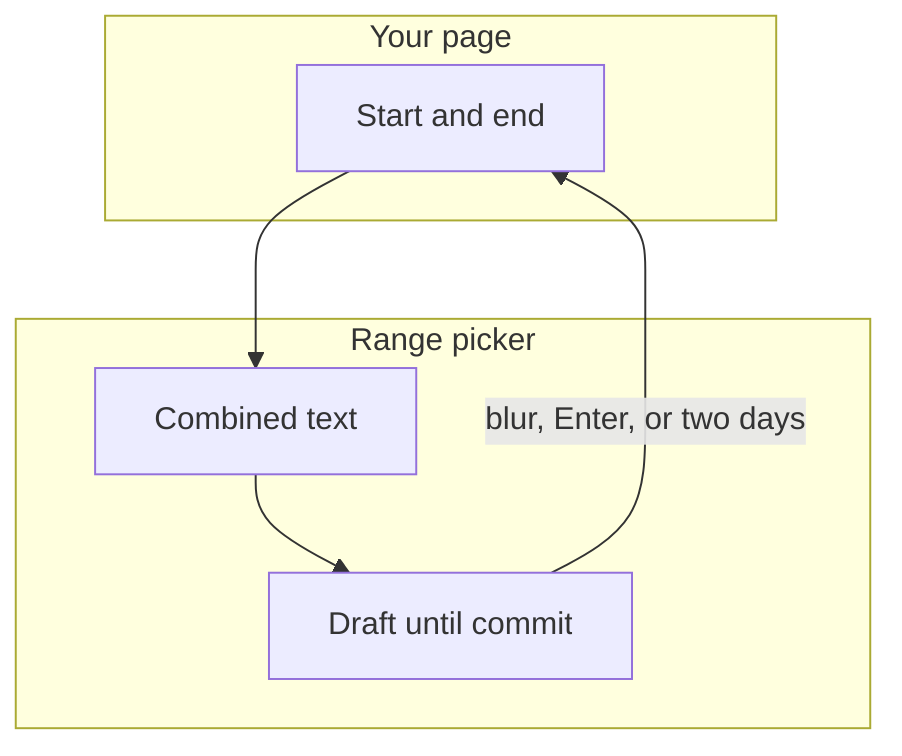
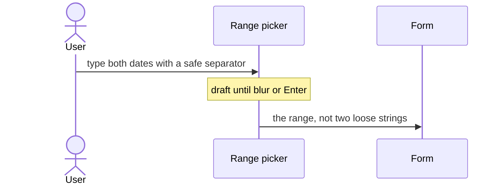
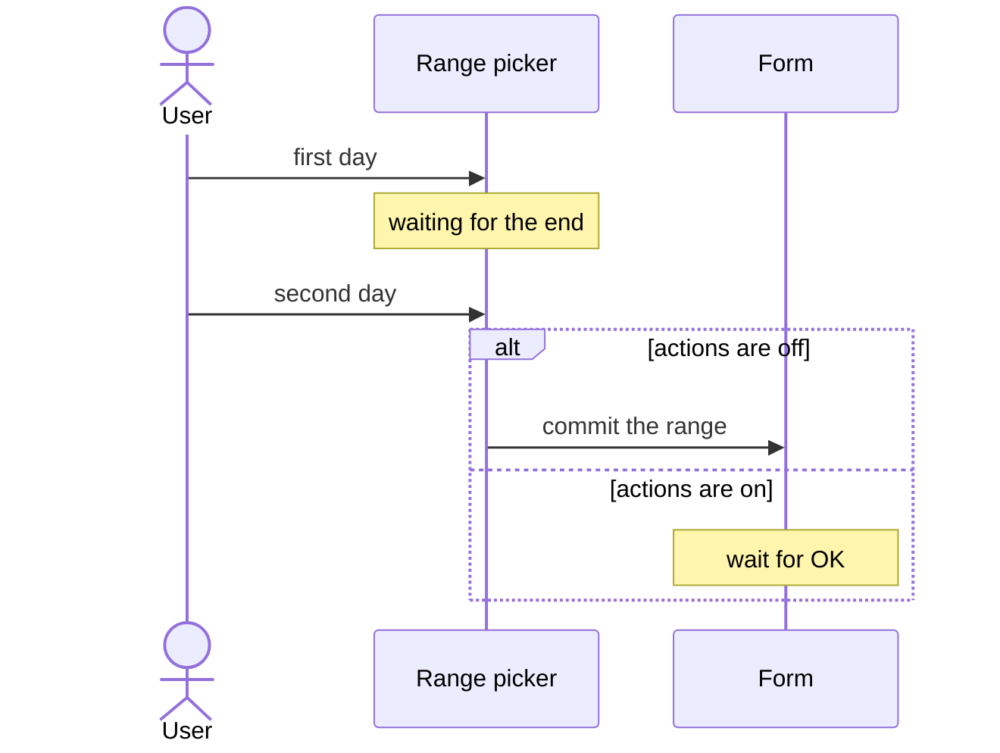

# pixel-date-range-picker — design

This page explains **pixel-date-range-picker** in plain language. The exact input and output names live in [README.md](./README.md). This page does not copy that table.

**Walk through every flow:** open [orchestration.html](./orchestration.html) in a browser (serve the `src/lib` folder so the shared player script can load).

## 1. What this does, and what it does not

A start date and an end date in one field. The host owns the combined text. The separator is an en dash, em dash, or a spaced hyphen so the hyphens inside an ISO date stay safe. Commit rules match the single date field.

| This piece does | It does not |
| --- | --- |
| Edits a start and an end | Use a bare hyphen with no spaces as the separator |
| Commits on blur, Enter, or a calendar pick | Write a partial range as null while the user is typing |

## 2. Who talks to whom

The host owns one combined range. The two fields are the display. The separator must not be a bare hyphen, because ISO dates already contain hyphens. Use an en dash, an em dash, or a spaced hyphen. Commit rules match the single datepicker.

**How to read the picture**

- **One control.** The form value is the range, not two unrelated inputs.
- **Separator.** En dash, em dash, or a hyphen with spaces. A raw hyphen splits the ISO text in the wrong place.
- **Two days.** The second day completes the range and commits, unless actions are on.

## 3. Flows

### Type a range

1. The field shows both dates with a safe separator. The user edits the draft.
2. Blur or Enter commits when both dates parse. Escape closes and restores focus.

### Pick two days

1. The user picks a start, then an end, in the calendar.
2. Without action buttons, the complete range commits. With action buttons, OK commits and Cancel restores the last range.

## 4. Step by step

Section 3 is the short list. Each picture here is one of those flows, with the branch that changes what the developer must do. Read the note under the picture before copying the pattern.

### Type a range

If you change the separator, keep it unambiguous. Do not use a single hyphen between two ISO dates.

### Pick two days

The first day is not a finished value. Do not save the range until the end is chosen or the user commits.

## 5. States

- Empty, partial draft, and a committed start plus end.
- Calendar choosing the start, then the end.
- Disabled, readonly, and error.

## 6. Easy to get wrong

- Do not use a plain hyphen as the separator. ISO dates already contain hyphens.
- The host is the form control. The visible text is the draft.

## 7. Files

- `pixel-date-range-picker.html`
- `pixel-date-range-picker.scss`
- `pixel-date-range-picker.ts`
- `pixel-date-range-selection-strategy.ts`
- `pixel-date-range.ts`
- `pixel-default-date-range-selection-strategy.ts`
- `pixel-five-day-range-selection-strategy.ts`

The behavior contract stays in [README.md](./README.md). If this page and the README disagree, the README wins. Fix this page.
