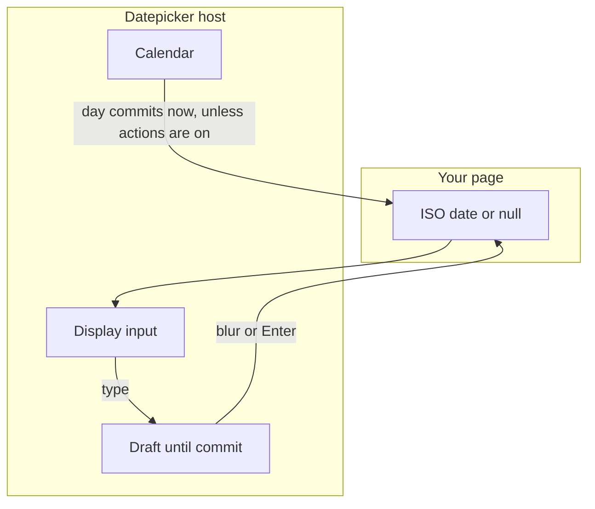
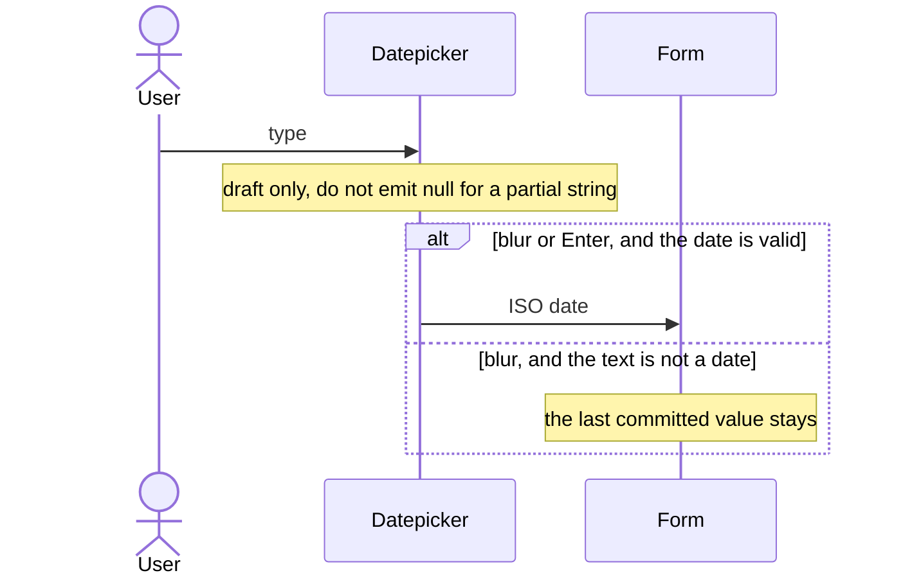
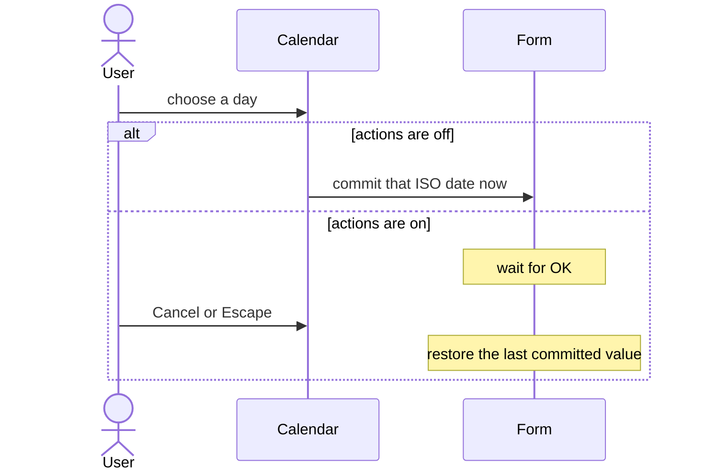

# pixel-datepicker — design

This page explains **pixel-datepicker** in plain language. The exact input and output names live in [README.md](./README.md). This page does not copy that table.

**Walk through every flow:** open [orchestration.html](./orchestration.html) in a browser (serve the `src/lib` folder so the shared player script can load).

## 1. What this does, and what it does not

A date field. The host is the form control. The inner text is only a display. Typed text stays a draft until blur or Enter. Picking a day in the calendar commits immediately unless the page turned on action buttons. Values are ISO dates.

| This piece does | It does not |
| --- | --- |
| Edits one date and commits a draft safely | Treat the inner input as the form control |
| Parses ISO dates | Emit null while the user is still typing a partial date |

## 2. Who talks to whom

The host is the form control. The inner input is only the display. A typed date stays a draft until blur or Enter. Picking a day commits at once, unless the page turned on actions, in which case OK commits and Cancel restores. Values are ISO dates. Do not emit null for a half-typed draft.

**How to read the picture**

- **The form binds the host,** not the inner input.
- **Typing is a draft.** A partial string is not a cleared value.
- **A day click commits immediately** unless show-actions is on. Then OK commits and Cancel or Escape restores the last committed value.
- **Escape** closes the panel and returns focus to the field.

## 3. Flows

### Type a date

1. The page sets an ISO date. The user edits the text. That text is only a draft.
2. Blur or Enter commits a valid date. Escape closes the popup and restores focus. An invalid draft does not wipe the last good value.

### Pick a day

1. Opening the field shows the calendar. Choosing a day commits at once.
2. If the page shows action buttons, the day stays a draft until OK. Cancel restores the previous date.

## 4. Step by step

Section 3 is the short list. Each picture here is one of those flows, with the branch that changes what the developer must do. Read the note under the picture before copying the pattern.

### Type a date

Do not push every keystroke into the form as null. Wait for blur or Enter, and only commit a real date.

### Pick a day

Show actions when the user should be able to back out of a day click. Otherwise the click is the commit.

## 5. States

- Empty, draft text, and committed ISO date.
- Calendar open or closed.
- Disabled, readonly, and error.

## 6. Easy to get wrong

- Bind the form to the host, not the inner input.
- Do not commit on every keystroke. Wait for blur, Enter, or a calendar pick.

## 7. Files

- `pixel-datepicker.html`
- `pixel-datepicker.scss`
- `pixel-datepicker.ts`

The behavior contract stays in [README.md](./README.md). If this page and the README disagree, the README wins. Fix this page.
