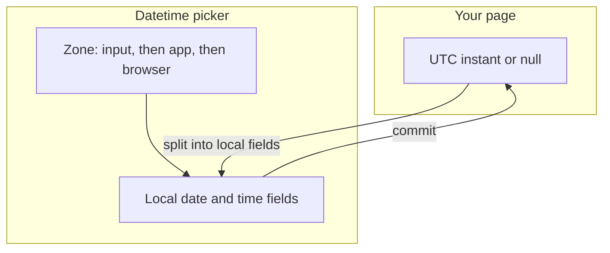
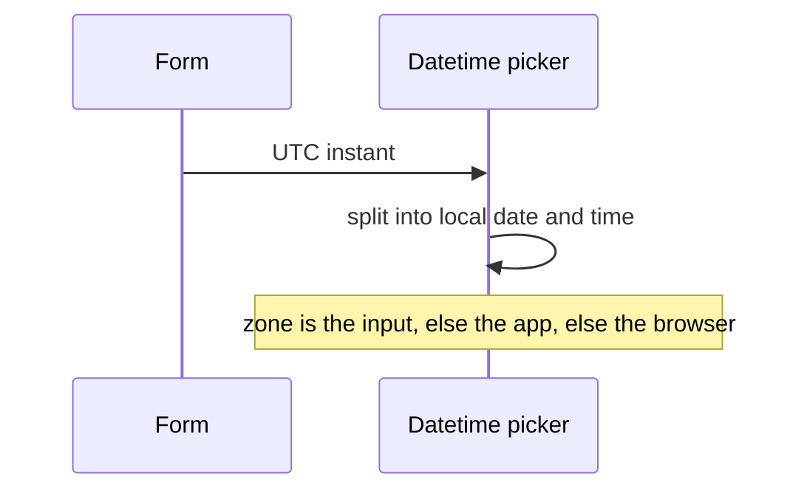
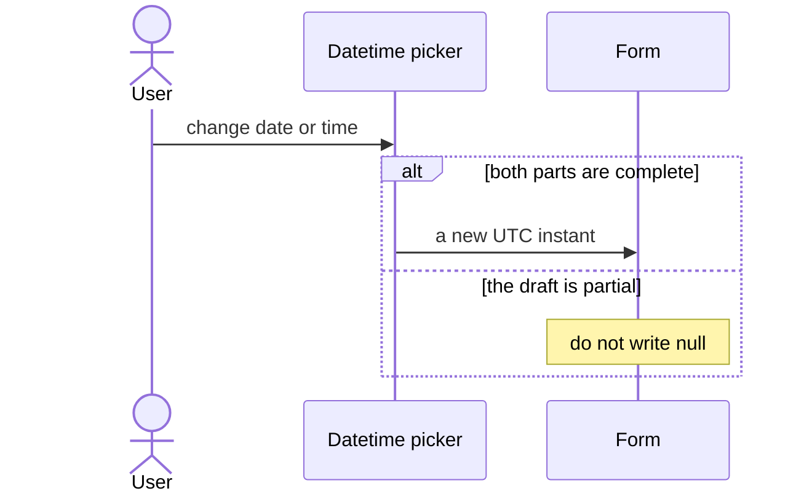

# pixel-datetime-picker — design

This page explains **pixel-datetime-picker** in plain language. The exact input and output names live in [README.md](./README.md). This page does not copy that table.

**Walk through every flow:** open [orchestration.html](./orchestration.html) in a browser (serve the `src/lib` folder so the shared player script can load).

## 1. What this does, and what it does not

A date and a time together. The form value is an ISO instant in UTC, or null. The time zone comes from the input, then PIXEL_TIMEZONE, then the browser. A half-finished draft must not emit null, or the saved date would be wiped.

| This piece does | It does not |
| --- | --- |
| Edits a date and a time as one UTC value | Emit null just because the time is half typed |
| Shows the instant in the chosen zone | Store a local wall time as the form value |

## 2. Who talks to whom

The form value is an ISO instant in UTC, or null. The fields show the local date and time. The zone is the input, then the app time-zone token, then the browser. A partial draft must not be written as null.

**How to read the picture**

- **write the instant, show local parts.** When the form sets a value, split that UTC instant into the local date and time.
- **Do not emit null** while the user has only filled the date or only the time.
- **Zone order is fixed.** Do not read the browser zone first if the page passed one.

## 3. Flows

### Set from the form

1. The form writes an ISO UTC value. The field splits it into a local date and time in the active zone.
2. The user sees that local date and time. The stored value stays UTC.

### Edit

1. The user changes the date or the time. A partial draft stays a draft.
2. A complete valid value commits as UTC. A partial draft does not emit null.

## 4. Step by step

Section 3 is the short list. Each picture here is one of those flows, with the branch that changes what the developer must do. Read the note under the picture before copying the pattern.

### Set from the form

Do not show the raw UTC string in the fields. The user edits local parts. The form still stores UTC.

### Edit

Null means “cleared”, not “still typing”. Keep the previous instant until the draft is complete or the user clears it on purpose.

## 5. States

- Empty, partial draft, and a committed UTC instant.
- Time zone from the field, the app token, or the browser.
- Disabled, readonly, and error.

## 6. Easy to get wrong

- Never emit null while the draft is incomplete. That would clear a date the user already had.
- The form value is UTC. Do not store the wall-clock text as the value.

## 7. Files

- `pixel-datetime-picker.html`
- `pixel-datetime-picker.scss`
- `pixel-datetime-picker.ts`

The behavior contract stays in [README.md](./README.md). If this page and the README disagree, the README wins. Fix this page.
