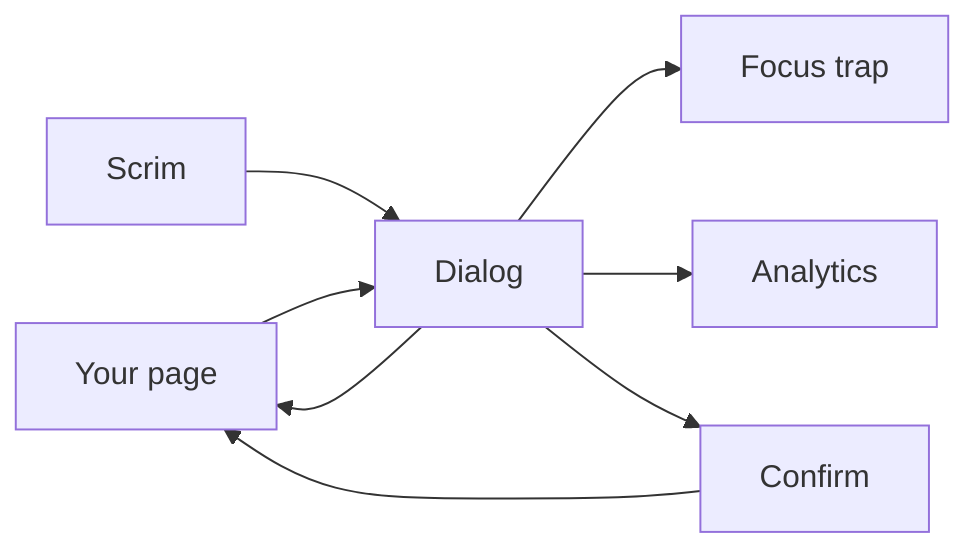
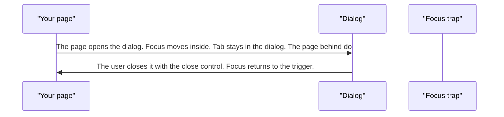
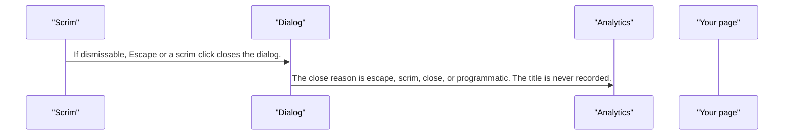
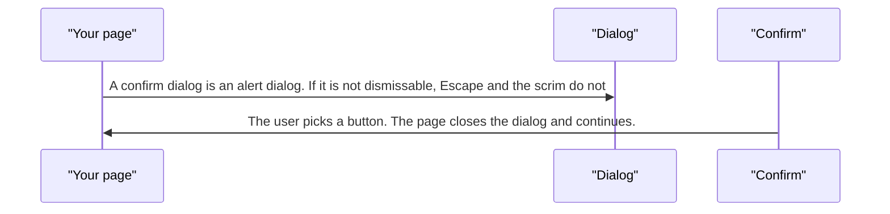

# pixel-dialog — design

This page explains **pixel-dialog** in plain language. The exact input and output names live in [README.md](./README.md). This page does not copy that table.

**Walk through every flow:** open [orchestration.html](./orchestration.html) in a browser (serve the `src/lib` folder so the shared player script can load).

## 1. What this does, and what it does not

A modal window. Focus is trapped inside until it closes. Escape and the scrim close it only when the page allows dismiss. A confirm dialog is an alert dialog. The body scrolls, not the whole page.

| This piece does | It does not |
| --- | --- |
| Shows a modal and restores focus to the trigger | Close on Escape when the page marked it not dismissable |
| Records open and close reasons if analytics is on | Send the dialog title to analytics |

## 2. Who talks to whom

## 3. Flows

### Open and close

1. The page opens the dialog. Focus moves inside. Tab stays in the dialog. The page behind does not scroll.
2. The user closes it with the close control. Focus returns to the trigger.

### Escape or scrim

1. If dismissable, Escape or a scrim click closes the dialog.
2. The close reason is escape, scrim, close, or programmatic. The title is never recorded.

### Must choose

1. A confirm dialog is an alert dialog. If it is not dismissable, Escape and the scrim do nothing.
2. The user picks a button. The page closes the dialog and continues.

## 4. Step by step

### Open and close

### Escape or scrim

### Must choose

## 5. States

- Closed.
- Open, focus trapped, body scrolling inside the dialog.
- Dismissable or locked.
- Confirm: alert dialog.

## 6. Easy to get wrong

- Do not send the title to analytics. Send the close reason only.
- A locked dialog must not close on Escape or the scrim.
- Restore focus to the trigger. Do not leave focus on the body.

## 7. Files

- `pixel-confirm-dialog.ts`
- `pixel-dialog-container.ts`
- `pixel-dialog-ref.ts`
- `pixel-dialog.scss`
- `pixel-dialog.service.ts`
- `pixel-dialog.ts`
- `pixel-dialog.types.ts`

The behavior contract stays in [README.md](./README.md). If this page and the README disagree, the README wins. Fix this page.
