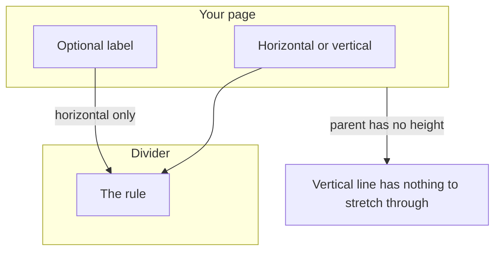
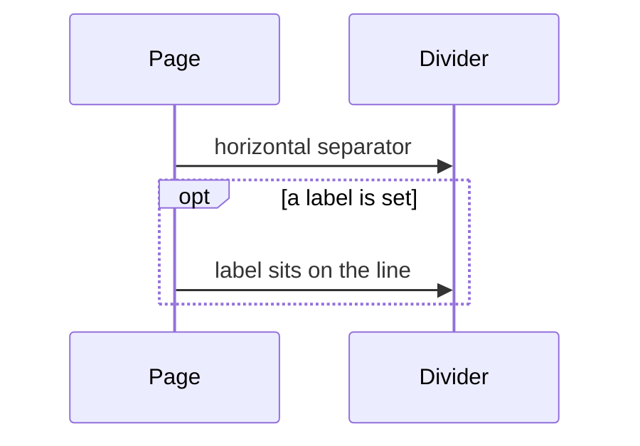
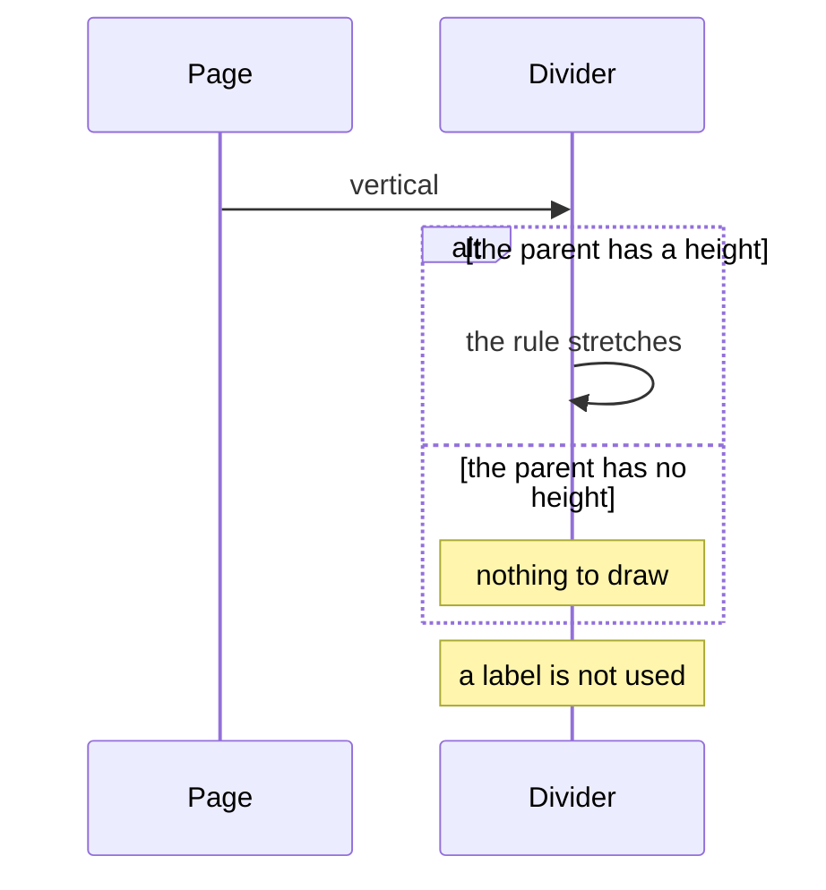
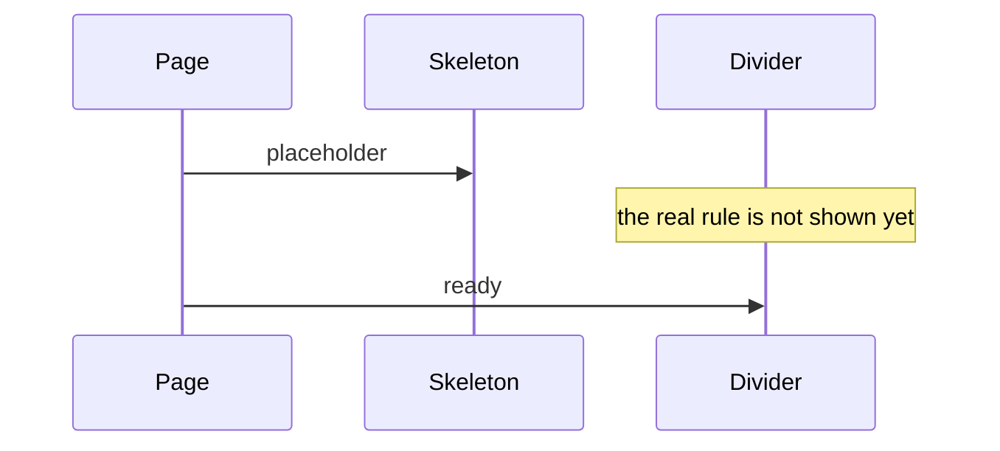

# pixel-divider — design

This page explains **pixel-divider** in plain language. The exact input and output names live in [README.md](./README.md). This page does not copy that table.

**Walk through every flow:** open [orchestration.html](./orchestration.html) in a browser (serve the `src/lib` folder so the shared player script can load).

## 1. What this does, and what it does not

A line that separates regions. Horizontal is the default. Vertical only works when the parent has a height. A label is for horizontal lines only.

| This piece does | It does not |
| --- | --- |
| Draws a horizontal or vertical rule | Replace a heading |
| Can show a short label on a horizontal line | Label a vertical line |

## 2. Who talks to whom

A divider is a separator, not a heading. Horizontal is the default. Vertical only works when the parent has a height. A label is allowed only on a horizontal line.

**How to read the picture**

- **Horizontal is the default.** It is announced as a separator.
- **Vertical.** The parent must have a height. Otherwise the line does not show.
- **Label.** Only on a horizontal line. Inset, dashed, and dotted stay on that same line.
- **Skeleton.** The placeholder replaces the rule until the page is ready.

## 3. Flows

### Horizontal

1. The page places a divider. It is horizontal and announced as a separator.
2. A label, if set, sits on that horizontal line. Inset and dashed or dotted styles stay on the same line.

### Vertical

1. The page asks for vertical. The parent must have a height, or the line has nothing to stretch through.
2. A label is not used on a vertical line.

### Skeleton

1. The page shows a skeleton. The divider is busy and is not the real rule yet.
2. Ready. The skeleton leaves and the rule is shown.

## 4. Step by step

Section 3 is the short list. Each picture here is one of those flows, with the branch that changes what the developer must do. Read the note under the picture before copying the pattern.

### Horizontal

Use a label for a short section name on the line. Do not use the divider as the page heading.

### Vertical

Give the parent a height before you ask for a vertical divider. Do not add a label to it.

### Skeleton

The skeleton uses the same shimmer as other placeholders. It is not a second style of rule.

## 5. States

- Horizontal (default) or vertical.
- Solid, dashed, or dotted.
- With or without a label (label is horizontal only).
- Inset, or full bleed.
- Skeleton while loading.

## 6. Easy to get wrong

- A vertical divider in a parent with no height will not show. Give the parent a height.
- Do not put a label on a vertical divider.

## 7. Files

- `pixel-divider.scss`
- `pixel-divider.ts`

The behavior contract stays in [README.md](./README.md). If this page and the README disagree, the README wins. Fix this page.
