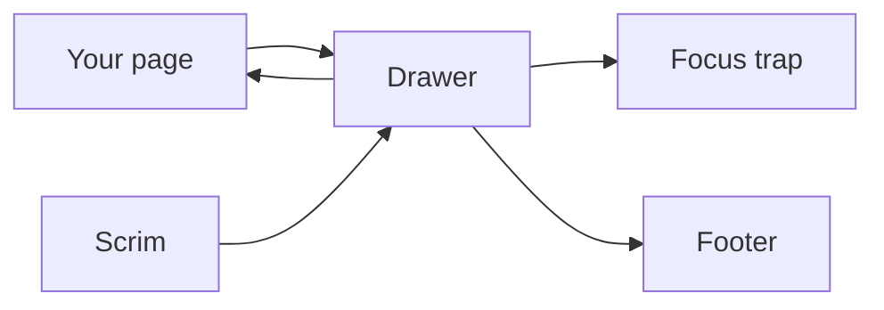
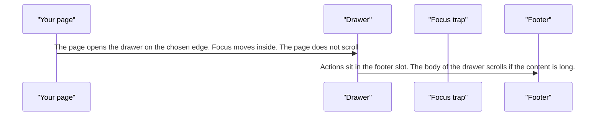
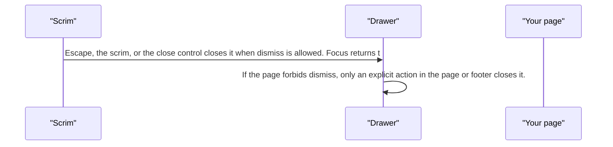

# pixel-drawer — design

This page explains **pixel-drawer** in plain language. The exact input and output names live in [README.md](./README.md). This page does not copy that table.

**Walk through every flow:** open [orchestration.html](./orchestration.html) in a browser (serve the `src/lib` folder so the shared player script can load).

## 1. What this does, and what it does not

A panel that slides in from an edge. It traps focus and locks page scroll, like a dialog. Escape and the scrim close it when dismiss is allowed. A side drawer uses the viewport height.

| This piece does | It does not |
| --- | --- |
| Shows a side or edge panel with a footer slot | Leave the page scrollable while open |
| Restores focus on close | Send the drawer title to analytics |

## 2. Who talks to whom

## 3. Flows

### Open

1. The page opens the drawer on the chosen edge. Focus moves inside. The page does not scroll.
2. Actions sit in the footer slot. The body of the drawer scrolls if the content is long.

### Close

1. Escape, the scrim, or the close control closes it when dismiss is allowed. Focus returns to the trigger.
2. If the page forbids dismiss, only an explicit action in the page or footer closes it.

## 4. Step by step

### Open

### Close

## 5. States

- Closed or open.
- Edge: start, end, top, or bottom. Horizontal drawers use the viewport height.
- Dismissable or locked.

## 6. Easy to get wrong

- Do not keep scrolling the page behind an open drawer.
- Analytics, if on, records drawer open and close without the title.

## 7. Files

- `pixel-drawer-container.ts`
- `pixel-drawer-ref.ts`
- `pixel-drawer.scss`
- `pixel-drawer.service.ts`
- `pixel-drawer.ts`
- `pixel-drawer.types.ts`

The behavior contract stays in [README.md](./README.md). If this page and the README disagree, the README wins. Fix this page.
