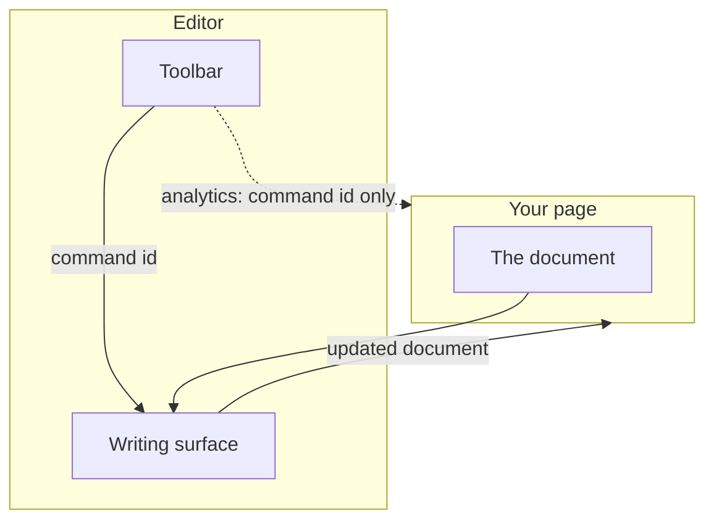
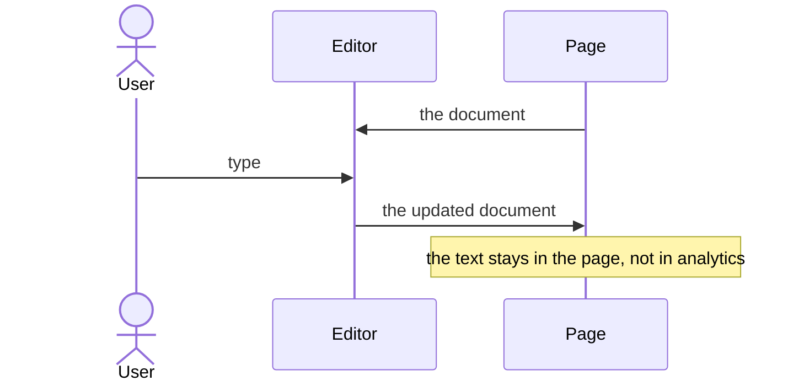
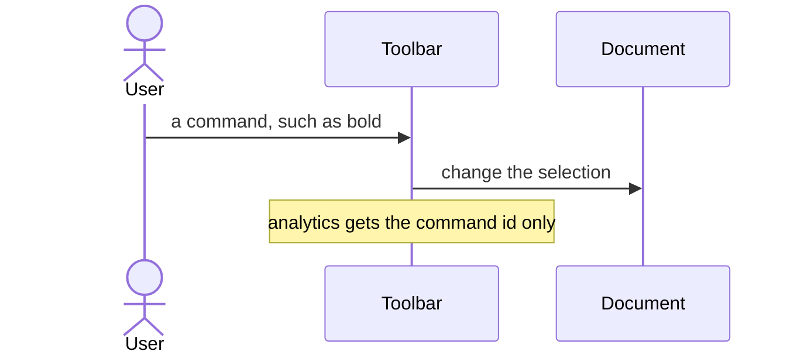

# pixel-editor — design

This page explains **pixel-editor** in plain language. The exact input and output names live in [README.md](./README.md). This page does not copy that table.

**Walk through every flow:** open [orchestration.html](./orchestration.html) in a browser (serve the `src/lib` folder so the shared player script can load).

## 1. What this does, and what it does not

A rich text surface with a toolbar. Import it from pixel-ui/editor, not the main barrel. The toolbar is a toolbar. The writing area is a multiline textbox. Analytics records the command id only, never the document text.

| This piece does | It does not |
| --- | --- |
| Edits formatted text | Send the document, a find query, or a pasted URL to analytics |
| Runs toolbar commands | Include find-and-replace or a table toolbar (those are not in this control yet) |

## 2. Who talks to whom

Import the editor from pixel-ui/editor, not the main barrel. The toolbar runs commands. The writing area is a multiline text box. Analytics records the command id only, never the document.

**How to read the picture**

- **The page owns the document.** The editor reports the update. The text is not an analytics payload.
- **Toolbar.** Bold and the other commands change the selection. If analytics is on, only the command id is recorded.
- **Not included.** Find-and-replace and a table toolbar are not in this control yet.

## 3. Flows

### Edit

1. The page gives the editor a document. The user types in the textbox.
2. The page reads the updated document from the editor output. The text stays in the page, not in analytics.

### Toolbar command

1. The user presses a toolbar button, such as bold. The command changes the selection in the document.
2. If analytics is on, only the command id is recorded. Not the text, not a search string, not a link URL.

## 4. Step by step

Section 3 is the short list. Each picture here is one of those flows, with the branch that changes what the developer must do. Read the note under the picture before copying the pattern.

### Edit

Read the document from the editor output. Do not scrape the DOM for the saved value.

### Toolbar command

Do not put the document, a search string, a link URL, or pasted text into analytics.

## 5. States

- Ready, focused textbox, and disabled toolbar buttons when a command does not apply.
- Empty document.
- Read-only when the page disallows edits.

## 6. Easy to get wrong

- Import from pixel-ui/editor.
- Do not expect a find toolbar or a table toolbar. They are deferred.
- Do not put document text in analytics.

## 7. Files

- `extensions`
- `pickers`
- `pixel-editor-content-styles.ts`
- `pixel-editor-date.util.ts`
- `pixel-editor-doc.util.ts`
- `pixel-editor-find-bar.html`
- `pixel-editor-find-bar.scss`
- `pixel-editor-find-bar.ts`
- `pixel-editor-image-crop.util.ts`
- `pixel-editor-image-toolbar.html`
- `pixel-editor-image-toolbar.scss`
- `pixel-editor-image-toolbar.ts`
- `pixel-editor-labels.ts`
- `pixel-editor-markdown.util.ts`
- `pixel-editor-status-bar.html`
- `pixel-editor-status-bar.scss`
- `pixel-editor-status-bar.ts`
- `pixel-editor-table-toolbar.html`
- `pixel-editor-table-toolbar.scss`
- `pixel-editor-table-toolbar.ts`
- `pixel-editor-toolbar.html`
- `pixel-editor-toolbar.scss`
- `pixel-editor-toolbar.ts`
- `pixel-editor.html`
- `pixel-editor.scss`
- `pixel-editor.service.ts`
- `pixel-editor.ts`
- `pixel-editor.types.ts`
- `public-api.ts`

The behavior contract stays in [README.md](./README.md). If this page and the README disagree, the README wins. Fix this page.
