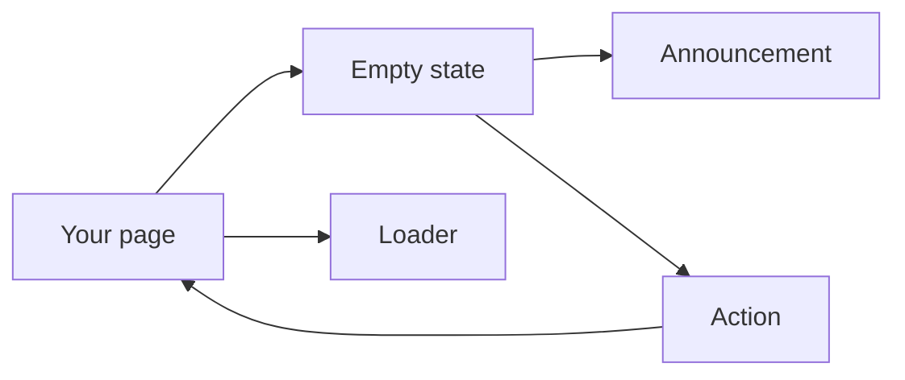
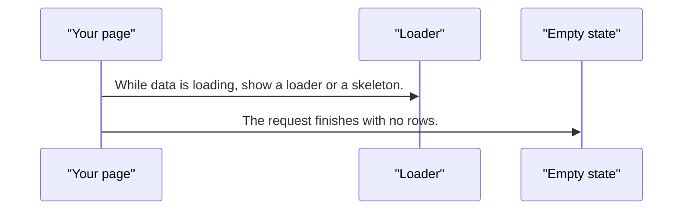
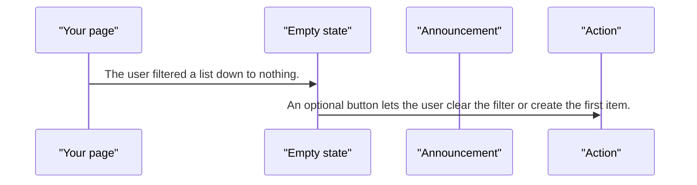
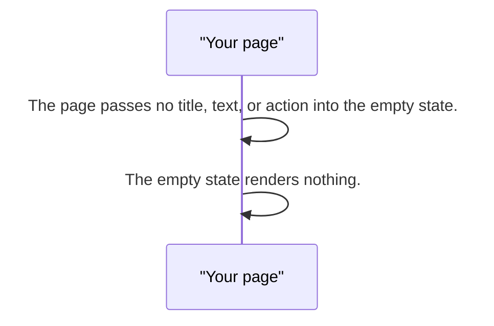

# pixel-empty-state — design

This page explains **pixel-empty-state** in plain language. The exact input and output names live in [README.md](./README.md). This page does not copy that table.

**Walk through every flow:** open [orchestration.html](./orchestration.html) in a browser (serve the `src/lib` folder so the shared player script can load).

## 1. What this does, and what it does not

What the page shows when there is nothing to list. If you pass no content, it renders nothing. It announces itself only when it replaces something that was already on screen. A first paint that is empty should stay quiet. Loading is a skeleton or a loader, then either data or this state.

| This piece does | It does not |
| --- | --- |
| Explains an empty list and offers an action | Show a skeleton. Loading is a different control |
| Announces a dynamic empty result | Announce on the first paint of a page that loads empty |

## 2. Who talks to whom

## 3. Flows

### First paint

1. While data is loading, show a loader or a skeleton. Do not show the empty state yet.
2. The request finishes with no rows. The empty state appears. It does not announce, because this is the first result.

### Replaces a list

1. The user filtered a list down to nothing. The empty state replaces rows and announces that, politely.
2. An optional button lets the user clear the filter or create the first item.

### No content

1. The page passes no title, text, or action into the empty state.
2. The empty state renders nothing. There is no announcement and no action button.

## 4. Step by step

### First paint

### Replaces a list

### No content

## 5. States

- Not rendered when there is no content.
- Visible and quiet on first paint.
- Visible and announced when it replaces existing content.

## 6. Easy to get wrong

- Do not use this as a loading state.
- Do not announce a static empty first paint.
- Do not use this inside a select panel. Select has its own short empty message.

## 7. Files

- `pixel-empty-state.html`
- `pixel-empty-state.scss`
- `pixel-empty-state.ts`

The behavior contract stays in [README.md](./README.md). If this page and the README disagree, the README wins. Fix this page.
