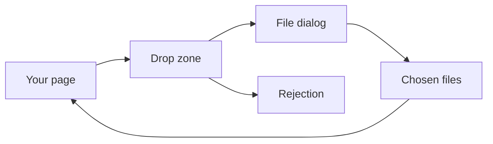
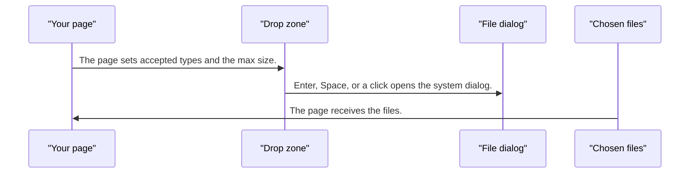
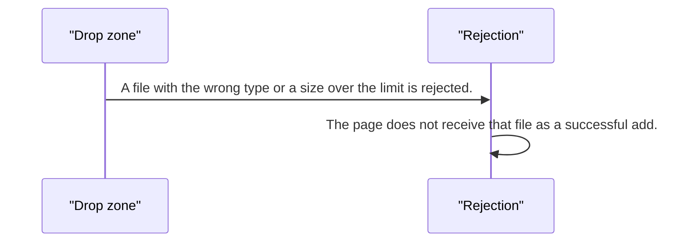

# pixel-file-upload — design

This page explains **pixel-file-upload** in plain language. The exact input and output names live in [README.md](./README.md). This page does not copy that table.

**Walk through every flow:** open [orchestration.html](./orchestration.html) in a browser (serve the `src/lib` folder so the shared player script can load).

## 1. What this does, and what it does not

A drop zone and a hidden file input. The user can drop files or press Enter or Space to open the system file dialog. Analytics may count files and coarse type or size buckets. It never records file names.

| This piece does | It does not |
| --- | --- |
| Accepts dropped or picked files | Upload bytes by itself (the page or file-transfer service does that) |
| Rejects the wrong type or a file that is too large | Send file names to analytics |

## 2. Who talks to whom

## 3. Flows

### Pick files

1. The page sets accepted types and the max size. The zone is a button plus a hidden file input.
2. Enter, Space, or a click opens the system dialog. Dropping files skips the dialog.
3. The page receives the files. Names stay on screen for the user. They are not sent to analytics.

### Reject a file

1. A file with the wrong type or a size over the limit is rejected. The message uses the component labels.
2. The page does not receive that file as a successful add.

## 4. Step by step

### Pick files

### Reject a file

## 5. States

- Idle, drag-over, and disabled.
- Files listed after a successful pick.
- Error for type or size.
- Busy if the page shows progress while it uploads.

## 6. Easy to get wrong

- This control collects files. It does not run the HTTP upload. Hand the files to your upload code or the file-transfer service.
- Never log file names in analytics. Counts and coarse buckets only.

## 7. Files

- `pixel-file-upload.html`
- `pixel-file-upload.scss`
- `pixel-file-upload.ts`
- `pixel-file-upload.types.ts`

The behavior contract stays in [README.md](./README.md). If this page and the README disagree, the README wins. Fix this page.
