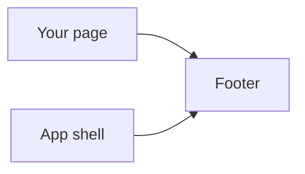
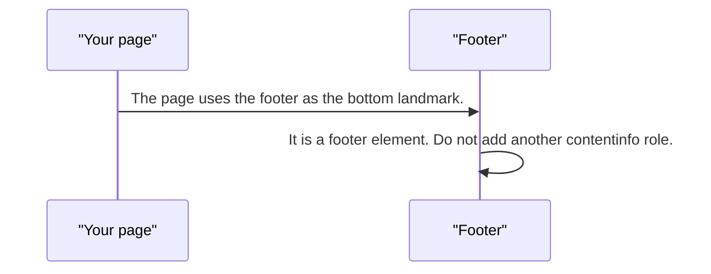
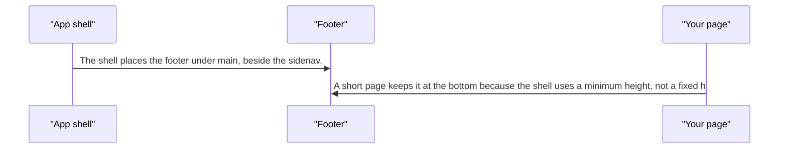

# pixel-footer — design

This page explains **pixel-footer** in plain language. The exact input and output names live in [README.md](./README.md). This page does not copy that table.

**Walk through every flow:** open [orchestration.html](./orchestration.html) in a browser (serve the `src/lib` folder so the shared player script can load).

## 1. What this does, and what it does not

The bottom landmark. It is a real footer element. Inside the app shell it sits at the end of the column beside the sidenav.

| This piece does | It does not |
| --- | --- |
| Renders the bottom bar as a footer landmark | Replace the app shell |
| Holds links and status for the page | Become a sticky toolbar by itself |

## 2. Who talks to whom

## 3. Flows

### On its own

1. The page uses the footer as the bottom landmark.
2. It is a footer element. Do not add another contentinfo role.

### Inside the shell

1. The shell places the footer under main, beside the sidenav.
2. A short page keeps it at the bottom because the shell uses a minimum height, not a fixed height.

## 4. Step by step

### On its own

### Inside the shell

## 5. States

- Present with projected links or status.
- Inside the shell, at the end of the content column.

## 6. Easy to get wrong

- Do not nest another footer inside it.
- Do not give the shell a fixed height or the footer will cover long pages.

## 7. Files

- `pixel-footer.scss`
- `pixel-footer.ts`

The behavior contract stays in [README.md](./README.md). If this page and the README disagree, the README wins. Fix this page.
