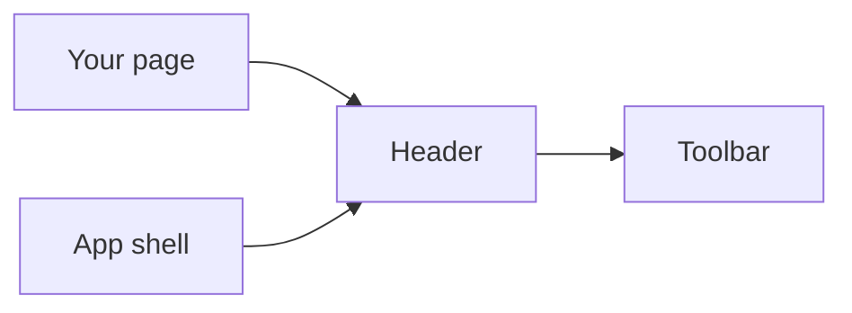
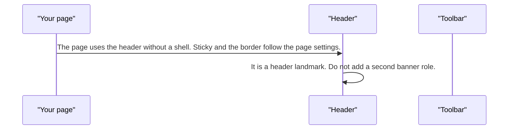
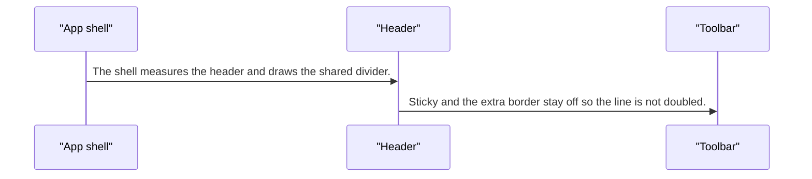

# pixel-header — design

This page explains **pixel-header** in plain language. The exact input and output names live in [README.md](./README.md). This page does not copy that table.

**Walk through every flow:** open [orchestration.html](./orchestration.html) in a browser (serve the `src/lib` folder so the shared player script can load).

## 1. What this does, and what it does not

The top landmark. It is a real header element. Sticky and a bottom border apply when the header is used on its own. Inside the app shell those are suppressed so the shell can draw one line.

| This piece does | It does not |
| --- | --- |
| Renders the top bar as a header landmark | Replace the app shell |
| Can stick and show a border when standalone | Draw that border again inside the shell |

## 2. Who talks to whom

## 3. Flows

### On its own

1. The page uses the header without a shell. Sticky and the border follow the page settings.
2. It is a header landmark. Do not add a second banner role.

### Inside the shell

1. The shell measures the header and draws the shared divider.
2. Sticky and the extra border stay off so the line is not doubled.

## 4. Step by step

### On its own

### Inside the shell

## 5. States

- Standalone: sticky and border as set.
- Inside the shell: those chrome flags forced off.

## 6. Easy to get wrong

- Do not wrap it in another header. It is already the landmark.
- Inside the shell, do not fight the shared divider.

## 7. Files

- `pixel-header.scss`
- `pixel-header.ts`

The behavior contract stays in [README.md](./README.md). If this page and the README disagree, the README wins. Fix this page.
