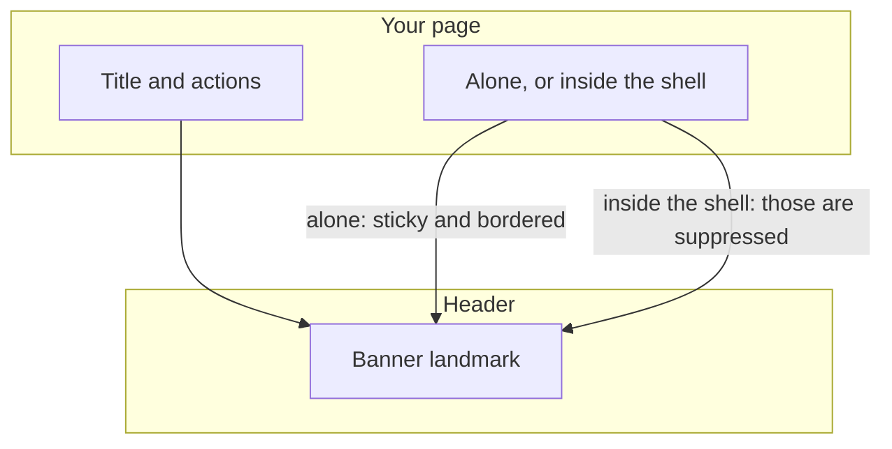
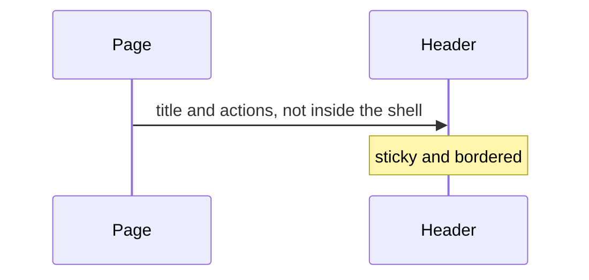
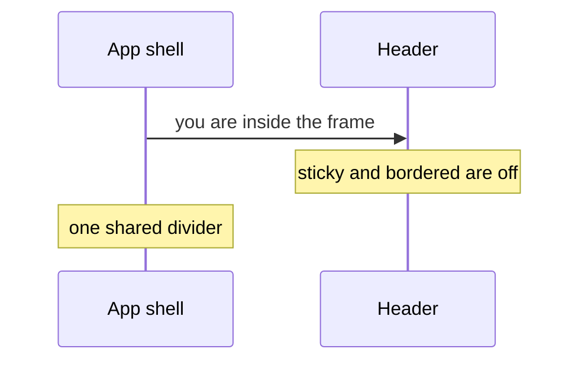

# pixel-header — design

This page explains **pixel-header** in plain language. The exact input and output names live in [README.md](./README.md). This page does not copy that table.

**Walk through every flow:** open [orchestration.html](./orchestration.html) in a browser (serve the `src/lib` folder so the shared player script can load).

## 1. What this does, and what it does not

The top landmark. It is a real header element. Sticky and a bottom border apply when the header is used on its own. Inside the app shell those are suppressed so the shell can draw one line.

| This piece does | It does not |
| --- | --- |
| Renders the top bar as a header landmark | Replace the app shell |
| Can stick and show a border when standalone | Draw that border again inside the shell |

## 2. Who talks to whom

The header is a real banner landmark. Sticky and bordered apply when it stands alone. Inside the app shell those are turned off so the shell can draw one shared divider.

**How to read the picture**

- **Use the header component** so the page has a banner. Do not style a div as the banner.
- **Standalone.** Sticky and bordered are the header’s own chrome.
- **Inside the shell.** The shell suppresses that chrome. Do not fight it with a second border.

## 3. Flows

### On its own

1. The page uses the header without a shell. Sticky and the border follow the page settings.
2. It is a header landmark. Do not add a second banner role.

### Inside the shell

1. The shell measures the header and draws the shared divider.
2. Sticky and the extra border stay off so the line is not doubled.

## 4. Step by step

Section 3 is the short list. Each picture here is one of those flows, with the branch that changes what the developer must do. Read the note under the picture before copying the pattern.

### On its own

This is the right setup for a page that does not use the app shell.

### Inside the shell

Do not re-enable the header border inside the shell. The frame already has the line.

## 5. States

- Standalone: sticky and border as set.
- Inside the shell: those chrome flags forced off.

## 6. Easy to get wrong

- Do not wrap it in another header. It is already the landmark.
- Inside the shell, do not fight the shared divider.

## 7. Files

- `pixel-header.scss`
- `pixel-header.ts`

The behavior contract stays in [README.md](./README.md). If this page and the README disagree, the README wins. Fix this page.
