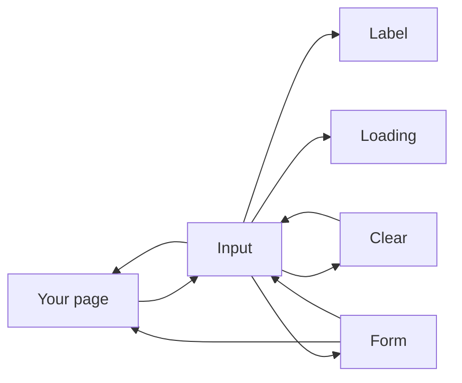
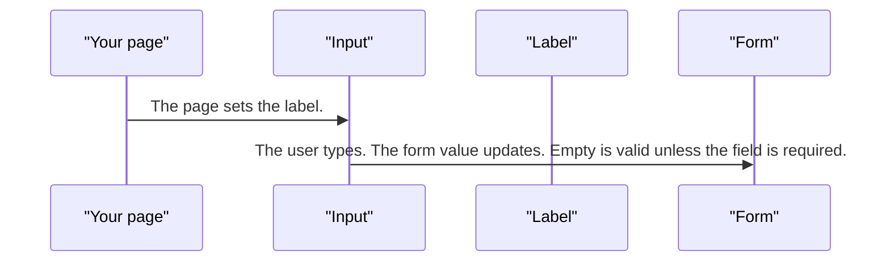
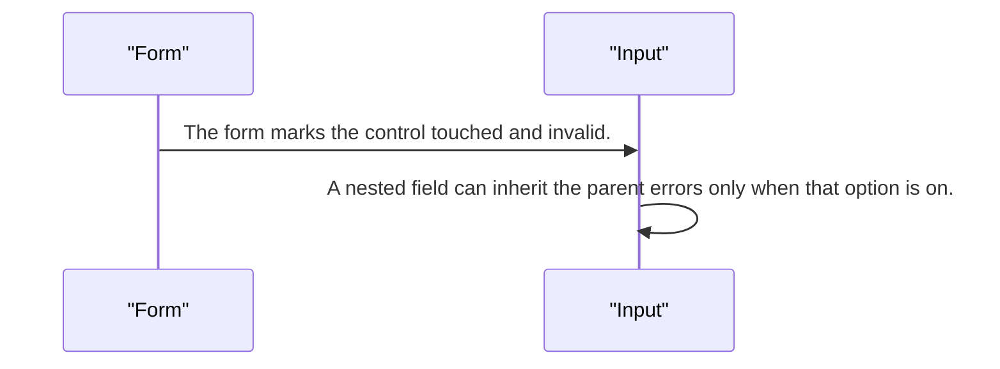
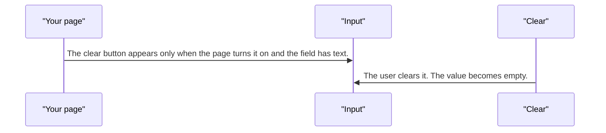
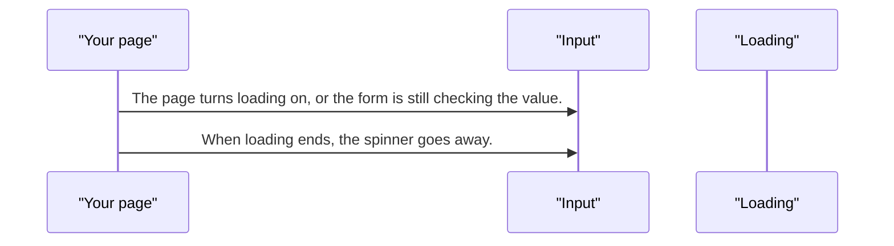

# pixel-input — design

This page explains **pixel-input** in plain language. The exact input and output names live in [README.md](./README.md). This page does not copy that table.

**Walk through every flow:** open [orchestration.html](./orchestration.html) in a browser (serve the `src/lib` folder so the shared player script can load).

## 1. What this does, and what it does not

A single text field with a label, helper text, and errors. It works with reactive forms and template forms. The label can sit on top, on the left, float, or be hidden (still named for screen readers).

| This piece does | It does not |
| --- | --- |
| Edits one text value | Pick from a list (use pixel-select or pixel-autocomplete) |
| Shows required, error, and loading | Clear the field unless the page asks for a clear button |

## 2. Who talks to whom

## 3. Flows

### Type

1. The page sets the label. Top is the default. Left stacks under the field on a narrow screen. Hidden still names the field.
2. The user types. The form value updates. Empty is valid unless the field is required.

### Error

1. The form marks the control touched and invalid. The error text is shown and tied to the field.
2. A nested field can inherit the parent errors only when that option is on. Otherwise it keeps its own errors.

### Clear

1. The clear button appears only when the page turns it on and the field has text.
2. The user clears it. The value becomes empty.

### Loading

1. The page turns loading on, or the form is still checking the value. A spinner covers the field. Typing still works unless the page also disables the field while loading.
2. When loading ends, the spinner goes away.

## 4. Step by step

### Type

### Error

### Clear

### Loading

## 5. States

- Empty, filled, focused, disabled, and readonly.
- Required. Empty is valid until required says otherwise.
- Error after the form says the control is invalid.
- Loading overlay while the page is busy.
- Label positions: top, left, floating, or hidden.

## 6. Easy to get wrong

- The clear button is off until the page sets it. Do not expect it by default.
- Left labels wrap below the field on small screens. Plan for that stack.
- Do not treat a nested control as inheriting parent errors unless that option is on.

## 7. Files

- `pixel-input.html`
- `pixel-input.scss`
- `pixel-input.ts`

The behavior contract stays in [README.md](./README.md). If this page and the README disagree, the README wins. Fix this page.
