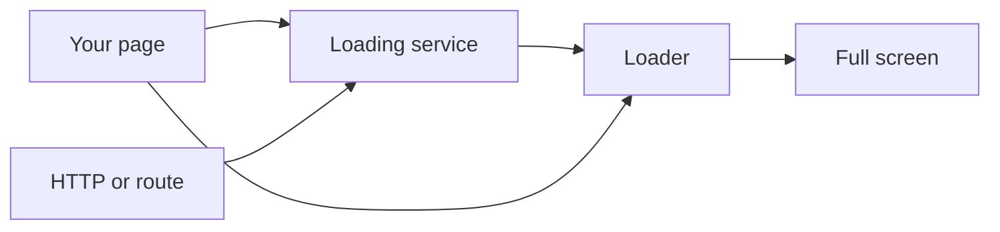
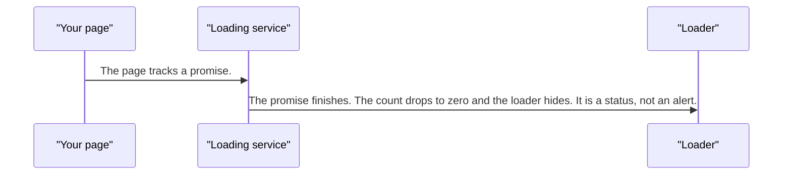
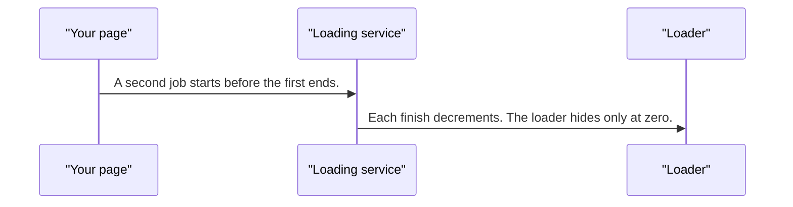
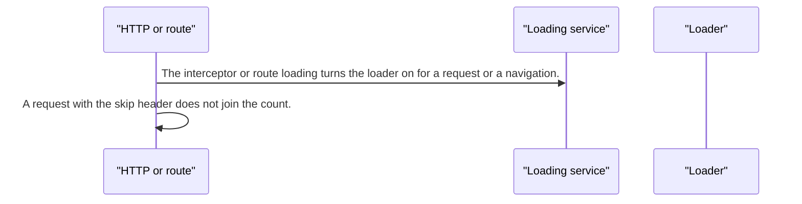
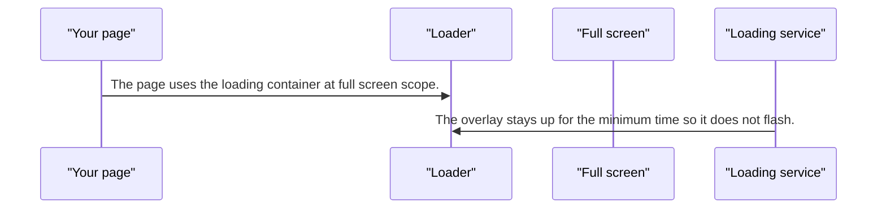

# pixel-loader — design

This page explains **pixel-loader** in plain language. The exact input and output names live in [README.md](./README.md). This page does not copy that table.

**Walk through every flow:** open [orchestration.html](./orchestration.html) in a browser (serve the `src/lib` folder so the shared player script can load).

## 1. What this does, and what it does not

A busy indicator. It can wait a moment before showing, and it can stay up for a minimum time so it does not flash. A loading service counts overlapping jobs. Full screen locks scroll. An HTTP interceptor and route loading can turn it on. A request can opt out with a skip header.

| This piece does | It does not |
| --- | --- |
| Shows progress for a job, a request, or a route | Replace an empty state |
| Reference-counts overlapping work | Hide in the middle of a job that is still running |

## 2. Who talks to whom

## 3. Flows

### One job

1. The page tracks a promise. The loader waits for the show delay, then appears, and stays at least the minimum time.
2. The promise finishes. The count drops to zero and the loader hides. It is a status, not an alert.

### Two jobs

1. A second job starts before the first ends. The count is 2. The loader stays.
2. Each finish decrements. The loader hides only at zero.

### Request or route

1. The interceptor or route loading turns the loader on for a request or a navigation.
2. A request with the skip header does not join the count.

### Full screen

1. The page uses the loading container at full screen scope. While that overlay is showing, page scroll is locked.
2. The overlay stays up for the minimum time so it does not flash. When it hides, scroll unlocks. The service count is separate: the global loader hides only when that count is zero.

## 4. Step by step

### One job

### Two jobs

### Request or route

### Full screen

## 5. States

- Hidden during the show delay.
- Visible, including a minimum time so it does not flicker.
- Full screen with scroll locked.
- Idle when the count is zero.

## 6. Easy to get wrong

- Do not hide the loader when one of two jobs ends.
- Use the skip header for requests that must not flash the loader.
- This is not the empty state. Show the loader first, then data or the empty state.

## 7. Files

- `_pixel-loader-shared.scss`
- `pixel-loader.html`
- `pixel-loader.scss`
- `pixel-loader.service.ts`
- `pixel-loader.ts`
- `pixel-loader.types.ts`
- `pixel-loading-container.html`
- `pixel-loading-container.scss`
- `pixel-loading-container.ts`
- `pixel-loading-router.service.ts`
- `pixel-loading-router.ts`
- `pixel-loading.interceptor.ts`
- `pixel-loading.service.ts`
- `pixel-skeleton.html`
- `pixel-skeleton.scss`
- `pixel-skeleton.ts`

The behavior contract stays in [README.md](./README.md). If this page and the README disagree, the README wins. Fix this page.
