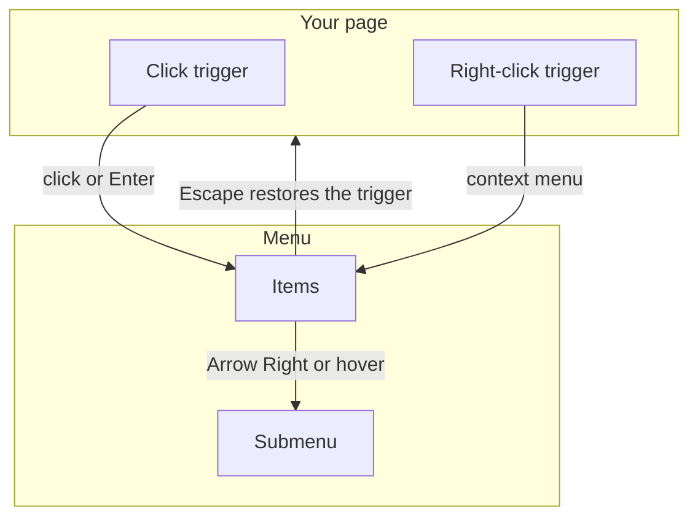
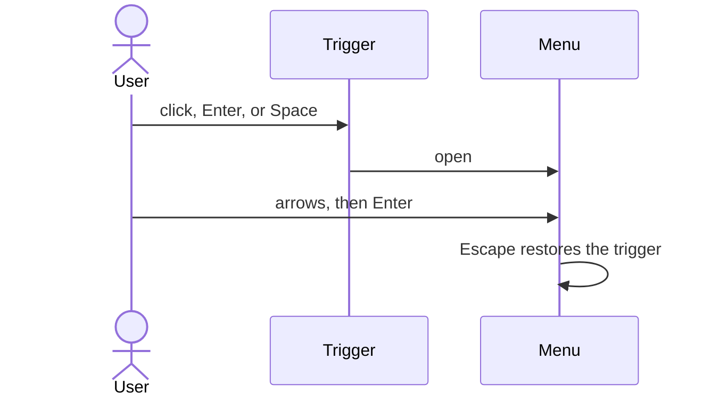
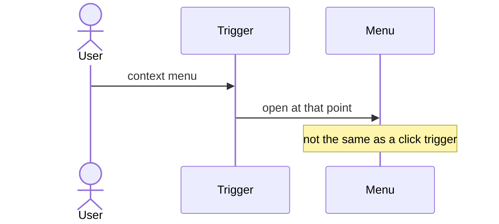
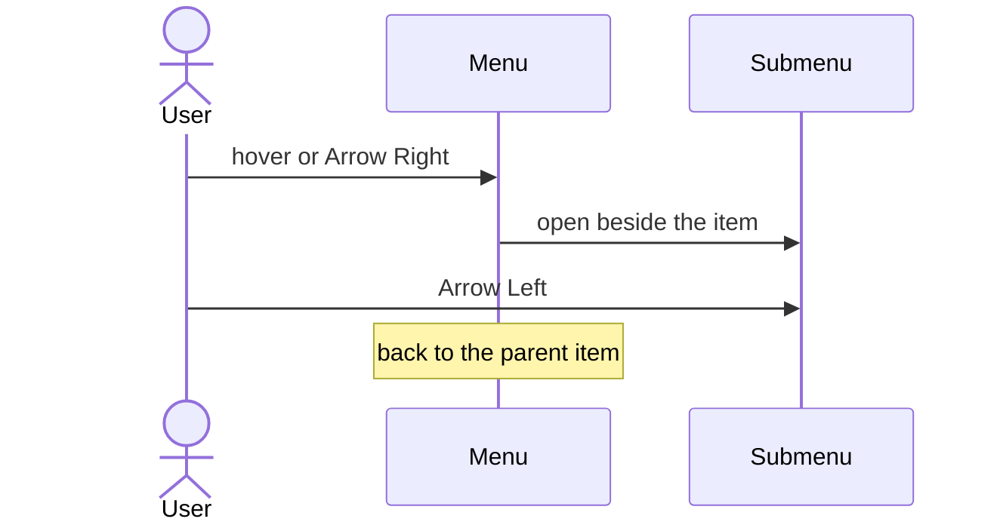

# pixel-menu — design

This page explains **pixel-menu** in plain language. The exact input and output names live in [README.md](./README.md). This page does not copy that table.

**Walk through every flow:** open [orchestration.html](./orchestration.html) in a browser (serve the `src/lib` folder so the shared player script can load).

## 1. What this does, and what it does not

A list of actions opened from a trigger, or from a right-click. A submenu opens on hover or Arrow Right. Escape closes and returns focus to the trigger. The panel is moved to the document body and keeps the theme.

| This piece does | It does not |
| --- | --- |
| Opens a menu of actions | Show a skeleton or virtualize rows |
| Supports nested menus | Trap the whole page like a modal |

## 2. Who talks to whom

The menu is a sibling of the trigger, then it is moved to the body and given a copy of the theme. A click trigger and a right-click trigger are different. There is no skeleton and no virtual list. Nested menus open to the side.

**How to read the picture**

- **Point the trigger at the menu.** The menu is not inside the button.
- **Theme.** Because the menu is moved to the body, the theme is copied onto it. Otherwise it would lose the page colors.
- **Keys.** Arrows move. Enter or Space picks. Escape closes and restores the trigger. Arrow Right opens a submenu. Arrow Left returns.
- **No skeleton.** Do not show a placeholder menu.

## 3. Flows

### Click to open

1. A click on the trigger opens the menu. The panel is portaled and the current theme is copied so colors still work.
2. The user picks an item or presses Escape. Escape returns focus to the trigger.

### Right-click

1. Context-menu mode opens at the pointer when the user right-clicks the trigger.
2. Choosing an item or pressing Escape closes it.

### Submenu

1. Hover or Arrow Right opens a nested menu. Arrow Left returns to the parent item.
2. Escape closes the stack and restores the trigger. There is no skeleton and no virtualized list.

## 4. Step by step

Section 3 is the short list. Each picture here is one of those flows, with the branch that changes what the developer must do. Read the note under the picture before copying the pattern.

### Click to open

Use this for a button menu. The trigger is a normal control, not a right-click target.

### Right-click

Do not put both trigger types on the same element unless you mean both gestures. They are separate.

### Submenu

Submenus are part of the same menu tree. They are not a second popover.

## 5. States

- Closed, open, and submenu open.
- Keyboard highlight moving with arrows.
- Disabled item: skipped.

## 6. Easy to get wrong

- The open panel is not inside the trigger’s component tree. Theme tokens are copied on purpose.
- Do not add a skeleton or row virtualization. The menu is a short action list.

## 7. Files

- `pixel-menu-item.ts`
- `pixel-menu-trigger.ts`
- `pixel-menu.ts`

The behavior contract stays in [README.md](./README.md). If this page and the README disagree, the README wins. Fix this page.
