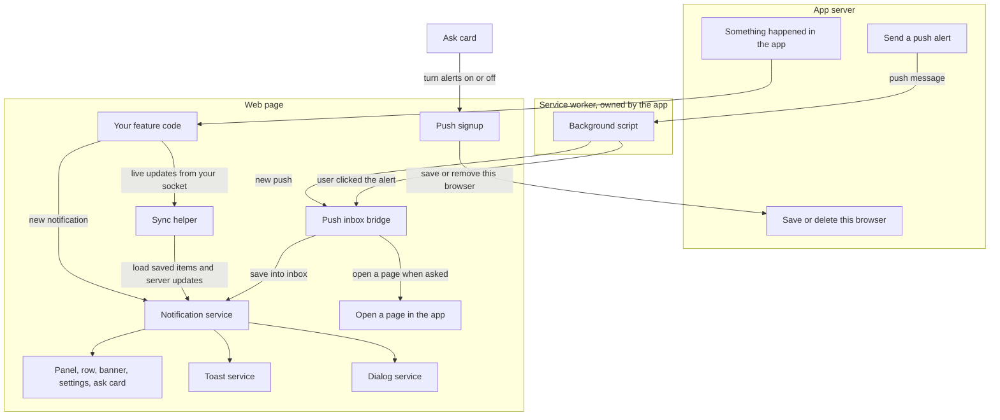
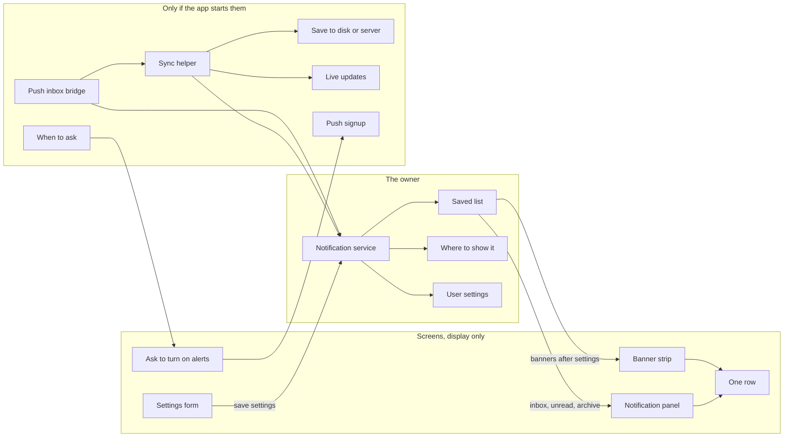
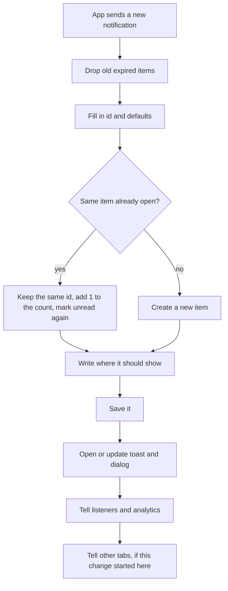
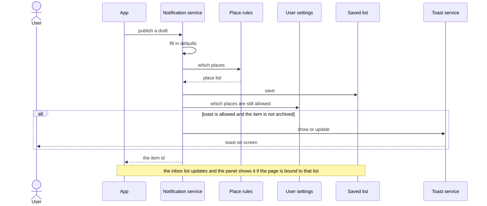
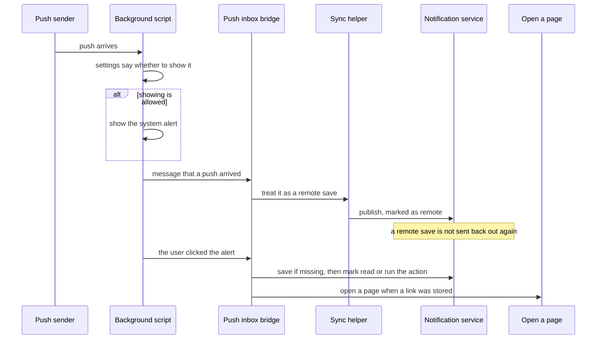
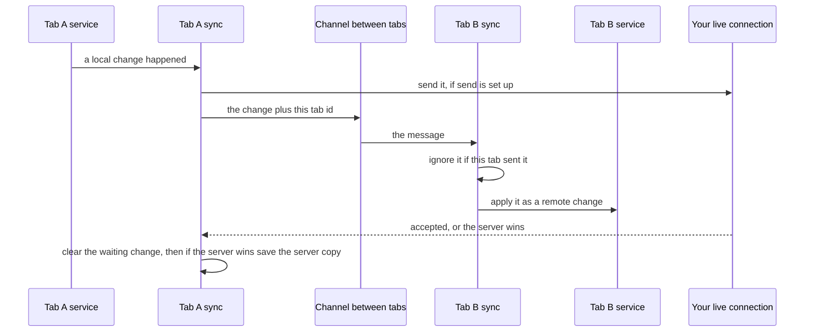
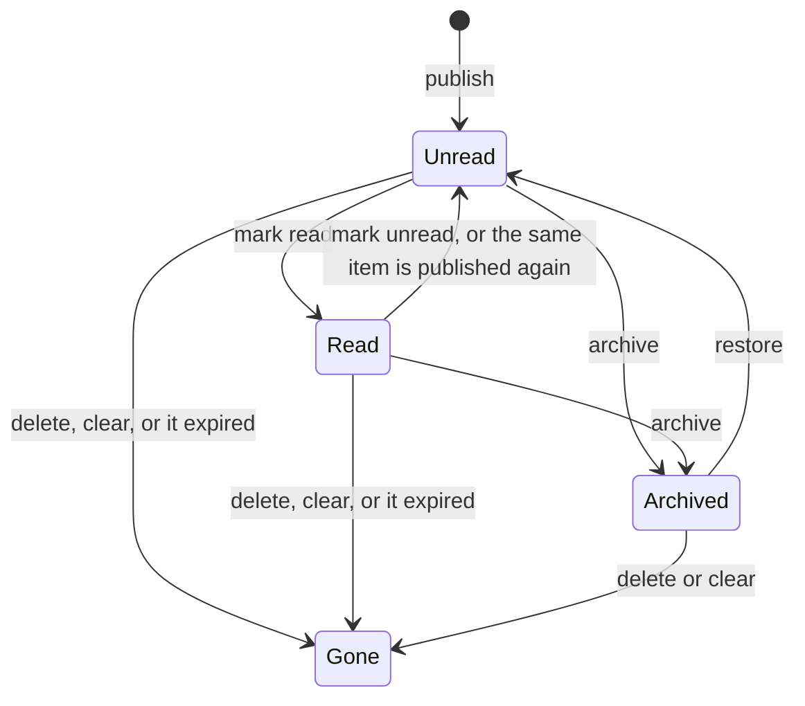

# pixel-notification — design

This page explains how notifications work, in plain language. Exact input and output names are in [README.md](./README.md).

**Interactive walkthrough:** open [orchestration.html](./orchestration.html) in a browser to step through publish, toast-only, quiet hours, hydrate, system alert, and two-tab sync.

**One rule:** there is one saved notification. The inbox, the toast, the banner, the dialog, and the phone or desktop alert are different ways to show that same item. They are not five different notifications.

---

## 1. What this feature does, and what it does not

`PixelNotificationService` is the owner. The app hands it a new notification. The service fills in missing fields, saves it, and shows it in the places the rules allow.

The panel, the row, and the banner only draw what the page gives them. They do not save or change notifications on their own.

| This library does | The app does |
| --- | --- |
| Save the notification and keep the inbox lists | Decide which business event becomes a notification |
| Choose inbox, toast, banner, dialog, or push | Check permissions (who may see or act) |
| Hide noisy alerts when the user mutes a topic or sets quiet hours | Open the socket, send the push, and keep the push keys |
| Show a toast or a dialog when those places are allowed | Put `<pixel-toast-container>` on the page |
| Draw the panel, one row, the banner, settings, and the “turn on alerts” card | Choose where the panel sits (a popover or its own page) |
| Sync and push helpers, after the app calls `start()` | Register the service worker file |
| Helpers the service worker can call to show or open an alert | Actually send the push from the server |
| Helpers for “open this page” and for the alert icon | Check that links are safe. The shell reads `?nav=` |
| `rebindAfterLogin` and `clearOnLogout` | Call those from the login and logout screens |

There is no phone drawer. On a small screen, use a push alert plus a full notifications page. The desktop panel only shrinks so it stays on screen.

If the app hides a button because the user lacks access, that is only for the screen. The server must still refuse the action.

---

## 2. Who talks to whom

The page keeps the inbox. The background script shows the system alert. The server decides who receives that alert.

---

## 3. The pieces

Changes go through the notification service. The panel and the banner only show the list they are given.

| Piece | What it does |
| --- | --- |
| Saved list (`PixelNotificationStore`) | Holds every notification. Also builds inbox, unread, archive, and counts per topic. |
| Notification service | Cleans the draft, merges duplicates, picks places to show, opens toast or dialog, and exposes `banners()`. |
| Where to show it | Writes the `channels` list on the saved item. If the app does not set channels: normal items go to the inbox only. High and critical items also get a toast and are marked as push-eligible. **Banner and dialog are never added by this default.** If the app sets `channels`, that list is used as-is. |
| User settings | Do not rewrite the saved list. They only hide extra alerts. Mute or quiet hours keep the inbox row and hide toast, banner, dialog, and the system alert. Settings cover muted topics, turned-off places, and a quiet-hours window. |
| Sync helper | Loads saved items, applies server messages, sends local changes out, and copies changes to other tabs. |
| Push signup | Asks the browser for permission and subscribes. It is not created automatically. The app must call `providePixelPushNotifications()`. |
| Push inbox bridge | Turns a background-script message into an inbox item. Copies settings to the background script. Reads the “just opened from an alert” link. |
| When to ask | Optional. Opens the “turn on alerts” card after a delay or after a useful moment. It waits if a critical dialog is already open. |
| Panel, row, banner | Display only. The page binds `inbox()` or `banners()` and calls the service when the user acts. |

---

## 4. How to choose

### 4.1 Toast only, or a real notification

| You need | Use |
| --- | --- |
| A short message that disappears, with no inbox, unread count, sync, or phone alert | Call `PixelToastService` yourself |
| A message that stays, with unread, archive, settings, sync, or a system alert | `PixelNotificationService.publish` |
| The same typed message and tracking, but no inbox row | `publish` with `channels: ['toast']` |
| A loud event that must pop up and also stay in the list | Leave channels empty and set priority to high or critical |

Do not show the same words twice, once as a toast and once as a notification. If it is a saved notification, let this service open the toast.

### 4.2 How urgent versus what it means

| | Changes | Does not change |
| --- | --- | --- |
| **How urgent** (`low`, `normal`, `high`, `critical`) | Default places, how hard it interrupts, whether a critical dialog can be dismissed, whether a critical toast stays up | The color or the meaning |
| **What it means** (`neutral`, `info`, `success`, `warning`, `error`) | Toast color, system-alert icon, how the row looks | Whether a toast or a push is sent |

Do not mark every server event as high or critical. Save the loud path for approvals, security, and failures the user must see now.

### 4.3 Default places when the app leaves `channels` empty

| How urgent | Saved places | Notes |
| --- | --- | --- |
| Low or normal | Inbox only | No toast, banner, dialog, or push |
| High or critical | Inbox, toast, and push | A system alert still needs the server to send it, and the user must have allowed it |
| Anything | — | **Banner and dialog only happen if the app lists them, or if you replace the default rule** |

If the app sets `channels`, that list wins. Toast-only never lands in the inbox. A critical item with `channels: ['inbox']` does not toast.

---

## 5. What happens when you publish

Push and banner are only flags on the saved item. Publishing does not pop a system alert. The banner shows only if the page draws `pixel-notification-banner` from `banners()`. A dialog opens only when `dialog` is allowed. The default rule never adds `dialog`.

“Same item” means the same `dedupeKey`, or the same id.

---

## 6. What each action does to the list and the popups

| Action | Saved list | Toast and dialog | Tell other tabs or the server |
| --- | --- | --- | --- |
| Publish, started in this tab | Save or merge | Yes, show or update | Yes |
| Publish, came from the server or another tab | Save or merge | Yes, show or update | No |
| Update | Change the item. Places are rewritten if needed | Update an open toast or dialog. Open one if it is newly allowed | Yes, when this tab started it |
| Load saved items (`hydrate`) | Replace the list | **No.** Do not pop old toasts again | No |
| Change settings | Settings only | Close popups that are no longer allowed | No separate settings saver. The in-memory settings change, and the push bridge copies them to the background script |
| Restore from archive | Put it back in the inbox | **No** new toast or dialog | Yes, when this tab started it |
| Same item published again | Same id, count goes up, unread again | Show the popup again | Yes, when this tab started it |

Changing settings must not flood the screen. Turning quiet hours on, or muting a topic, closes toasts and dialogs that are no longer allowed. It does not open them again for every old high-priority item. Only a later publish or update opens a new popup.

---

## 7. Choices that are easy to get wrong

- **One saved item, many views.** The toast, the banner, and the system alert show the same item. Updating it updates a toast that is already open. Archive and delete close the toast and the dialog.
- **The place list is saved. Settings only hide.** Mute and quiet hours keep the inbox row and hide the other places. Turning a place off hides that place only.
- **`push` means “allowed to be a system alert”, not “show it now”.** The system alert appears when the server sends a push and the background script agrees. Publishing from the page cannot raise a system alert by itself.
- **If the app sets places, urgency does not add more.** See section 4.3.
- **A repeat does not add a second row.** The same `dedupeKey` or id increases the count, clears read and archive, and shows the popup again.
- **The panel does not call the service.** The page decides mark-as-read, archive, and where a click goes. That is why the same panel can sit in a popover or on a full page.
- **Extra helpers are optional.** With no setup call, the in-memory list and the default places still work. Saving, live updates, analytics, and push stay off until the app turns them on.
- **No Angular CDK.** Toast and dialog are Pixel pieces. The panel is just content. The page chooses the popover or the layout.
- **Click handlers are not saved.** A function on an action is dropped before save or push. After load or login, the app attaches them again with `bindActionHandlers`. A toast click cannot wait for that function. Listen to `actionEvents` if you need one place to report errors.
- **The list has a size limit.** It keeps at most `maxItems`, newest first by `createdAt`. Expired rows are removed when something is published, or when the app calls `pruneExpired()`. There is no timer.

---

## 8. Step by step: a local publish that shows a toast

Banner and dialog use the same check. A dialog is skipped when the page is rendering on the server, because there is no `document`. A critical dialog cannot be closed by clicking outside, and it is announced as an alert dialog.

---

## 9. Step by step: a system alert becomes an inbox item

Order on click: the background script focuses or opens a tab, the bridge saves the item if it is missing, then it marks read or runs the action, then it opens a page if a link was stored. If no tab was open, the link includes `pixelPushId` and sometimes `pixelPushAction` so the new page can finish the job.

Turning alerts on is a different path: the ask card calls `enable()`, the push signup asks the browser, the browser subscribes, and the app saves that subscription on the server.

### 9.1 Opening the right page

| What is already open | What happens |
| --- | --- |
| A tab is open, but on another page | Focus that tab, then go to the route |
| A tab is already on that page | Focus it, then move to the section or tab inside the page |
| Several windows | Prefer a tab that is already on that path |
| No tab | Open a new window with the link. After boot, the shell reads the link and the bridge reads the cold-start ids |

For an inbox click, the page decides navigation. For a **system-alert click**, the bridge opens the page itself when it has been started and the navigate service is available. Marking an item read does not open a page.

Two helpers resolve the link, and they are not the same:

| Helper | Order | Used for |
| --- | --- | --- |
| `getNotificationNavigateRequest` | action link object, then `data.nav`, then a **relative** `action.href` | Inbox and in-app open. A full `http` or `https` href is ignored |
| `resolvePixelPushNavigateRequest` | action link object, then `data.nav` | System-alert open. It does not read `href` |

### 9.2 Login, logout, and a changed browser subscription

| When | What to call |
| --- | --- |
| After login, once the background script is ready | `bridge.start()`, and sync `start()` if you use sync. You can also refresh or call `rebindAfterLogin()` |
| After loading saved items | `bindActionHandlers` so action ids work again |
| On logout | `clearOnLogout()` so this browser is not still tied to the old user |
| The browser replaces the push subscription | The page listens for `controllerchange`, not the worker’s `pushsubscriptionchange` event. `PixelPushNotificationService.start()` then refreshes and calls `rebindAfterLogin()` if permission is still granted. The app still saves the new subscription |

---

## 10. Step by step: two tabs stay in step

`start()` loads saved items first, then connects the live feed, then listens to other tabs. A message with an older sequence number is ignored, except a full snapshot, an “accepted” reply, or a “server wins” reply. Each tab has its own random id, so one tab does not ignore the other by mistake.

When the server wins, that server copy is saved into the local list. Sequence numbers only move forward. The app owns reconnect, and it can ask for a replay after the last sequence it saw.

---

## 11. What may interrupt the user, and in what order

When several things want attention, use this order for **new** interruptions:

1. **Critical dialog.** Highest. It is an alert dialog. A critical one may block outside click and Escape.
2. **Toast.** Not a dialog. It can sit on screen while the panel is open. The toast service announces it.
3. **Banner.** Sits in the page. The app places it near the top chrome.
4. **“Turn on alerts” card.** Lowest dialog. It waits while a critical notification dialog is open, waits while the user is typing in a field, and waits out the cooldown after the user dismisses it.

Focus: the critical dialog and the ask card use the dialog focus trap, and focus returns to the button that opened them. The ask card’s first focus is the close button, not Enable, because the close button is the first control in the dialog. The panel’s keyboard behavior belongs to whatever hosts it (popover or page). The toast is announced by the toast live region. This feature does not add a second announcement for the same event.

---

## 12. How to put it on a page

| Screen | How to build it |
| --- | --- |
| Desktop bell | Badge with the unread count, popover, panel bound to `inbox()`. The page handles commands and row clicks |
| Full page, or a small screen | Bind `inbox()` on the page. You can group by day. Use the panel’s “view all”, or skip the popover. Use push when the tab is in the background |
| Banner area | Near the page chrome. Bind `banners()` to `pixel-notification-banner` |
| Toasts | Put `<pixel-toast-container>` on the page once, if any rule can emit a toast |
| Settings | Host `pixel-notification-preferences`. On change, call `setPreferences` |
| Ask to turn on alerts | After a useful moment, or from the scheduler. Do not call `enable()` as soon as the page loads |

The panel does not load data itself. The page passes `loading`, `loadingMore`, `hasMore`, `offline`, `errorMessage`, and `totalCount`. The panel only **emits** mark-all-read, load-more, retry, and view-all. The page calls the service.

---

## 13. How many items, what order, and what we track

### How many, and what order

- The list keeps at most `maxItems`. Newest `createdAt` stays.
- The raw list follows that keep-order. Updating `updatedAt` when someone reads or archives does **not** move the row in the inbox.
- The inbox, the panel, and day groups sort like this: newer day first, then unread before read on that day, then newest `createdAt`.

### What we record, and what we do not

If analytics is connected, it hears publish, update, read, actions, setting changes, and sync. If the shared UI analytics token is also connected, those become `ui.notification.show`, `ui.notification.action`, and `ui.notification.dismiss`. The payload has id, urgency, meaning, and maybe topic or action id. It does **not** include the title or the message. The ask card uses `push_*` names on the same connection. Do not put secrets or personal data in a push body. Send an id, and load the detail when the user opens it.

### What not to trust

Push messages, live updates, and loaded saves are just JSON. They can come from your server or from another tab.

- Saved and pushed actions have ids only, never functions. Attach functions again in the app.
- The app must check `href`, `openUrl`, and `nav` before opening them.
- System-alert pictures come from `resolveOsNotificationVisuals` (avatar, meaning icon, or a large image). Remote image addresses are still the app’s security problem.

---

## 14. The life of one item

This is separate from “what it means” and from the work state (`default`, `loading`, `completed`, `failed`).

Restore does not pop a toast or dialog again. Publishing the same item again clears read and archive, and does pop the toast or dialog again.

When an active item may show:

| Check | Result |
| --- | --- |
| That place is not on the saved list | It never shows there |
| The user turned that place off | It is hidden |
| The topic is muted, or quiet hours are on | The inbox row stays. Toast, banner, dialog, and the system alert stop |
| The item is archived | Toast and dialog close. It leaves the inbox |
| Settings change | Close toast and dialog that are no longer allowed. Do not reopen them for the whole inbox |

Push permission is a separate status on the push signup: idle, busy, subscribed, or error. The browser permission is default, granted, denied, or unsupported.

---

## 15. Who writes the data

| Data | Who writes it | Who reads it |
| --- | --- | --- |
| Saved notifications | The service, through the store | Inbox, unread, unread count, archive, counts by topic, banners |
| Saved places (`channels`) | The place rules, on publish and update | Inbox filter and the settings filter |
| User settings | `setPreferences` | The show-or-hide check. The bridge copies them to the background script |
| Open toast ids and dialog handles | Private maps on the service | Toast and dialog updates only |
| Change and action signals | The service | The page, for errors, navigation, and tracking |
| Sync connection, last sequence, waiting changes | Sync helper | A “connected” indicator if you build one |
| Push permission and status | Push signup | The ask card and settings |

Change types are: published, updated, read, unread, archived, restored, removed, cleared.

A change that came from the server or another tab is not sent out again. That stops two tabs from bouncing the same change forever.

---

## 16. Files

| File | What it is |
| --- | --- |
| `pixel-notification.types.ts` | The notification shape, the draft, and the place names |
| `pixel-notification.config.ts` | Defaults, the default place rule, and `providePixelNotifications` |
| `pixel-notification.store.ts` | The saved list and the inbox views |
| `pixel-notification.service.ts` | The owner |
| `pixel-notification.adapters.ts` | Save, live updates, settings shape, and grouping helpers |
| `pixel-notification.sync.ts` | Load, live updates, and other tabs |
| `pixel-notification-labels.ts` | Default words for the screens |
| `pixel-notification-item.ts` | One row |
| `pixel-notification-panel.ts` | The center. Filters: all, unread, needs action |
| `pixel-notification-banner.ts` | The strip. Shows at most 3 at once |
| `pixel-notification-preferences.ts` | Mute, places, and quiet hours |
| `pixel-notification-dialog.ts` | The body of a critical alert dialog |
| `pixel-notification-push.types.ts` | Push message and status shapes |
| `pixel-notification-push.config.ts` | Push defaults |
| `pixel-notification-push.adapters.ts` | How the app saves a subscription |
| `pixel-notification-push.provide.ts` | `providePixelPushNotifications` |
| `pixel-notification-push.service.ts` | Permission and subscribe |
| `pixel-notification-push.bridge.ts` | Background script messages into the inbox |
| `pixel-notification-push.deep-link.ts` | Cold-start link helpers |
| `pixel-notification-push.visuals.ts` | Icons for the system alert |
| `pixel-notification-push.sw.ts` | Helpers for the background script |
| `pixel-notification-push-prompt.ts` | The ask card |
| `pixel-notification-push-prompt-dialog.ts` | The dialog wrapper around the ask card |
| `pixel-notification-push-prompt.scheduler.ts` | When to open the ask. Default wait after dismiss is 30 days |
| `pixel-notification-push-prompt.scheduler.types.ts` | Scheduler options |
| `pixel-notification-push-prompt.scheduler.provide.ts` | `providePixelPushPromptScheduler` |

Public names are exported from `public-api.ts`. Input tables stay in the README. Tests sit next to these files as `*.spec.ts`.

---

## 17. Details that are easy to break

- **The notification service is created for the whole app. Push signup is not.** You must call `providePixelPushNotifications()` on the same injector that creates the push service. If you forget, inject fails immediately. That is better than a subscribe that quietly does nothing.
- **Sync and the bridge start only when you call `start()`.** Importing the service does not open a socket or listen to the background script. On the server, those starts return immediately because `document` or `serviceWorker` is missing.
- **A settings change does not replay history.** It closes toasts and dialogs that are no longer allowed. It does not show them again for every old row.
- **Expired items are removed when you publish**, not on a clock. You can also call `pruneExpired()`.
- **Each tab needs its own id.** A shared counter would reset in every tab and make every tab look like the sender, so the other tab’s message would be dropped.
- **Until the page has run, the background script may not know the settings.** If the settings cache is empty, it still shows the system alert. After the bridge starts, it writes the cache and sends `pixel-push-prefs`.
- **A system alert can have at most two buttons.** That is a browser limit. Rows inside the app are not limited the same way.
- **Panel commands are events, not actions.** Mark-all-read, load-more, retry, and view-all do not call the service. The page does.
- **The panel does not talk to the service on purpose.** If it did, you could not reuse the same list on a full page with different buttons.
- **The library does not register the background script.** The app owns registration and updates. The library ships helpers and a sample script in the docs.

---

## 18. If you change this, also update

| If you change | Also update |
| --- | --- |
| Default places, or how settings hide them | Sections 4 to 6, the README behavior notes, and the service tests |
| When to use a toast versus a notification | Section 4.1 and the AI consume guide |
| Message names between the page and the background script | The bridge, `pixel-notification-push.sw.ts`, and the docs sample worker |
| Cold-start query names or link order | Section 9.1, the bridge and deep-link tests, and the navigate docs |
| What a saved place means | The inbox filter (an inbox row must include `inbox`) and the banner filter |
| Public inputs or outputs | Run `npm run readme:api` and check the README API block |
| Ask card versus critical dialog order | Section 11 and the scheduler tests |

Tests that lock these stories: `pixel-notification.spec.ts`, `pixel-notification.sync.spec.ts`, `pixel-notification-push.spec.ts`, `pixel-notification-panel.spec.ts`, plus the ask-card and scheduler tests.

Do not add a second list for push. A push message is a remote publish of the same notification.
