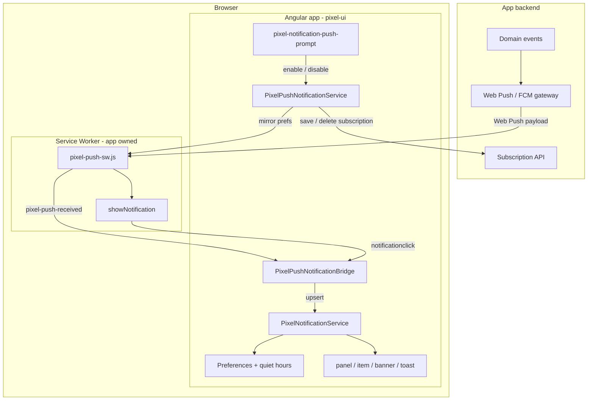
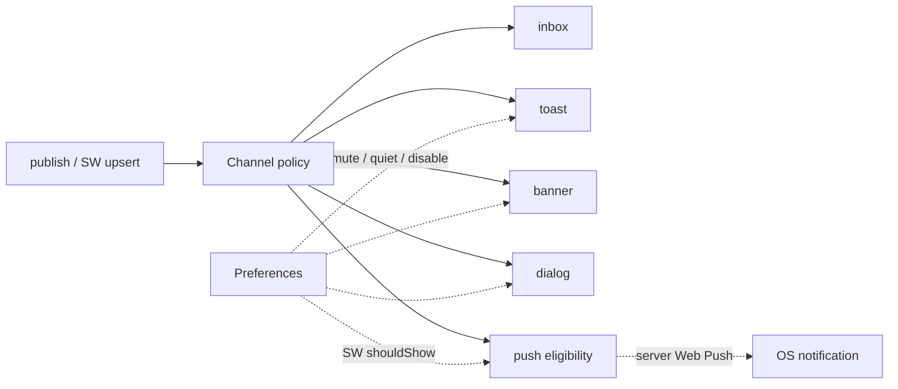

# Pixel Notification

Enterprise notification orchestration and desktop presentation primitives for durable inbox
records and policy-driven delivery. `PixelNotificationService` owns lifecycle,
`pixel-notification-item` / `pixel-notification-panel` / `pixel-notification-banner` /
`pixel-notification-preferences` / `pixel-notification-push-prompt` provide controlled UI,
preferences and sync / Web Push adapters are pluggable, and transient toast presentation
delegates to the existing `PixelToastService`.

## Overview

- One normalized `PixelNotification` record across inbox, toast, banner, dialog, and push
  channels.
- Immutable signal store with inbox, unread, archive, banner, category-count, and full-record
  projections.
- Minimal-interruption default routing: low/normal priority goes to inbox; high/critical also
  produce toast + `push` (OS delivery when the user is subscribed).
- Explicit channels override policy per notification; the policy is replaceable through DI.
- Preferences mute categories, disable interruptive channels (including `push`), and honor quiet
  hours without rewriting stored channel policy.
- Active records deduplicate by `dedupeKey`, increment `occurrences`, and become unread again.
- Persistence / transport adapters plus `PixelNotificationSyncService` cover hydrate, reconnect
  replay, conflict, and multi-tab fan-out while apps own sockets and auth.
- **Web Push:** `PixelPushNotificationService` + `providePixelPushNotifications()` manage
  permission/subscription; `PixelPushNotificationBridge` upserts SW payloads into the inbox;
  `pixel-notification-push-prompt` is the soft-ask UI. Apps own the Service Worker (reference
  `docs/public/pixel-push-sw.js`). OS `icon`/`image`/`badge` resolve via
  `resolveOsNotificationVisuals` (avatars, Material Symbols gstatic SVGs for severity/ligatures,
  hero `push.image`). No mandatory vendor SDK.
- `pixel-notification-item` presents one controlled record; `pixel-notification-panel` composes
  records into an anchored desktop center; `groupNotifications()` supports full-page recipes.
- Mobile drawer behavior is intentionally not shipped for the current desktop-only product scope.
  On small viewports prefer **push + full-page notification center**; the panel still clamps to
  the viewport to avoid horizontal clipping.

## Architecture

In-app notifications and Web Push share one canonical record. The page owns orchestration and
the inbox; the Service Worker owns OS chrome; the app backend owns targeting and the push
gateway.



### Delivery channels



| Layer | Responsibility |
| --- | --- |
| Backend | VAPID keys, subscription store, Web Push / FCM send, TTL / urgency |
| Service Worker | `push` → OS notification; `notificationclick` → focus client + protocol message |
| `PixelPushNotificationService` | Permission, `PushManager` subscribe/unsubscribe, login/logout rebind |
| `PixelPushNotificationBridge` | SW messages → inbox upsert; prefs mirror for SW gating |
| `PixelNotificationService` | Canonical store, channel policy, toast/dialog/banner |
| UI | Panel, item, banner, preferences, soft-ask prompt |

## Use cases

- Durable job-complete, approval, security, billing, and account notifications.
- High-priority events that need an inbox record, an in-tab toast, and optional OS push.
- Banner and critical-dialog escalations for operational and security workflows.
- Toast-only action feedback routed through the same typed API.
- Application-owned WebSocket/SSE/polling clients publishing normalized server events through
  transport adapters and `PixelNotificationSyncService`.
- Background / closed-tab alerts via Web Push when the user has granted permission.
- Soft-ask enablement after a value moment (e.g. “Get notified when this approval completes”).
- Multi-device subscription lifecycle: rebind after login, clear on logout.

## Setup

Add the existing toast container once if any policy can route to `toast`:

```html
<pixel-toast-container />
```

Optional global configuration (including adapters):

```ts
export const appConfig: ApplicationConfig = {
  providers: [
    providePixelNotifications({
      config: {
        maxItems: 1000,
        highPriorityToastTimeout: 10_000,
      },
      persistence: myIndexedDbAdapter,
      transport: myWebsocketAdapter,
      analytics: { track: (event) => analytics.capture(event.name, event.data) },
      preferences: { quietHoursEnabled: true },
    }),
  ],
};

// After bootstrap, when the browser session is ready:
inject(PixelNotificationSyncService).start();
```

`PixelNotificationService` and `PixelToastService` are root-provided; calling
`providePixelNotifications()` is only required to override defaults, policy, or adapters. The
service exposes the store's read-only signals; mutation stays behind the orchestrator so policy
and delivery cannot be bypassed accidentally.

### Web Push setup

**`providePixelPushNotifications()` is required** — push services are not `providedIn: 'root'`,
so the subscription adapter must be registered on the same injector that creates
`PixelPushNotificationService` (app `ApplicationConfig` or a feature/example component).

#### Soft-ask UX (do not prompt on load)

1. Value context after a related success.
2. `<pixel-notification-push-prompt />` explains what the user gets.
3. Explicit **Enable push** CTA → `enable()` → native permission.
4. Denied / blocked: recovery copy; inbox still works; never re-prompt natively.
5. Preferences: master **Disable push**, category mutes, and quiet hours apply to OS delivery.

#### Register the Service Worker

1. Serve a worker that implements the pixel push protocol (copy
   [`projects/docs/public/pixel-push-sw.js`](../../../../../docs/public/pixel-push-sw.js), or import
   helpers from `pixel-notification-push.sw.ts` into your bundled worker).
2. Register it from the **application** (library does not auto-register):

```ts
await navigator.serviceWorker.register('/pixel-push-sw.js');
```

#### Provide adapters and start after login

```ts
import {
  providePixelPushNotifications,
  PixelPushNotificationService,
  type PixelPushSubscriptionAdapter,
} from 'pixel-ui';

const pushSubscriptions: PixelPushSubscriptionAdapter = {
  getVapidPublicKey: () => fetch('/api/push/vapid-public-key').then((r) => r.text()),
  saveSubscription: (subscription) =>
    fetch('/api/push/subscriptions', {
      method: 'POST',
      headers: { 'Content-Type': 'application/json' },
      body: JSON.stringify(subscription),
    }).then(() => undefined),
  deleteSubscription: (subscription) =>
    fetch('/api/push/subscriptions', {
      method: 'DELETE',
      headers: { 'Content-Type': 'application/json' },
      body: JSON.stringify({ endpoint: subscription.endpoint }),
    }).then(() => undefined),
};

export const appConfig: ApplicationConfig = {
  providers: [
    providePixelNotifications({ /* … */ }),
    providePixelPushNotifications({ subscription: pushSubscriptions }),
  ],
};

// After login / SW ready:
const push = inject(PixelPushNotificationService);
push.start(); // bridge + subscription refresh
// Soft-ask UI: <pixel-notification-push-prompt /> — only its CTA calls enable()
// await push.rebindAfterLogin();
// await push.clearOnLogout();
```

#### Soft-ask component

```html
<pixel-notification-push-prompt
  deviceLabel="desktop"
  (enabled)="onPushEnabled($event)"
  (disabled)="onPushDisabled($event)"
/>

<!-- Dialog / nested hosts: surface="flat"; optional custom copy -->
<pixel-notification-push-prompt surface="flat" [labels]="{ heading: '…', description: '…' }" />

<pixel-notification-push-prompt surface="flat">
  <div pixelPushPromptContent>
    <h3>Get notified when approvals land</h3>
    <p>One alert per request — mute anytime in preferences.</p>
  </div>
</pixel-notification-push-prompt>
```

#### Soft-ask presentation vs orchestration

`pixel-notification-push-prompt` is a **pure soft-ask surface**. It never schedules itself,
opens a dialog, or writes cooldowns. Timing and presentation belong to the host (or
`PixelPushPromptScheduler`):

| Recipe | When | How |
| --- | --- | --- |
| **A · Inline** | Settings / preferences | Drop-in `<pixel-notification-push-prompt />` (`surface` default `'card'`) |
| **B · Delayed dialog** | After engagement delay (~45s typical) | `providePixelPushPromptScheduler({ mode: 'delayed', delayMs })` |
| **C · Value moment** | After job done / watch thread | `scheduler.showAfterValueMoment()` |

Dialog recipes set the dialog `title` from `labels.heading` (opposite the close control) and use
`promptSurface: 'flat'` + `promptLayout: 'dialog'` so CTAs land in `[pixelDialogFooter]`
(end-aligned, Cancel → Confirm order). Override copy with `labels` or project
`[pixelPushPromptContent]` on inline hosts.

**Anti-pattern:** `setTimeout(() => push.enable(), …)` or calling `Notification.requestPermission()`
on load. Delay may only open the **soft-ask** UI; native permission stays behind Enable.

```ts
// App config (alongside providePixelPushNotifications)
providePixelPushPromptScheduler({
  mode: 'delayed',
  delayMs: 45_000,
  cooldownMs: 30 * 24 * 60 * 60 * 1000,
  deviceLabel: 'desktop',
  onEvent: (e) => analytics.track('push_soft_ask', e),
});

// Or value-moment from a feature:
inject(PixelPushPromptScheduler).showAfterValueMoment();
```

#### Server payload shape

Gateway push bodies should JSON-parse to `PixelPushPayload`:

```json
{
  "notification": {
    "title": "Approval required",
    "message": "Travel request TR-104 needs your review.",
    "priority": "high",
    "category": "approvals",
    "dedupeKey": "approval:TR-104",
    "actions": [{ "id": "review", "label": "Review" }],
    "data": { "nav": { "route": ["/approvals", "TR-104"] } }
  },
  "push": {
    "tag": "approval:TR-104",
    "leading": "severity",
    "renotify": true,
    "requireInteraction": false
  }
}
```

#### OS visuals (icon / image / badge)

The Notification API needs **image URLs**, not Material font ligatures. `resolveOsNotificationVisuals`
(and `buildOsNotificationOptions`) map library fields as follows:

| OS slot | Source |
| --- | --- |
| `icon` | `push.icon` → avatar `notification.imageSrc` → http(s) `notification.icon` → Material SVG from ligature/`severity` → `visual.defaultIconUrl` |
| `image` | **Only** `push.image` (hero). Avatar `imageSrc` is never the hero. |
| `badge` | `push.badge`, or a small Material severity SVG when the leading icon is an avatar |

Severity / ligature glyphs use Google-hosted Material Symbols Outlined SVGs:

`https://fonts.gstatic.com/s/i/short-term/release/materialsymbolsoutlined/{name}/default/48px.svg`

`push.leading`: `'auto'` | `'avatar'` | `'severity'` | `'icon'` | `'none'`.

Optional provide config:

```ts
providePixelPushNotifications({
  subscription: pushSubscriptions,
  visual: {
    materialIconBaseUrl: 'https://fonts.gstatic.com/s/i/short-term/release/materialsymbolsoutlined',
    materialIconSize: 48,
    defaultIconUrl: 'https://cdn.example.com/app-icon.png',
    useMaterialSeverityIcons: true,
  },
});
```

**Limitations:** Material **font** already loaded in the page cannot paint OS icons; gstatic URLs
are a network dependency (`materialIconBaseUrl` can point at your mirror). SVG support and
contrast on dark OS chrome vary by browser — QA Chrome/Edge/Firefox/Safari; prefer app-hosted
PNG overrides for branded production marks.

#### Browser / platform matrix

| Runtime | Support | Notes |
| --- | --- | --- |
| Chrome / Edge (desktop & Android) | Yes | Secure context + Service Worker |
| Firefox | Yes | Secure context + Service Worker |
| Safari (macOS) | Yes (recent) | Verify target OS / Safari version in QA |
| Safari / iOS | Limited | Often requires an installed PWA |
| SSR / non-HTTPS | No | Surfaces `unsupported` / `insecure-context` |

#### Angular Service Worker (`ngsw`)

Do not register two workers at `/`. Merge push handlers into a custom worker that also hosts
ngsw logic, use a dedicated SW scope, or skip `ngsw` when first-class Web Push is required. The
reference worker is opt-in, not mandatory.

#### SW ↔ page protocol

| Message | Direction | Purpose |
| --- | --- | --- |
| `pixel-push-received` | SW → page | Upsert inbox (`Bridge.ingestPayload` / sync transport) |
| `pixel-push-click` | SW → page | Focus app, mark read, optional action / `nav` |
| `pixel-push-close` | SW → page | OS notification dismissed |
| `pixel-push-prefs` | page → SW | Mirror muted categories / disabled channels / quiet hours |

Signals on `PixelPushNotificationService`: `permission`, `subscription`, `busy`, `lastError`,
`supported`, `status` (`idle` | `busy` | `subscribed` | `error`).

Helpers exported for custom workers: `parsePixelPushPayload`, `buildOsNotificationOptions`,
`buildPixelPushOpenUrl`, `focusOrOpenClient`, `resolveOsNotificationVisuals`,
`materialSymbolsOutlinedUrl`, `shouldShowOsNotification`, `writePixelPushPrefsCache`,
`broadcastPixelPushMessage`.

#### Optional FCM web adapter (not a core dependency)

Map Firebase Messaging tokens/payloads into `PixelPushSubscriptionAdapter` + `PixelPushPayload`
yourself — keep `firebase` out of pixel-ui:

```ts
// App-owned sketch — not shipped by the library
const messaging = getMessaging();
const fcmAdapter: PixelPushSubscriptionAdapter = {
  getVapidPublicKey: () => environment.firebaseVapidKey,
  saveSubscription: async () => {
    const token = await getToken(messaging, { vapidKey: environment.firebaseVapidKey });
    await api.saveFcmToken(token);
  },
  deleteSubscription: async () => {
    await deleteToken(messaging);
    await api.deleteFcmToken();
  },
};
```

Normalize FCM `onBackgroundMessage` / `onMessage` bodies into `PixelPushPayload` and call
`PixelPushNotificationBridge.ingestPayload()` (or show via your SW using the same protocol).

<!-- API-CONTRACT:START — generated by tools/generate-readme-api.mjs. Do NOT edit between these markers; run `npm run readme:api` instead. -->

## API contract

_Machine-generated from the component source. This is the behavioral API surface: any change
to it is a **breaking-change candidate** and must be deliberate. After modifying this
component, run `npm run readme:api` and review this section's diff as a regression check._

### Component `pixel-notification-banner` (`PixelNotificationBannerComponent`)

Inline banner stack for records routed to the `banner` channel. Place near page chrome and bind `PixelNotificationService.banners()` (or a filtered subset). Mutations stay application-owned.

**Inputs**

| Input | Type | Default | Description |
| --- | --- | --- | --- |
| `notifications` | `readonly PixelNotification[]` | `[]` | Banner-channel records to render. |
| `maxVisible` | `number` | `3` | Maximum concurrent banners; older items remain in the inbox. |
| `showOverflow` | `boolean` | `false` | Always show overflow on banner items. |
| `maxInlineActions` | `number` | `2` | Inline action budget per banner item. |
| `ariaLabel` | `string` | `'Notification banners'` | Accessible name for the banner region. |

**Outputs**

| Output | Payload | Description |
| --- | --- | --- |
| `activated` | `PixelNotificationItemActivateEvent` |  |
| `actionClicked` | `PixelNotificationItemActionEvent` |  |

### Component `pixel-notification-dialog` (`PixelNotificationDialogComponent`)

Imperative critical-dialog content opened by the notification orchestrator when a record routes to the `dialog` channel. Uses `alertdialog` semantics via the dialog service config.

### Component `pixel-notification-item` (`PixelNotificationItemComponent`)

Accessible, controlled presentation for one durable notification record. The item emits intent events but never mutates notification state directly.

**Inputs**

| Input | Type | Default | Description |
| --- | --- | --- | --- |
| `notification` | `PixelNotification` | *required* | Canonical notification record to render. |
| `id` | `string` | `''` | Optional host id; a unique id is generated when omitted. |
| `density` | `PixelNotificationItemDensity` | `'default'` | `compact` reduces vertical spacing for dense panels and full-page lists. |
| `disabled` | `boolean` | `false` | Disables activation and action controls while preserving readable content. |
| `showUnreadIndicator` | `boolean` | `true` | Shows the unread accent bar and includes unread in the screen-reader status text. |
| `showActions` | `boolean` | `true` | Renders action controls supplied by the notification record. |
| `showOverflow` | `boolean` | `false` | Always shows the overflow control, even when no actions overflow. |
| `showDismiss` | `boolean` | `false` | Shows a dismiss (close) control for archive/remove intents. Takes precedence over overflow. |
| `maxInlineActions` | `number` | `2` | Maximum inline actions before remaining actions move behind the overflow intent. |
| `timestampLabel` | `string` | `''` | Optional explicit timestamp text; when set, skips relative/absolute formatting. |
| `timestampMode` | `PixelNotificationTimestampMode` | `'relative'` | `relative` uses Intl phrases (now / 5 minutes ago); `absolute` uses locale date-time. Absolute time always remains available on the `<time title>`. |
| `imageAlt` | `string` | `''` | Alternative text for `notification.imageSrc`; empty keeps decorative imagery silent. |
| `avatarText` | `string` | `''` | Initials rendered as an avatar when no image is present. |
| `ariaLabel` | `string` | `''` | Overrides the generated accessible name for the main item control. |
| `overflowAriaLabel` | `string` | `'More notification actions'` | Accessible label for the overflow action control. |
| `dismissAriaLabel` | `string` | `'Archive notification'` | Accessible label for the dismiss (close) control. |
| `statusLabels` | `Partial<PixelNotificationItemStatusLabels>` | `{}` | Partial override map for status chips and screen-reader status text. Merged with `DEFAULT_NOTIFICATION_ITEM_STATUS_LABELS`. |
| `showSkeleton` | `boolean` | `false` | Replaces the item with a footprint-matched loading skeleton. |
| `className` | `string` | `''` | Additional host utility or theme-hook classes. |

**Outputs**

| Output | Payload | Description |
| --- | --- | --- |
| `activated` | `PixelNotificationItemActivateEvent` | Emits when the main item control is activated. |
| `actionClicked` | `PixelNotificationItemActionEvent` | Emits an inline action intent without mutating notification state. |
| `overflowClicked` | `PixelNotificationItemOverflowEvent` | Emits the overflow intent and actions not rendered inline. |
| `dismissClicked` | `PixelNotificationItemActivateEvent` | Emits when the dismiss (close) control is activated. |

### Component `pixel-notification-panel` (`PixelNotificationPanelComponent`)

Desktop notification-center panel content. Compose it inside `pixel-popover`; it owns list filtering and bounded incremental rendering while emitting all application mutations as intents.

**Inputs**

| Input | Type | Default | Description |
| --- | --- | --- | --- |
| `notifications` | `readonly PixelNotification[]` | `[]` | Records available to the panel; normally bind `PixelNotificationService.inbox()`. |
| `id` | `string` | `''` | Optional stable host id. |
| `heading` | `string` | `'Notifications'` | Panel heading and list accessible-name prefix. |
| `pageSize` | `number` | `20` | Initial and incremental render window for long variable-height lists. |
| `totalCount` | `number | null, unknown` | `null` | Optional total for the footer "Showing X of Y" when the inbox is paged externally. When omitted, Y is the filtered in-memory count. |
| `loading` | `boolean` | `false` | Shows skeleton rows when no records have loaded. |
| `loadingMore` | `boolean` | `false` | Shows non-blocking progress while another page is requested. |
| `hasMore` | `boolean` | `false` | Indicates that the application data source has more records. |
| `offline` | `boolean` | `false` | Displays a persistent offline status without hiding cached records. |
| `errorMessage` | `string` | `''` | Blocking load error. Cached records remain available when non-empty. |
| `showViewAll` | `boolean` | `true` | Displays the footer intent for an application-composed full-page center. |
| `viewAllLabel` | `string` | `'View Notification Center'` | Label for the full-page navigation intent. |
| `emptyHeading` | `string` | `'No notifications'` | Empty-state heading when the unfiltered inbox has no records. |
| `emptyDescription` | `string` | `'You are all caught up.'` | Empty-state supporting copy. |
| `labels` | `Partial<PixelNotificationPanelLabels>` | `{}` | Partial override map for panel chrome, filters, empty/error copy, and live-region strings. Merged with `DEFAULT_NOTIFICATION_PANEL_LABELS`. Templates may use `{n}`, `{total}`, `{heading}`, `{category}`, or `{error}` placeholders. |

**Two-way (model)**

| Model | Type | Default | Description |
| --- | --- | --- | --- |
| `filter` | `PixelNotificationPanelFilter` | `'all'` | Two-way filter selection for all, unread, or action-required records. |
| `category` | `string` | `''` | Two-way category selection; empty means every category. |

**Outputs**

| Output | Payload | Description |
| --- | --- | --- |
| `notificationActivated` | `PixelNotificationItemActivateEvent` | Emits when a record's main control is activated. |
| `actionClicked` | `PixelNotificationItemActionEvent` | Emits an inline notification action intent. |
| `overflowClicked` | `PixelNotificationItemOverflowEvent` | Emits an item overflow intent for application-owned menus. |
| `dismissClicked` | `PixelNotificationItemActivateEvent` | Emits when an item dismiss (close) control is activated. |
| `command` | `PixelNotificationPanelCommandEvent` | Emits toolbar, pagination, recovery, and full-page navigation intents. |

### Component `pixel-notification-preferences` (`PixelNotificationPreferencesComponent`)

Controlled preferences surface for muting categories, disabling interruptive channels, and configuring quiet hours. Emits preference snapshots; the application (or sync layer) persists.

**Inputs**

| Input | Type | Default | Description |
| --- | --- | --- | --- |
| `categories` | `readonly string[]` | `[]` | Category chips offered for muting. |
| `compact` | `boolean` | `false` | Compact density for settings drawers. |
| `heading` | `string` | `'Notification preferences'` | Accessible heading. |
| `labels` | `Partial<PixelNotificationPreferencesLabels>` | `{}` | Partial override map for section headings, reset, quiet hours, and checkbox labels. Merged with `DEFAULT_NOTIFICATION_PREFERENCES_LABELS`. |

**Two-way (model)**

| Model | Type | Default | Description |
| --- | --- | --- | --- |
| `preferences` | `PixelNotificationPreferences` | `{ ...PIXEL_NOTIFICATION_DEFAULT_PREFERENCES, }` | Two-way preferences snapshot. |

**Outputs**

| Output | Payload | Description |
| --- | --- | --- |
| `preferencesChange` | `PixelNotificationPreferences` |  |

### Component `pixel-notification-push-prompt-dialog` (`PixelNotificationPushPromptDialogComponent`)

### Component `pixel-notification-push-prompt` (`PixelNotificationPushPromptComponent`)

Soft-ask / recovery UI for Web Push. Never calls `enable()` on its own — only from the explicit CTA. Compose near settings or after a value moment (approval success, etc.).

**Inputs**

| Input | Type | Default | Description |
| --- | --- | --- | --- |
| `compact` | `boolean` | `false` | Compact density for drawers / dense settings (stacked icon + full-width CTA). |
| `surface` | `PixelNotificationPushPromptSurface` | `'card'` | `'card'` draws outlined chrome (settings / inline). `'flat'` drops border and padding so the prompt sits on a parent surface (dialog scheduler default). |
| `layout` | `PixelNotificationPushPromptLayout` | `'inline'` | `'dialog'` omits the in-body heading (dialog `title` owns it), hides benefit chips, moves CTAs to `[pixelDialogFooter]` (end-aligned dialog chrome), and shows a settings hint in the body. Scheduler hosts should pass `'dialog'` with `surface="flat"`. |
| `deviceLabel` | `string` | `''` | Optional device label stored with the subscription DTO and shown when subscribed. |
| `dismissible` | `boolean` | `true` | Show the secondary “Not now” control on the soft-ask prompt. |
| `showBenefits` | `boolean` | `true` | Show benefit chips on the soft-ask prompt. Hidden when `compact`, or when `layout` is `'dialog'` (chips repeat the description in modal soft-asks). |
| `siteSettingsHref` | `string` | `''` | Optional help-article URL linked from denied-state guidance. Does not open native browser settings (browsers block that). |
| `labels` | `Partial<PixelNotificationPushPromptLabels>` | `{}` | Override chrome copy (including `heading` / `description` for the soft-ask view). |

**Outputs**

| Output | Payload | Description |
| --- | --- | --- |
| `enabled` | `PixelPushOperationResult` |  |
| `disabled` | `PixelPushOperationResult` |  |
| `dismissed` | `void` | Soft-ask dismissed via “Not now” (host may hide or persist preference). |
| `settingsRequest` | `void` | Denied-state: optional hook when the help-article link is activated. Inline how-to steps always show when permission is denied — no separate CTA. |
| `continueWithInbox` | `void` | Denied-state: user chose inbox-only and dismissed the prompt. |

### Directive `[pixelPushPromptContent]` (`PixelPushPromptContentDirective`)

Marks projected content that replaces the default soft-ask heading + description. ```html <pixel-notification-push-prompt surface="flat"> <div pixelPushPromptContent> <h3>Get notified when approvals land</h3> <p>One alert per request — mute anytime in preferences.</p> </div> </pixel-notification-push-prompt> ```

### Service `PixelPushPromptScheduler`

Opens `pixel-notification-push-prompt` in a dialog on a schedule or after a value moment. Defaults: dialog title from `labels.heading`, `promptSurface: 'flat'`, `promptLayout: 'dialog'` (footer CTAs end-aligned, no benefit chips, settings hint in body). Never calls `Notification.requestPermission` / `enable()` — only the soft-ask CTA does. Provide via `providePixelPushPromptScheduler`. Requires `providePixelPushNotifications` in a parent injector.

| Method | Signature | Description |
| --- | --- | --- |
| `start` | `start(): void` | Begin the delayed soft-ask timer (`mode: 'delayed'`). Idempotent. |
| `cancel` | `cancel(): void` | Cancel a pending delayed / editing-retry open. Does not close an open dialog. |
| `show` | `show(reason: PixelPushPromptSchedulerReason = 'manual'): boolean` | Open the soft-ask dialog when eligible. |
| `showAfterValueMoment` | `showAfterValueMoment(): boolean` | Soft-ask after a product value moment (job done, watch thread, …). |
| `isEligible` | `isEligible(): boolean` | Whether the soft-ask may open now (permission, cooldown, dialogs). |
| `clearCooldown` | `clearCooldown(): void` | Clear persisted cooldown (e.g. settings “Ask again”). |

### Service `PixelPushNotificationBridge`

Bridges Service Worker push messages into the in-app notification store and mirrors preferences for OS-notification gating. Call `start` once the app shell is ready. Click order: focus/open (SW) → ingest if needed → markRead / invokeAction (bound handlers) → optional `PixelNavigateService.openFromNotification`.

| Method | Signature | Description |
| --- | --- | --- |
| `start` | `start(): void` | Listen for SW protocol messages and keep the prefs cache warm. Idempotent. SSR no-op. |
| `stop` | `stop(): void` |  |
| `mirrorPreferences` | `mirrorPreferences(preferences: PixelNotificationPreferences): void` | Write prefs for the page cache and notify the active worker. |
| `ingestPayload` | `ingestPayload(payload: PixelPushPayload): string` | Apply a push payload as a remote upsert (tests / tooling). |
| `handleActivation` | `handleActivation(message: Omit<PixelPushClickMessage, 'type'> & { readonly type?: 'pixel-push-click' }): Promise<void>` | Same handling as a Service Worker `pixel-push-click` message (without SW focus/openWindow). Useful for docs demos and unit tests. |

### Service `PixelPushNotificationService`

Web Push lifecycle orchestrator. Feature-detects Push / Notification APIs, manages permission + subscription, persists via `PixelPushSubscriptionAdapter`, and can start the inbox bridge (`PixelPushNotificationBridge`). SSR-safe: browser APIs are gated; signals default to `unsupported` on the server.

| Method | Signature | Description |
| --- | --- | --- |
| `start` | `start(): void` | Starts the SW → inbox bridge and (when supported) listens for `pushsubscriptionchange`. Call after login / SW registration. Idempotent. Also consumes cold-start `?pixelPushId=` / `?pixelPushAction=` from `openWindow` deep links. |
| `stop` | `stop(): void` |  |
| `refresh` | `refresh(): Promise<PixelPushOperationResult>` | Re-reads permission and any existing `PushSubscription` without prompting. Safe to call after login or when the app shell becomes interactive. |
| `enable` | `enable(options?: { readonly deviceLabel?: string }): Promise<PixelPushOperationResult>` | Requests notification permission (if needed), creates a Web Push subscription, and POSTs it through the configured subscription adapter. |
| `disable` | `disable(): Promise<PixelPushOperationResult>` | Unsubscribes the browser endpoint and asks the adapter to delete the server record. |
| `rebindAfterLogin` | `rebindAfterLogin(options?: { readonly deviceLabel?: string }): Promise<PixelPushOperationResult>` | After login: refresh local subscription and re-POST to the adapter when one exists. Does not prompt for permission. |
| `clearOnLogout` | `clearOnLogout(): Promise<PixelPushOperationResult>` | On logout: unsubscribe locally and delete the server record. Prefer this over leaving orphaned endpoints bound to the previous user. |
| `getSubscriptionSnapshot` | `getSubscriptionSnapshot(): PixelPushOperationResult` | Immutable snapshot of permission + subscription (same shape as operation results). |

### Service `PixelNotificationService`

Application-facing notification orchestrator. Normalizes and deduplicates records, maintains durable signal state, applies the injected channel policy and preferences, and delegates toast / dialog presentation to existing pixel primitives.

| Method | Signature | Description |
| --- | --- | --- |
| `bindActionHandlers` | `bindActionHandlers(handlers: Readonly<Record<string, NonNullable<PixelNotificationAction['handler']>>>): void` | Register handlers by action id. Merges with any existing bindings. Use after login / hydrate so push and sync payloads stay JSON-serializable. |
| `unbindActionHandlers` | `unbindActionHandlers(actionIds?: readonly string[]): void` | Remove bound handlers. Pass ids to remove a subset; omit to clear all. |
| `setPreferences` | `setPreferences(preferences: Partial<PixelNotificationPreferences>): void` | Replace runtime preferences and reconcile interruptive surfaces. Surfaces that are no longer allowed (muted / quiet hours / disabled channels) are dismissed. Historical records are **not** replayed as new toasts or dialogs — only subsequent `publish` / `update` calls open interruptive UI again. |
| `hydrate` | `hydrate(records: readonly PixelNotificationCreate[] | readonly PixelNotification[]): void` | Hydrate canonical state without replaying delivery channels or outbound sync. |
| `publish` | `publish(draft: PixelNotificationCreate, options: PixelNotificationMutationOptions = {}): string` | Publish one record through normalization, deduplication, storage, and channel delivery. |
| `publishMany` | `publishMany(drafts: readonly PixelNotificationCreate[]): readonly string[]` | Publish a batch in input order and return the resolved ids. |
| `update` | `update(id: string, patch: PixelNotificationUpdate, options: PixelNotificationMutationOptions = {}): PixelNotification | null` | Patch canonical state and synchronize any active bridged surfaces. |
| `get` | `get(id: string): PixelNotification | null` | Read a canonical record by id. |
| `markRead` | `markRead(id: string, options: PixelNotificationMutationOptions = {}): PixelNotification | null` | Mark one inbox record as read. |
| `markUnread` | `markUnread(id: string, options: PixelNotificationMutationOptions = {}): PixelNotification | null` | Return one inbox record to unread state. |
| `markAllRead` | `markAllRead(options: PixelNotificationMutationOptions = {}): void` | Mark every active inbox record as read in one immutable update. |
| `archive` | `archive(id: string, options: PixelNotificationMutationOptions = {}): PixelNotification | null` | Archive a record and dismiss its active bridged surfaces. |
| `restore` | `restore(id: string, options: PixelNotificationMutationOptions = {}): PixelNotification | null` | Restore an archived record without replaying delivery channels. |
| `remove` | `remove(id: string, options: PixelNotificationMutationOptions = {}): PixelNotification | null` | Permanently remove a record and dismiss its active bridged surfaces. |
| `clear` | `clear(options: PixelNotificationMutationOptions = {}): void` | Clear notification-owned state and surfaces without touching direct application toasts. |
| `invokeAction` | `invokeAction(notificationId: string, actionId: string): Promise<PixelNotificationActionEvent | null>` | Emit and invoke a typed action; marks the record read unless the action opts out. |
| `pruneExpired` | `pruneExpired(now = Date.now()): readonly PixelNotification[]` | Remove records whose `expiresAt` timestamp has elapsed. No background polling is used. |

### Service `PixelNotificationSyncService`

Optional sync coordinator. Hydrates from persistence, applies transport events with sequence/replay semantics, forwards optimistic local mutations, and mirrors changes across tabs when `BroadcastChannel` is available. SSR-safe: browser APIs are guarded.

| Method | Signature | Description |
| --- | --- | --- |
| `start` | `start(): Promise<void>` | Start hydration, transport, and multi-tab listeners. Idempotent. |
| `stop` | `stop(): void` | Tear down transport and multi-tab listeners. Persistence snapshot remains. |
| `applyTransportEvent` | `applyTransportEvent(event: PixelNotificationTransportEvent): void` | Apply a normalized transport event (also used by unit tests). |
| `notifyLocalMutation` | `notifyLocalMutation(mutation: Omit<PixelNotificationClientMutation, 'clientMutationId'>): void` | Record a local mutation for optimistic transport + multi-tab fan-out. |

### Exported types

| Type | Definition |
| --- | --- |
| `PixelNotificationItemDensity` | `'compact' | 'default'` |
| `PixelNotificationItemInteractionSource` | `'mouse' | 'keyboard'` |
| `PixelNotificationTimestampMode` | `'relative' | 'absolute'` |
| `PixelNotificationPanelFilter` | `'all' | 'unread' | 'action-required'` |
| `PixelNotificationPanelCommand` | `| 'mark-all-read' | 'load-more' | 'retry' | 'view-all'` |
| `PixelPushPromptSchedulerMode` | `'manual' | 'delayed' | 'event'` |
| `PixelPushPromptSchedulerReason` | `| 'delayed' | 'value-moment' | 'manual' | 'eligibility' | 'cooldown' | 'critical-dialog' | 'editing' | 'already-open'` |
| `PixelPushPromptSchedulerEventType` | `| 'shown' | 'dismissed' | 'accepted' | 'denied' | 'skipped' | 'suppressed'` |
| `PixelPushPromptDialogResult` | `| 'dismissed' | 'accepted' | 'continue-inbox' | 'escape'` |
| `PixelNotificationPushPromptView` | `| 'prompt' | 'subscribed' | 'denied' | 'unsupported' | 'insecure'` |
| `PixelNotificationPushPromptTone` | `| 'primary' | 'success' | 'warning' | 'muted'` |
| `PixelNotificationPushPromptSurface` | `'card' | 'flat'` |
| `PixelNotificationPushPromptLayout` | `'inline' | 'dialog'` |
| `PixelNotificationPushPromptBrowserFamily` | `| 'chromium' | 'firefox' | 'safari' | 'other'` |
| `PixelPushPermissionState` | `| 'unsupported' | 'insecure-context' | 'default' | 'granted' | 'denied'` |
| `PixelPushStatus` | `'idle' | 'busy' | 'subscribed' | 'error'` |
| `PixelPushLeadingVisual` | `'auto' | 'avatar' | 'severity' | 'icon' | 'none'` |
| `PixelPushClientMessageType` | `| 'pixel-push-received' | 'pixel-push-click' | 'pixel-push-close' | 'pixel-push-subscribe-result'` |
| `PixelPushClientMessage` | `| PixelPushReceivedMessage | PixelPushClickMessage | PixelPushCloseMessage | PixelPushSubscribeResultMessage` |
| `PixelNotificationPersistedAction` | `Omit<PixelNotificationAction, 'handler'>` |
| `PixelNotificationPersistedRecord` | `Omit<PixelNotification, 'actions'> & { readonly actions: readonly PixelNotificationPersistedAction[]; }` |
| `PixelNotificationTransportEventType` | `| 'upsert' | 'update' | 'remove' | 'read' | 'unread' | 'archive' | 'restore' | 'mark-all-read' | 'snapshot' | 'ack' | 'conflict'` |
| `PixelNotificationClientMutationType` | `| 'publish' | 'update' | 'read' | 'unread' | 'archive' | 'restore' | 'remove' | 'mark-all-read' | 'clear'` |
| `PixelNotificationGroupBy` | `'day' | 'category' | 'source'` |
| `PixelNotificationSeverity` | `'neutral' | 'info' | 'success' | 'warning' | 'error'` |
| `PixelNotificationPriority` | `'low' | 'normal' | 'high' | 'critical'` |
| `PixelNotificationState` | `'default' | 'loading' | 'completed' | 'failed'` |
| `PixelNotificationChannel` | `'inbox' | 'toast' | 'banner' | 'dialog' | 'push'` |
| `PixelNotificationActionAppearance` | `'primary' | 'secondary' | 'danger'` |
| `PixelNotificationActionResult` | `void | Promise<void>` |
| `PixelNotificationChannelPolicy` | `( notification: PixelNotification, ) => PixelNotificationRoute` |

### Exported interfaces

**`PixelNotificationDialogData`**

```ts
interface PixelNotificationDialogData {
  readonly notification: PixelNotification;
}
```

**`PixelNotificationItemActivateEvent`**

```ts
interface PixelNotificationItemActivateEvent {
  readonly notification: PixelNotification;
  readonly source: PixelNotificationItemInteractionSource;
  readonly originalEvent: MouseEvent | KeyboardEvent;
}
```

**`PixelNotificationItemActionEvent`**

```ts
interface PixelNotificationItemActionEvent {
  readonly action: PixelNotificationAction;
}
```

**`PixelNotificationItemOverflowEvent`**

```ts
interface PixelNotificationItemOverflowEvent {
  readonly hiddenActions: readonly PixelNotificationAction[];
}
```

**`PixelNotificationPanelLabels`** — User-visible chrome copy for `pixel-notification-panel` (i18n via `labels` input).

```ts
interface PixelNotificationPanelLabels {
  readonly markAllRead: string;
  readonly markAllReadAria: string;
  readonly filterGroupAria: string;
  readonly filterAll: string;
  readonly filterUnread: string;
  readonly filterActionRequired: string;
  readonly filterByCategoryAria: string;
  readonly filterByCategorySelectedAria: string;
  readonly allCategories: string;
  readonly offlineNotice: string;
  readonly retry: string;
  readonly tryAgain: string;
  readonly loadingNotifications: string;
  readonly unavailableHeading: string;
  readonly noMatchingHeading: string;
  readonly noMatchingDescription: string;
  readonly showingCount: string;
  readonly loadMore: string;
  readonly loadingMore: string;
  readonly unreadBadgeAria: string;
  readonly listAria: string;
  readonly liveLoadFailed: string;
  readonly liveOffline: string;
  readonly liveUnread: string;
}
```

**`PixelNotificationItemStatusLabels`** — Status chip and screen-reader status copy for `pixel-notification-item`.

```ts
interface PixelNotificationItemStatusLabels {
  readonly failed: string;
  readonly completed: string;
  readonly scheduled: string;
  readonly archived: string;
  readonly actionRequired: string;
  readonly unread: string;
  readonly read: string;
  readonly inProgress: string;
  readonly inProgressPercent: string;
  readonly noAdditionalDetails: string;
  readonly progressAria: string;
  readonly occurrencesAria: string;
}
```

**`PixelNotificationPreferencesLabels`** — User-visible copy for `pixel-notification-preferences`.

```ts
interface PixelNotificationPreferencesLabels {
  readonly reset: string;
  readonly mutedCategories: string;
  readonly noCategories: string;
  readonly muteCategory: string;
  readonly interruptiveChannels: string;
  readonly disableChannel: string;
  readonly quietHours: string;
  readonly enableQuietHours: string;
  readonly quietHoursStart: string;
  readonly quietHoursEnd: string;
}
```

**`PixelNotificationPanelCommandEvent`**

```ts
interface PixelNotificationPanelCommandEvent {
  readonly command: PixelNotificationPanelCommand;
  readonly source: 'mouse' | 'keyboard';
  readonly originalEvent: MouseEvent | KeyboardEvent;
}
```

**`PixelPushPromptSchedulerEvent`**

```ts
interface PixelPushPromptSchedulerEvent {
  readonly type: PixelPushPromptSchedulerEventType;
  readonly reason?: PixelPushPromptSchedulerReason;
  readonly at: number;
}
```

**`PixelPushPromptCooldownRecord`** — Persisted soft-ask dismiss cooldown (localStorage).

```ts
interface PixelPushPromptCooldownRecord {
  readonly dismissedAt: number;
}
```

**`ProvidePixelPushPromptSchedulerOptions`**

```ts
interface ProvidePixelPushPromptSchedulerOptions {
  readonly mode?: PixelPushPromptSchedulerMode;
  readonly delayMs?: number;
  readonly cooldownMs?: number;
  readonly storageKey?: string;
  readonly openIn?: 'dialog';
  readonly dialogTitle?: string;
  readonly deviceLabel?: string;
  readonly labels?: Partial<PixelNotificationPushPromptLabels>;
  readonly compact?: boolean;
  readonly promptSurface?: PixelNotificationPushPromptSurface;
  readonly promptLayout?: PixelNotificationPushPromptLayout;
  readonly showBenefits?: boolean;
  readonly respectCriticalDialogs?: boolean;
  readonly deferWhileEditing?: boolean;
  readonly editingRetryLimit?: number;
  readonly editingRetryMs?: number;
  readonly autoStart?: boolean;
  readonly onEvent?: (event: PixelPushPromptSchedulerEvent) => void;
}
```

**`PixelPushPromptDialogData`**

```ts
interface PixelPushPromptDialogData {
  readonly deviceLabel: string;
  readonly labels: Partial<PixelNotificationPushPromptLabels>;
  readonly compact: boolean;
  readonly surface: PixelNotificationPushPromptSurface;
  readonly layout: PixelNotificationPushPromptLayout;
  readonly showBenefits: boolean;
}
```

**`PixelNotificationPushPromptLabels`**

```ts
interface PixelNotificationPushPromptLabels {
  readonly heading: string;
  readonly description: string;
  readonly enable: string;
  readonly disable: string;
  readonly busy: string;
  readonly tryAgain: string;
  readonly dismiss: string;
  readonly benefitBackground: string;
  readonly benefitMute: string;
  readonly settingsHint: string;
  readonly activeBadge: string;
  readonly devicePrefix: string;
  readonly openSettings: string;
  readonly continueInbox: string;
  readonly stillBlocked: string;
  readonly helpHeading: string;
  readonly helpArticle: string;
  readonly helpStepsChromium: readonly string[];
  readonly helpStepsFirefox: readonly string[];
  readonly helpStepsSafari: readonly string[];
  readonly helpStepsOther: readonly string[];
  readonly unsupportedHeading: string;
  readonly unsupportedDescription: string;
  readonly insecureHeading: string;
  readonly insecureDescription: string;
  readonly deniedHeading: string;
  readonly deniedDescription: string;
  readonly subscribedHeading: string;
  readonly subscribedDescription: string;
  readonly errorPrefix: string;
}
```

**`PixelPushSubscriptionAdapter`** — App-owned persistence for Web Push subscriptions. Auth, tenant scoping, and HTTP stay here.

```ts
interface PixelPushSubscriptionAdapter {
  getVapidPublicKey(): string | Promise<string>;
  saveSubscription(subscription: PixelPushSubscriptionRecord): void | Promise<void>;
  deleteSubscription(subscription: PixelPushSubscriptionRecord): void | Promise<void>;
}
```

**`PixelPushServiceWorkerAdapter`** — Optional override for Service Worker lookup. Defaults to `navigator.serviceWorker`.

```ts
interface PixelPushServiceWorkerAdapter {
  getRegistration(): Promise<ServiceWorkerRegistration | null>;
}
```

**`PixelPushActivateEvent`**

```ts
interface PixelPushActivateEvent {
  readonly notificationId?: string;
  readonly actionId?: string;
  readonly nav?: string | Readonly<Record<string, unknown>>;
  readonly payload?: PixelPushPayload;
}
```

**`ProvidePixelPushNotificationsOptions`**

```ts
interface ProvidePixelPushNotificationsOptions {
  readonly subscription: PixelPushSubscriptionAdapter;
  readonly serviceWorker?: PixelPushServiceWorkerAdapter;
  readonly visual?: PixelPushVisualConfig;
}
```

**`PixelPushPrefsCache`**

```ts
interface PixelPushPrefsCache {
  readonly updatedAt: number;
}
```

**`PixelPushClientsLike`** — Minimal client list surface used by the reference SW helpers.

```ts
interface PixelPushClientsLike {
  matchAll(options?: { type?: 'window' | 'worker' | 'sharedworker' | 'all'; includeUncontrolled?: boolean; }): Promise<readonly PixelPushWindowClientLike[]>;
  openWindow?(url: string): Promise<PixelPushWindowClientLike | null>;
}
```

**`PixelPushWindowClientLike`**

```ts
interface PixelPushWindowClientLike {
  focus(): Promise<PixelPushWindowClientLike>;
  postMessage(message: unknown): void;
  readonly url?: string;
}
```

**`FocusOrOpenClientOptions`**

```ts
interface FocusOrOpenClientOptions {
  readonly url?: string;
  readonly preferPath?: string;
}
```

**`PixelPushSubscriptionRecord`** — Serializable Web Push subscription DTO for app backends. Apps may extend with `userId` / `tenantId` outside this shape.

```ts
interface PixelPushSubscriptionRecord {
  readonly endpoint: string;
  readonly expirationTime: number | null;
  readonly keys: { readonly p256dh: string; readonly auth: string; };
  readonly userAgent?: string;
  readonly deviceLabel?: string;
  readonly createdAt: string;
}
```

**`PixelPushPayload`** — Normalized push body. Service Workers should `JSON.parse` the push text into this shape. `notification` feeds the in-app inbox bridge; `push` tunes OS chrome.

```ts
interface PixelPushPayload {
  readonly notification: PixelNotificationCreate;
  readonly push?: PixelPushPresentationOptions;
}
```

**`PixelPushPresentationOptions`** — OS notification presentation hints (best-effort across browsers).

```ts
interface PixelPushPresentationOptions {
  readonly tag?: string;
  readonly requireInteraction?: boolean;
  readonly silent?: boolean;
  readonly icon?: string;
  readonly image?: string;
  readonly badge?: string;
  readonly renotify?: boolean;
  readonly timestamp?: number;
  readonly leading?: PixelPushLeadingVisual;
}
```

**`PixelPushVisualConfig`** — App-level defaults for resolving OS notification visuals (Material CDN, branded icon). Passed into `buildOsNotificationOptions` / Service Worker helpers — not DI-only.

```ts
interface PixelPushVisualConfig {
  readonly materialIconBaseUrl?: string;
  readonly materialIconSize?: number;
  readonly defaultIconUrl?: string;
  readonly useMaterialSeverityIcons?: boolean;
}
```

**`PixelPushReceivedMessage`**

```ts
interface PixelPushReceivedMessage {
  readonly type: 'pixel-push-received';
  readonly payload: PixelPushPayload;
}
```

**`PixelPushClickMessage`**

```ts
interface PixelPushClickMessage {
  readonly type: 'pixel-push-click';
  readonly notificationId?: string;
  readonly actionId?: string;
  readonly nav?: string | Readonly<Record<string, unknown>>;
  readonly openUrl?: string;
  readonly payload?: PixelPushPayload;
}
```

**`PixelPushCloseMessage`**

```ts
interface PixelPushCloseMessage {
  readonly type: 'pixel-push-close';
  readonly notificationId?: string;
  readonly tag?: string;
}
```

**`PixelPushSubscribeResultMessage`**

```ts
interface PixelPushSubscribeResultMessage {
  readonly type: 'pixel-push-subscribe-result';
  readonly ok: boolean;
  readonly subscription?: PixelPushSubscriptionRecord | null;
  readonly error?: string;
}
```

**`PixelPushOperationResult`** — Result of `PixelPushNotificationService.enable` / `PixelPushNotificationService.disable`.

```ts
interface PixelPushOperationResult {
  readonly ok: boolean;
  readonly permission: PixelPushPermissionState;
  readonly subscription: PixelPushSubscriptionRecord | null;
  readonly error?: string;
}
```

**`PixelOsNotificationVisuals`**

```ts
interface PixelOsNotificationVisuals {
  readonly icon?: string;
  readonly image?: string;
  readonly badge?: string;
}
```

**`PixelNotificationPersistenceAdapter`** — Pluggable persistence for durable inbox state. Implementations may use IndexedDB, localStorage, or a remote API. The core never assumes a browser storage engine.

```ts
interface PixelNotificationPersistenceAdapter {
  load(): | Promise<readonly PixelNotificationPersistedRecord[]> | readonly PixelNotificationPersistedRecord[];
  save( records: readonly PixelNotificationPersistedRecord[], ): Promise<void> | void;
  clear?(): Promise<void> | void;
}
```

**`PixelNotificationTransportEvent`** — Normalized inbound transport envelope. Applications own WebSocket/SSE/polling sockets and map backend payloads into this shape before forwarding.

```ts
interface PixelNotificationTransportEvent {
  readonly type: PixelNotificationTransportEventType;
  readonly sequence?: number;
  readonly id?: string;
  readonly notification?: PixelNotificationCreate;
  readonly notifications?: readonly PixelNotificationCreate[];
  readonly patch?: PixelNotificationUpdate;
  readonly clientMutationId?: string;
}
```

**`PixelNotificationClientMutation`** — Optimistic outbound mutation the sync layer may forward through a transport.

```ts
interface PixelNotificationClientMutation {
  readonly clientMutationId: string;
  readonly type: PixelNotificationClientMutationType;
  readonly id?: string;
  readonly notification?: PixelNotificationCreate;
  readonly patch?: PixelNotificationUpdate;
  readonly lastKnownUpdatedAt?: number;
}
```

**`PixelNotificationTransportAdapter`** — Application-owned transport contract. Connect returns a disconnect function. Auth, reconnect, heartbeats, and protocol framing stay outside pixel-ui.

```ts
interface PixelNotificationTransportAdapter {
  connect( handler: (event: PixelNotificationTransportEvent) => void, ): () => void;
  send?(mutation: PixelNotificationClientMutation): void | Promise<void>;
  requestReplay?(afterSequence: number): void | Promise<void>;
}
```

**`PixelNotificationPreferences`**

```ts
interface PixelNotificationPreferences {
  readonly mutedCategories: readonly string[];
  readonly disabledChannels: readonly PixelNotificationChannel[];
  readonly quietHoursEnabled: boolean;
  readonly quietHoursStart: string;
  readonly quietHoursEnd: string;
}
```

**`PixelNotificationAnalyticsEvent`**

```ts
interface PixelNotificationAnalyticsEvent {
  readonly name: | 'published' | 'updated' | 'read' | 'unread' | 'archived' | 'restored' | 'removed' | 'cleared' | 'action' | 'sync_connected' | 'sync_disconnected' | 'sync_conflict' | 'sync_replay' | 'preference_changed' | 'push_permission_prompted' | 'push_permission_granted' | 'push_permission_denied' | 'push_subscribed' | 'push_unsubscribed' | 'push_received' | 'push_clicked' | 'push_failed' | 'push_subscription_changed';
  readonly notification?: PixelNotification | null;
  readonly data?: Readonly<Record<string, unknown>>;
}
```

**`PixelNotificationAnalytics`**

```ts
interface PixelNotificationAnalytics {
  track(event: PixelNotificationAnalyticsEvent): void;
}
```

**`PixelNotificationGroup`**

```ts
interface PixelNotificationGroup {
  readonly key: string;
  readonly label: string;
  readonly notifications: readonly PixelNotification[];
}
```

**`ProvidePixelNotificationsOptions`**

```ts
interface ProvidePixelNotificationsOptions {
  readonly config?: Partial<PixelNotificationConfig>;
  readonly policy?: PixelNotificationChannelPolicy;
  readonly persistence?: PixelNotificationPersistenceAdapter;
  readonly transport?: PixelNotificationTransportAdapter;
  readonly analytics?: PixelNotificationAnalytics;
  readonly preferences?: Partial<PixelNotificationPreferences>;
}
```

**`PixelNotificationMutationOptions`**

```ts
interface PixelNotificationMutationOptions {
  readonly source?: 'local' | 'remote' | 'hydrate';
}
```

**`PixelNotificationActionContext`**

```ts
interface PixelNotificationActionContext {
  readonly notification: PixelNotification;
  readonly action: PixelNotificationAction;
}
```

**`PixelNotificationAction`**

```ts
interface PixelNotificationAction {
  readonly id: string;
  readonly label: string;
  readonly ariaLabel?: string;
  readonly appearance?: PixelNotificationActionAppearance;
  readonly href?: string;
  readonly markRead?: boolean;
  readonly nav?: string | Readonly<Record<string, unknown>>;
  readonly handler?: (context: PixelNotificationActionContext) => PixelNotificationActionResult;
}
```

**`PixelNotificationCreate`**

```ts
interface PixelNotificationCreate {
  readonly id?: string;
  readonly title: string;
  readonly message?: string;
  readonly severity?: PixelNotificationSeverity;
  readonly priority?: PixelNotificationPriority;
  readonly state?: PixelNotificationState;
  readonly category?: string;
  readonly source?: string;
  readonly icon?: string;
  readonly imageSrc?: string;
  readonly createdAt?: number | string | Date;
  readonly expiresAt?: number | string | Date | null;
  readonly progress?: number | null;
  readonly actions?: readonly PixelNotificationAction[];
  readonly channels?: readonly PixelNotificationChannel[];
  readonly dedupeKey?: string;
  readonly data?: Readonly<Record<string, unknown>>;
}
```

**`PixelNotificationUpdate`**

```ts
interface PixelNotificationUpdate {
  readonly title?: string;
  readonly message?: string;
  readonly severity?: PixelNotificationSeverity;
  readonly priority?: PixelNotificationPriority;
  readonly state?: PixelNotificationState;
  readonly category?: string;
  readonly source?: string;
  readonly icon?: string;
  readonly imageSrc?: string;
  readonly expiresAt?: number | string | Date | null;
  readonly progress?: number | null;
  readonly actions?: readonly PixelNotificationAction[];
  readonly channels?: readonly PixelNotificationChannel[];
  readonly dedupeKey?: string;
  readonly data?: Readonly<Record<string, unknown>>;
}
```

**`PixelNotification`**

```ts
interface PixelNotification {
  readonly id: string;
  readonly title: string;
  readonly message: string;
  readonly severity: PixelNotificationSeverity;
  readonly priority: PixelNotificationPriority;
  readonly state: PixelNotificationState;
  readonly category: string;
  readonly source: string;
  readonly icon: string;
  readonly imageSrc: string;
  readonly createdAt: number;
  readonly updatedAt: number;
  readonly expiresAt: number | null;
  readonly readAt: number | null;
  readonly archivedAt: number | null;
  readonly progress: number | null;
  readonly occurrences: number;
  readonly actions: readonly PixelNotificationAction[];
  readonly channels: readonly PixelNotificationChannel[];
  readonly dedupeKey: string;
  readonly data: Readonly<Record<string, unknown>>;
}
```

**`PixelNotificationRoute`**

```ts
interface PixelNotificationRoute {
  readonly channels: readonly PixelNotificationChannel[];
}
```

**`PixelNotificationConfig`**

```ts
interface PixelNotificationConfig {
  readonly maxItems: number;
  readonly defaultSeverity: PixelNotificationSeverity;
  readonly defaultPriority: PixelNotificationPriority;
  readonly highPriorityToastTimeout: number;
  readonly criticalToastPersistent: boolean;
}
```

**`PixelNotificationActionEvent`**

```ts
interface PixelNotificationActionEvent {
  readonly notification: PixelNotification;
  readonly action: PixelNotificationAction;
}
```

**`PixelNotificationChangeEvent`**

```ts
interface PixelNotificationChangeEvent {
  readonly type: | 'published' | 'updated' | 'read' | 'unread' | 'archived' | 'restored' | 'removed' | 'cleared';
  readonly notification: PixelNotification | null;
}
```

<!-- API-CONTRACT:END -->

## Behavior notes

- **Canonical state:** `notifications` contains every retained record. `inbox` contains unarchived
  records routed to the inbox; `unread` and `unreadCount` are derived from that inbox only.
  `banners` projects active banner-channel records after preference filtering.
- **Routing:** explicit `channels` win. Otherwise the injected channel policy runs after
  normalization. The default sends low/normal priority to `inbox`, and high/critical priority to
  `inbox + toast + push`. `banner` and `dialog` require explicit channels (or a custom policy).
  The `push` channel marks OS-push eligibility; the Service Worker performs delivery.
- **Preferences:** muted categories and quiet hours suppress interruptive channels (`toast`,
  `banner`, `dialog`, `push`) while preserving inbox storage. `disabledChannels` removes selected
  channels at delivery time without rewriting the stored channel list. Changing preferences
  dismisses active toast/dialog surfaces that are no longer allowed; it does **not** replay
  historical records as new toasts/dialogs (only later `publish` / `update` calls open them).
- **Toast bridge:** the notification service converts severity/state/actions/progress into
  `PixelToastConfig`; it never replaces or duplicates `PixelToastService`. Existing application
  code may continue using `PixelToastService` directly for ephemeral feedback that should not
  participate in notification state.
- **Dialog bridge:** dialog-channel records open through `PixelDialogService` as `alertdialog`.
  Critical priority sets `disableClose`; dismiss/action closes the dialog and marks read as needed.
- **Web Push:** `PixelPushNotificationService` owns permission + subscribe/unsubscribe;
  `PixelPushNotificationBridge` upserts `pixel-push-received` into the store (via sync transport
  event when available). Never call `enable()` on first paint — use
  `pixel-notification-push-prompt` or an explicit gesture. `rebindAfterLogin` / `clearOnLogout`
  cover session lifecycle; analytics events use the `push_*` names on the shared analytics adapter.
  OS visuals resolve via `resolveOsNotificationVisuals`: avatars use `imageSrc` as `icon`;
  severity/ligatures use Material Symbols gstatic SVG URLs; hero media is `push.image` only.
  **OS click path:** SW posts `pixel-push-click`, then focuses a matching tab when possible
  (pathname match on `openUrl`) or opens `data.openUrl` on cold start. The bridge
  upserts / `invokeAction` or `markRead`, then `PixelNavigateService.go` with the full
  `nav` request (route + target chain: section / tabs / accordion / stepper / grid-row / …)
  using an 8s default `timeoutMs` so adapters can register after focus. Apps must call
  `push.start()` (also consumes `?pixelPushId=` / `?pixelPushAction=` after cold open).
  Shells should call `goFromUrl()` when `?nav=` is present. Bind handlers with
  `notifications.bindActionHandlers({ review: … })` — never put `handler` functions in
  push payloads. Use `bridge.handleActivation()` in tests/docs.

| Client state | Behavior |
| --- | --- |
| Tab open, wrong route | Focus → bridge → `go({ route, target })` → scroll / highlight |
| Tab open, right route | Focus → bridge → target chain → scroll / highlight |
| Prefer matching tab | When several windows exist, focus one already on the deep-link path |
| No tab (cold start) | `openWindow(openUrl)` → shell `goFromUrl` + `start()` cold-start params |

- **Banner surface:** bind `banners()` (or a filtered subset) to `pixel-notification-banner`. The
  host is presentational and emits the same item activation/action intents.
- **Deduplication:** publishing an active record with the same non-empty `dedupeKey` reuses its id,
  preserves original `createdAt`, updates content, increments `occurrences`, clears archive/read
  timestamps, and re-runs delivery.
- **Read/archive:** read state does not dismiss UI and does not clear the Action Required
  flag/filter (that stays until the record is archived or reaches a terminal/loading state, or
  no longer has actions / high|critical priority). Archiving removes a matching active toast /
  dialog and hides the record from inbox projections; restoring returns it without replaying
  delivery.
- **Actions:** `invokeAction()` emits `actionEvents`, marks read by default, then invokes the
  optional inline `handler` **or** a handler from `bindActionHandlers` for that action id.
  `unbindActionHandlers()` clears bindings (all or by id). Set `markRead: false` to opt out.
  Persist action ids/labels, not handler functions; re-bind after hydration / login.
- **Navigate integration:** optional deep links via reserved `data.nav` and per-action `nav`
  (JSON-serializable `PixelNavigateRequest` shape or `?nav=` string). Resolve order on click:
  `action.nav` → `data.nav` → `action.href`. Use `getNotificationNavigateRequest` /
  `openNotificationTarget` / `PixelNavigateService.openFromNotification` from the navigate
  package. Inbox item clicks still leave navigation to the app; **OS push clicks** auto-navigate
  when the bridge is started and `PixelNavigateService` is available. Marking read alone does not
  navigate.
  Servers may send the same JSON on sync/hydrate; never put functions in `data` / `nav`.
- **Expiration:** the service does not poll. Expired records are pruned on publish and through
  explicit `pruneExpired()` calls, keeping the headless core SSR-safe and timer-free.
- **Ordering:** durable retention and raw `notifications()` order are newest-`createdAt` first.
  `updatedAt` still advances on read/unread/archive for sync/conflict metadata but does not
  reorder the inbox. `inbox()`, the desktop panel, and `sortNotificationsForDisplay()` /
  day-`groupNotifications()` use: newer calendar day first → unread before read within the day →
  newest `createdAt`. Marking read keeps the item on its day and only sinks it below remaining
  unread siblings that day.
- **Capacity:** the in-memory store retains at most `maxItems`, newest-created first.
- **Sync adapters:** provide `PIXEL_NOTIFICATION_PERSISTENCE` and/or `PIXEL_NOTIFICATION_TRANSPORT`,
  then call `PixelNotificationSyncService.start()`. The sync layer hydrates, requests replay after
  the last sequence, rejects out-of-order events, applies snapshots/conflicts, persists after
  mutations, and fans out through `BroadcastChannel` when available. Apps still own sockets, auth,
  and reconnect.
- **Remote mutations:** pass `{ source: 'remote' }` (or use the sync layer) so outbound transport
  fan-out is skipped. `hydrate()` replaces state without delivery replay.
- **Analytics:** optional `PIXEL_NOTIFICATION_ANALYTICS` receives lifecycle, action, preference, and
  sync events.
- **Grouping:** `groupNotifications(records, 'day' | 'category' | 'source')` is a pure helper for
  full-page activity feeds; there is no dedicated page component. Day groups are sorted
  newest-first (Today → Yesterday → older) with unread-first ordering inside each day.
  Category group labels use `formatNotificationCategoryLabel()` (same title-casing as the panel
  filter menu).
- **Errors in action handlers:** direct `invokeAction()` callers receive rejected promises.
  Toast callbacks cannot await handlers; action events should be the integration point for
  centralized error reporting.
- **Notification item:** the item never mutates the service. `activated`, `actionClicked`,
  `dismissClicked`, and `overflowClicked` emit typed intents so a parent can mark read, archive,
  navigate, invoke an action, or open a menu. At most `maxInlineActions` render inline; the
  overflow payload carries the rest. `showDismiss` replaces the overflow control with a close icon
  (panel default); keep `showOverflow` for full-page recipes that need a detailed menu.
- **Timestamps:** default `timestampMode="relative"` uses `formatRelativeTime` (`Intl.RelativeTimeFormat`)
  for phrases like "now", "5 minutes ago", and "yesterday", falling back to an absolute local
  date-time after 7 days. The `<time>` element keeps an ISO `datetime` and an absolute `title`
  tooltip. Pass `timestampMode="absolute"` or `timestampLabel` to override. Relative labels refresh
  about every 30 seconds while the item remains mounted.
- **Item states:** unread is conveyed by a start accent bar, an unread dot before the timestamp,
  weight, and hidden status text; failed/completed/archived use visible status labels. Loading
  supports indeterminate or determinate progress. Long titles truncate to one line and messages
  clamp to two lines while preserving full text in `title`.
- **Composition slots:** project `[pixelNotificationLeading]`, `[pixelNotificationMeta]`, or
  `[pixelNotificationActions]` when the standard source visual, metadata, or action anatomy needs
  application-specific content.
- **Desktop panel:** compose `pixel-notification-panel` inside `pixel-popover` and use
  `pixel-badge` around the bell trigger. Header shows title + unread `pixel-badge` (`md`) with no
  divider under the heading. Mark all as read appears only when unread &gt; 0. Filters are All /
  Unread / Action Required plus a category **mini-fab** (`filter_list` / pressed `filter_alt`)
  that opens a `pixel-menu` (no icon on “All categories”; no separate clear control). Category
  menu labels are title-cased for display (`jobs` → `Jobs`) while filtering still matches the
  stored slug. Choosing **All** also clears the category. A `pixel-divider` sits under the filter
  row (and before the footer). Rows are grouped by day (**Today** / **Yesterday**, sentence case),
  newest day first, with unread items listed before read items inside each day. Footer shows
  `Showing X of Y` and View Notification Center. Override chrome / empty / ARIA copy via the
  panel `labels` map (merged with `DEFAULT_NOTIFICATION_PANEL_LABELS`); item status chips use
  `statusLabels`, preferences use `labels` — English defaults remain for zero-config i18n (CONVENTIONS §3i).
- **Item presentation:** toast-aligned spacing/type (padding, radius, title weight, flat
  `1.25rem` icon, `xs` dismiss) on the existing neutral surface colors — severity tints the icon
  only. Title-only heading row. Meta order is source chip → status chip → optional `×N`
  occurrences chip → unread-dot + time (time pushed to the end). Compact density uses
  ultra-compact relative time (`3m ago`) and tighter padding. Avatars only for photo /
  `avatarText`. Inline actions map `primary` → filled (`solid`) and `secondary`/`danger` →
  outlined (`outline`; danger also uses button `error` state).
- **Long lists:** the panel renders at most `pageSize` records initially. `Load more` expands the
  local window before emitting an external `load-more` command when `hasMore` is set. This bounded
  incremental strategy supports variable-height action/progress items without fixed-row
  virtualization assumptions.
- **Resilience:** initial loading uses item skeletons; errors expose retry; offline state keeps
  cached records readable; filtered and unfiltered empty states use `pixel-empty-state`.

## Examples

```ts
private readonly notifications = inject(PixelNotificationService);

readonly unreadCount = this.notifications.unreadCount;

notifyApproval(): void {
  this.notifications.publish({
    title: 'Approval required',
    message: 'Travel request TR-104 needs your review.',
    category: 'approvals',
    severity: 'warning',
    priority: 'high',
    dedupeKey: 'approval:TR-104',
    actions: [
      { id: 'review', label: 'Review', appearance: 'primary' },
    ],
  });
}
```

Force a toast-only transient record:

```ts
notifications.publish({
  title: 'Link copied',
  severity: 'success',
  channels: ['toast'],
});
```

Render a service record and handle its controlled intents:

```html
<pixel-notification-item
  [notification]="item"
  (activated)="notifications.markRead(item.id)"
  (actionClicked)="notifications.invokeAction(item.id, $event.action.id)"
  (overflowClicked)="openItemMenu($event)"
/>
```

Compose the desktop panel and bell trigger:

```html
<pixel-badge type="notification" [value]="notifications.unreadCount()">
  <pixel-button
    appearance="icon"
    leadingIcon="notifications"
    [pixelPopoverTriggerFor]="notificationPopover"
  />
</pixel-badge>

<pixel-popover #notificationPopover align="end" panelWidth="26rem">
  <pixel-notification-panel
    [notifications]="notifications.inbox()"
    [(filter)]="panelFilter"
    [(category)]="panelCategory"
    (notificationActivated)="notifications.markRead($event.notification.id)"
    (command)="onPanelCommand($event)"
  />
</pixel-popover>
```

Replace the default policy:

```ts
providers: [
  ...providePixelNotifications(),
  {
    provide: PIXEL_NOTIFICATION_CHANNEL_POLICY,
    useValue: (notification: PixelNotification) => ({
      channels: notification.category === 'security'
        ? ['inbox', 'toast', 'dialog']
        : ['inbox'],
    }),
  },
]
```

Banner + preferences + day-grouped full-page recipe:

```html
<pixel-notification-banner
  [notifications]="notifications.banners()"
  (activated)="notifications.markRead($event.notification.id)"
/>

<pixel-notification-preferences
  [categories]="categories()"
  [(preferences)]="preferences"
  (preferencesChange)="notifications.setPreferences($event)"
/>

@for (group of groupNotifications(notifications.inbox(), 'day'); track group.key) {
  <h3>{{ group.label }}</h3>
  @for (item of group.notifications; track item.id) {
    <pixel-notification-item [notification]="item" density="compact" />
  }
}
```

Soft-ask Web Push (after a value moment or in settings), then bind preferences so users can disable the `push` channel:

```html
<pixel-notification-push-prompt
  deviceLabel="desktop"
  (enabled)="onPushEnabled($event)"
  (disabled)="onPushDisabled($event)"
/>

<pixel-notification-preferences
  [categories]="categories()"
  [(preferences)]="preferences"
  (preferencesChange)="notifications.setPreferences($event)"
/>
```

```ts
// App bootstrap (same injector as the prompt)
providers: [
  ...providePixelNotifications({ /* persistence / transport / analytics */ }),
  ...providePixelPushNotifications({ subscription: pushSubscriptions }),
],

ngOnInit(): void {
  void this.push.start(); // bridge + refresh; does not prompt
  this.notifications.bindActionHandlers({
    review: ({ notification }) => this.openApproval(notification.id),
    later: () => undefined,
  });
}

async onPushEnabled(result: PixelPushOperationResult): Promise<void> {
  if (!result.ok) {
    // Surface result.error; inbox still works without push
  }
}
```

High-priority publish marks the `push` channel; OS delivery still needs an active subscription + SW:

```ts
notifications.publish({
  title: 'Approval required',
  message: 'Travel request TR-104 needs your review.',
  priority: 'high',
  category: 'approvals',
  dedupeKey: 'approval:TR-104',
  // Default policy → inbox + toast + push eligibility
});
```

## Accessibility

- `pixel-notification-item` uses a native main button and native button/link action controls, so
  Tab, Shift+Tab, Enter, and Space follow browser semantics.
- The article is connected to title, message, and hidden state text. Unread/failed/archived meaning
  does not depend on color, and loading state sets `aria-busy` with accessible progress semantics.
- Focus uses a visible `:focus-within` ring; built-in controls retain at least a 44px effective
  target. Reduced-motion preferences disable item transitions.
- The recommended popover trigger supplies `aria-haspopup`, `aria-expanded`, and `aria-controls`;
  opening moves focus into the panel, Escape restores the bell, and outside pointer or Tab-out
  dismisses without trapping focus.
- Panel filters are native toggle buttons in a labelled group. Loading, offline, errors, and unread
  count changes have appropriate status/alert announcements without turning the whole list into a
  noisy live region.
- Toast delivery inherits `pixel-toast` live-region roles, keyboard controls, focus pause, Escape,
  and reduced-motion behavior.
- Dialog-channel records open as `alertdialog`; critical priority can disable dismiss. Banner hosts
  use a labelled region and reuse item keyboard semantics.
- Priority controls interruption; severity controls meaning. Do not make every server event high
  priority, because excessive assertive/toast feedback harms screen-reader and cognitive UX.
- Human-readable titles remain required in the record contract; actions require visible labels and
  may provide a more specific `ariaLabel`.
- **Web Push soft-ask:** `pixel-notification-push-prompt` never opens the browser permission dialog
  on mount — only Enable / Try again (error recovery on the soft-ask) call `enable()`. Chrome uses
  `surface` (`'card'` outlined for settings; `'flat'` for dialog hosts) and `layout` (`'inline'` vs
  `'dialog'`). **Dialog layout** matches confirm-dialog chrome: heading is the dialog `title`
  (opposite close), body is icon + description + optional settings hint, and CTAs use
  `[pixelDialogFooter]` (end-aligned; Not now → Enable). Benefit chips stay on inline/settings only.
  Soft-ask heading/description come from `labels` or projected `[pixelPushPromptContent]` (projection
  replaces copy only on the `prompt` view). Denied shows **Continue with inbox only** plus
  always-visible browser-family how-to steps (optional `siteSettingsHref` help article;
  `settingsRequest` fires when that link is clicked — never opens native site-settings chrome). Not
  now / Continue / dialog **X** / Escape are the same soft dismiss (cooldown). Initial focus lands on
  the dialog close control (not Enable). Preferences expose **Disable push** as an
  interruptive-channel checkbox (`disabledChannels` includes `'push'`); quiet hours and category mutes
  also gate OS delivery in the Service Worker.
- **Soft-ask orchestration:** Timing, dialog hosting, and cooldown live in
  `PixelPushPromptScheduler` (`providePixelPushPromptScheduler`), not on the prompt component.
  Default mode is `manual`. Delayed / value-moment recipes open `role="dialog"` (not
  `alertdialog`) with title from `labels.heading`, `promptSurface: 'flat'`, `promptLayout: 'dialog'`,
  and `showBenefits: false`. Pass `dialogTitle: ''` to omit the header title. Skip while a critical
  dialog is open, defer while the user is editing, and persist Not now / Escape / continue-with-inbox
  to `localStorage` for `cooldownMs` (default 30 days). Docs examples: inline (optional projected
  content + chips), delayed dialog, value moment (`labels` for contextual title/copy).

## Theme customization

Toast deliveries use the documented `--pixel-toast-*` contract. Notification items keep the
previous neutral surface colors and mirror toast **spacing/type/icon chrome** via
`--pixel-notification-item-bg`, `--pixel-notification-item-bg-hover`,
`--pixel-notification-item-fg`, `--pixel-notification-item-muted`,
`--pixel-notification-item-border`, `--pixel-notification-item-accent`,
`--pixel-notification-item-error` / `success` / `warning` / `info` (icon tint only),
`--pixel-notification-item-radius`, `--pixel-notification-item-duration`,
`--pixel-notification-item-padding`, `--pixel-notification-item-gap`,
`--pixel-notification-item-icon-size`, and `--pixel-notification-item-media-size`.
The panel adds `--pixel-notification-panel-inline-size`, `--pixel-notification-panel-bg`,
`--pixel-notification-panel-fg`, `--pixel-notification-panel-muted`,
`--pixel-notification-panel-border`, `--pixel-notification-panel-notice-bg`,
`--pixel-notification-panel-error`, `--pixel-notification-panel-max-block-size`, and
`--pixel-notification-panel-list-max-block-size`.
The push soft-ask uses its own `__surface` chrome (`surface="card"` outlined; `surface="flat"`
transparent) and `layout` tokens for dialog density. Layout tokens:
`--pixel-notification-push-prompt-gap`, `--pixel-notification-push-prompt-body-gap`,
`--pixel-notification-push-prompt-action-gap`, `--pixel-notification-push-prompt-icon-size`,
`--pixel-notification-push-prompt-icon-glyph`, `--pixel-notification-push-prompt-icon-bg`, and
`--pixel-notification-push-prompt-icon-fg` (tone switches via `data-tone` on `__surface`). Compact and
`sm`-down viewports stack the icon above copy; below `sm` the icon is horizontally centered (compact
drawers stay start-aligned). Action buttons stay on one row with wider gaps in dialog layout. OS
notifications are browser/OS chrome and are not themed by these tokens.

## Security & compliance checklist (Web Push)

- Obtain permission only after an explicit user gesture (soft-ask → CTA).
- Store VAPID **private** keys only on the server; the library only ever sees the public key.
- Do not put secrets or PII in push payloads; prefer ids + fetch-on-open when needed.
- Treat subscription endpoints as credentials — bind them to the authenticated user, delete on
  logout (`clearOnLogout`), and prune `410 Gone` endpoints server-side.
- Log consent (permission grant time / policy version) if required by your privacy program.
- Honor quiet hours, category mutes, and `disabledChannels` for OS notifications.
- Backend TTL / urgency: short TTL for time-sensitive alerts; avoid silent-push product features
  (`userVisibleOnly: true` subscriptions).
- iOS / Safari often require an installed PWA — document that in your app’s support matrix.
- OS icons from Material gstatic are best-effort; mirror icons or set `defaultIconUrl` /
  `push.icon` for production resilience. Do not put secrets in image URLs.

## Breaking changes

- Default channel policy for high/critical now includes `'push'` alongside `'inbox'` and
  `'toast'`. Apps that asserted exact channel arrays should update expectations. Delivery of OS
  notifications still requires an active Web Push subscription and Service Worker.
- `PixelNotificationChannel` union adds `'push'`.
- `pixel-notification-push-prompt` soft-ask UX redesign: default heading/description copy updated;
  `PixelNotificationPushPromptLabels` gains additive keys (`tryAgain`, `dismiss`, benefit/recovery
  strings, etc.) with defaults — Partial overrides remain valid. Unsupported / insecure / denied no
  longer render as bare `pixel-empty-state` (same messaging in the unified card). New optional
  inputs/outputs: `dismissible`, `showBenefits`, `siteSettingsHref`, `dismissed`,
  `settingsRequest`, `continueWithInbox`. Denied UI shows **Continue with inbox only** plus always-visible how-to steps (no Try again / How to allow CTAs).
- Soft-ask dialog chrome: additive `surface` / `layout`, `[pixelPushPromptContent]`,
  `labels.settingsHint`, and scheduler defaults (`dialogTitle` from `labels.heading`,
  `promptSurface: 'flat'`, `promptLayout: 'dialog'`, `showBenefits: false`). Imperative dialogs
  redistribute `[pixelDialogFooter]` into dialog footer chrome (same as confirm-dialog). Existing
  inline `card` + chips usage is unchanged.
