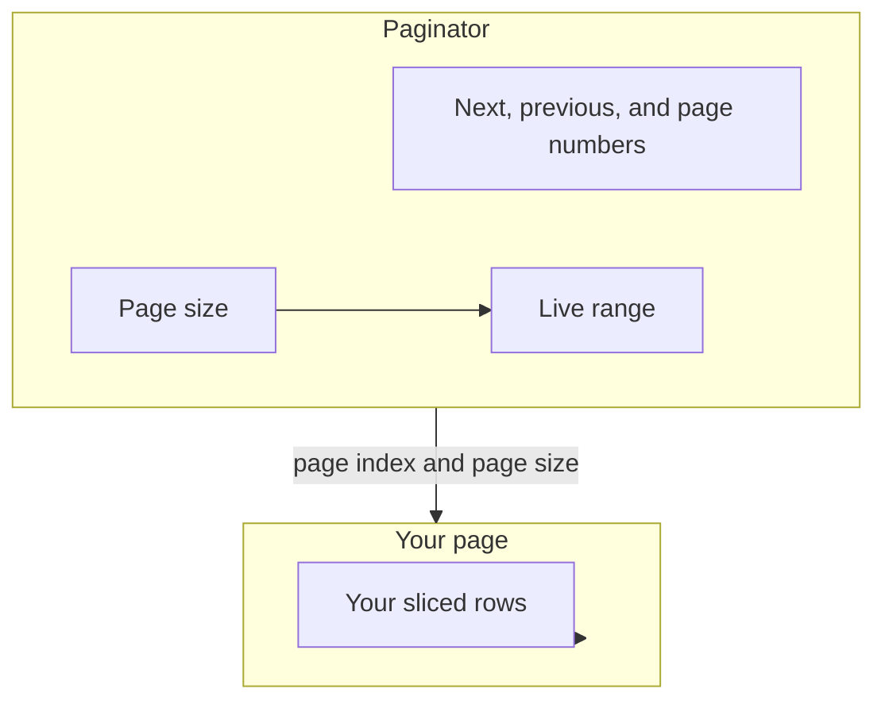
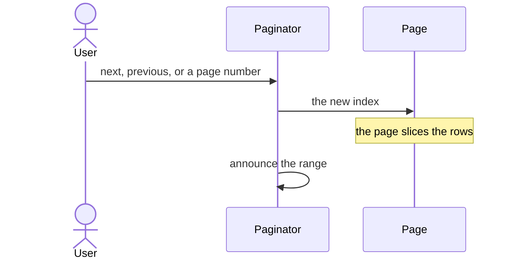
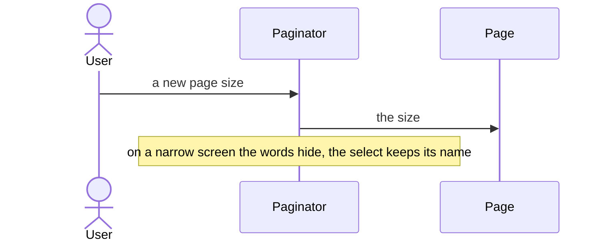

# pixel-paginator — design

This page explains **pixel-paginator** in plain language. The exact input and output names live in [README.md](./README.md). This page does not copy that table.

**Walk through every flow:** open [orchestration.html](./orchestration.html) in a browser (serve the `src/lib` folder so the shared player script can load).

## 1. What this does, and what it does not

Page controls for a list. It is a navigation landmark. On a small screen the page numbers and the "items per page" words hide, but the page-size select keeps its name. A live region announces the range. Analytics records indexes and page size only.

| This piece does | It does not |
| --- | --- |
| Changes the page index and the page size | Slice the data. The page does that |
| Announces the visible range | Send row text to analytics |

## 2. Who talks to whom

The paginator tells the page which page and which page size the user wants. It does not slice the rows. On a narrow screen it hides the page-number list and the “items per page” words. The select keeps its own name. A live region speaks the range. Analytics records indexes and page size only.

**How to read the picture**

- **You slice the data.** The paginator only reports the index and the size.
- **Narrow screens** drop the page numbers and the “items per page” label. The select still has an accessible name.
- **The live region** announces the visible range. Do not duplicate that sentence in a second status.
- **Analytics** is the index and the page size. Not the row contents.

## 3. Flows

### Next page

1. The page passes the length and the current index. The paginator shows previous, next, and page numbers.
2. The user goes to another page. The page loads that slice. The live region reads the new range.

### Page size

1. The user changes how many rows per page. The index resets as the page decides.
2. On a narrow screen the numbers and the "items per page" label hide. The select still has an accessible name.

## 4. Step by step

Section 3 is the short list. Each picture here is one of those flows, with the branch that changes what the developer must do. Read the note under the picture before copying the pattern.

### Next page

Listen for the page change and load or slice that page. The paginator will not hide rows for you.

### Page size

Reset to the first page when the size changes if your list would otherwise point past the end. That reset belongs in the page.

## 5. States

- First page: previous is unavailable.
- Last page: next is unavailable.
- Narrow: numbers hidden, size select still named.
- Live range after a change.

## 6. Easy to get wrong

- The paginator does not slice your array. Listen for the new index and slice in the page.
- Analytics gets indexes and page size, never the row contents.

## 7. Files

- `pixel-paginator.html`
- `pixel-paginator.scss`
- `pixel-paginator.ts`

The behavior contract stays in [README.md](./README.md). If this page and the README disagree, the README wins. Fix this page.
