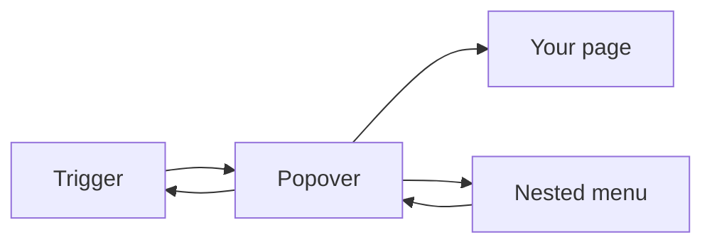
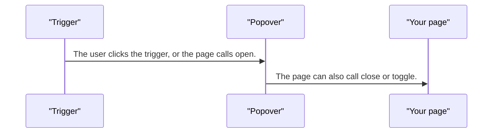
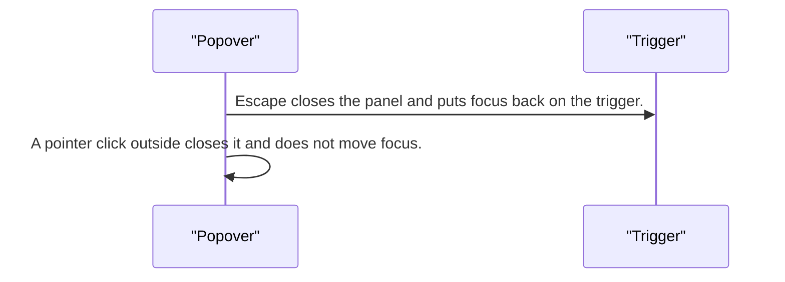
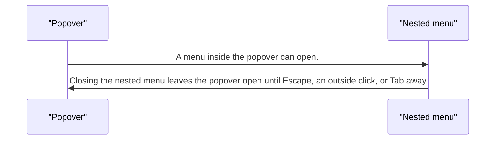

# pixel-popover — design

This page explains **pixel-popover** in plain language. The exact input and output names live in [README.md](./README.md). This page does not copy that table.

**Walk through every flow:** open [orchestration.html](./orchestration.html) in a browser (serve the `src/lib` folder so the shared player script can load).

## 1. What this does, and what it does not

A small panel tied to a trigger. It is not a modal: there is no focus trap and no scrim. Escape returns focus to the trigger. A click outside closes it without moving focus. A nested menu does not close the popover.

| This piece does | It does not |
| --- | --- |
| Opens a panel next to a trigger | Trap focus or dim the page |
| Closes on Escape, outside click, or Tab away | Close when a nested menu opens |

## 2. Who talks to whom

## 3. Flows

### Open

1. The user clicks the trigger, or the page calls open. The panel is a dialog in name only. Focus is not trapped.
2. The page can also call close or toggle.

### Dismiss

1. Escape closes the panel and puts focus back on the trigger.
2. A pointer click outside closes it and does not move focus. Tabbing out also closes it.

### Nested menu

1. A menu inside the popover can open. That does not dismiss the popover.
2. Closing the nested menu leaves the popover open until Escape, an outside click, or Tab away.

## 4. Step by step

### Open

### Dismiss

### Nested menu

## 5. States

- Closed or open.
- Nested overlay open, popover still open.
- Dismissed by Escape, outside pointer, or Tab.

## 6. Easy to get wrong

- Do not add a scrim or a focus trap. This is not a dialog.
- Do not close the popover just because a menu inside it opened.
- An outside click closes the panel but does not steal focus.

## 7. Files

- `pixel-popover-trigger.ts`
- `pixel-popover.scss`
- `pixel-popover.ts`

The behavior contract stays in [README.md](./README.md). If this page and the README disagree, the README wins. Fix this page.
