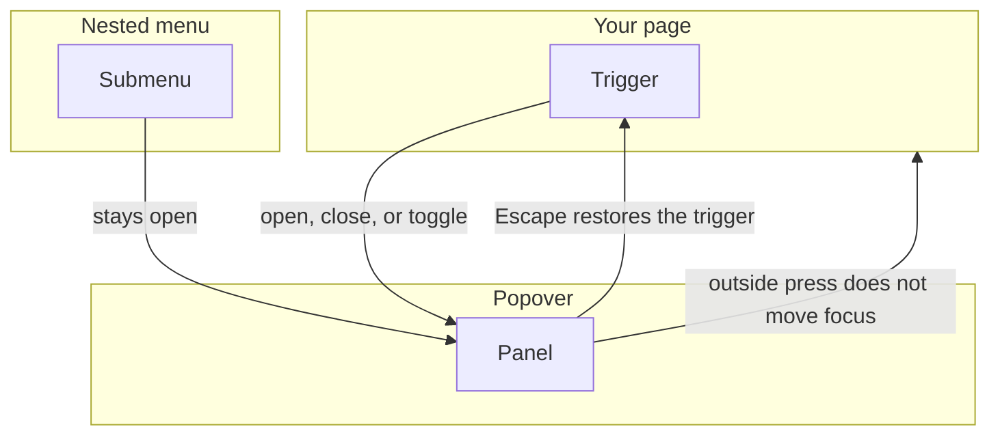
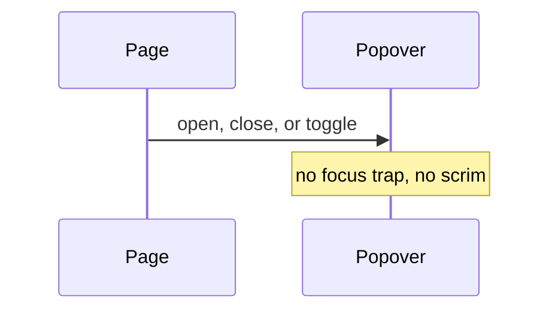
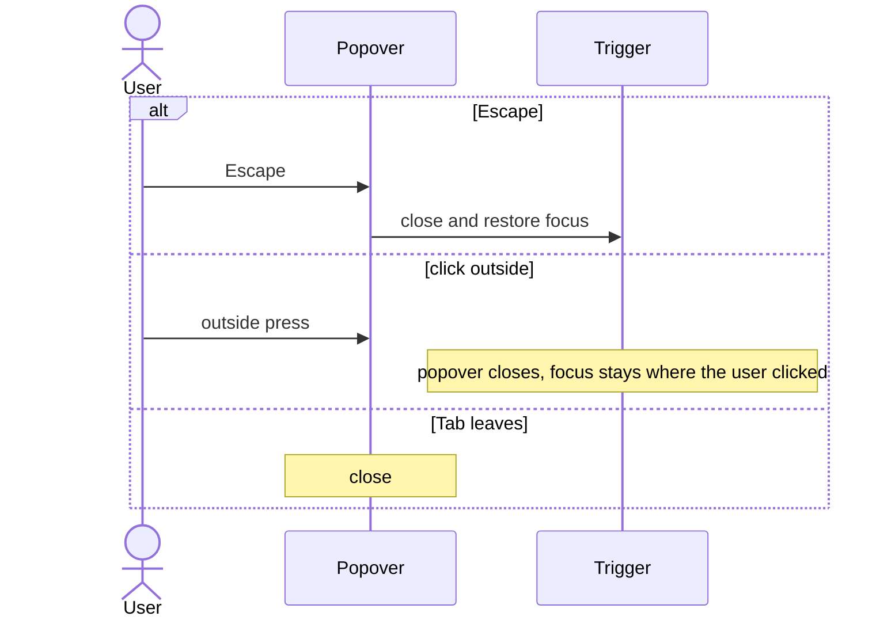
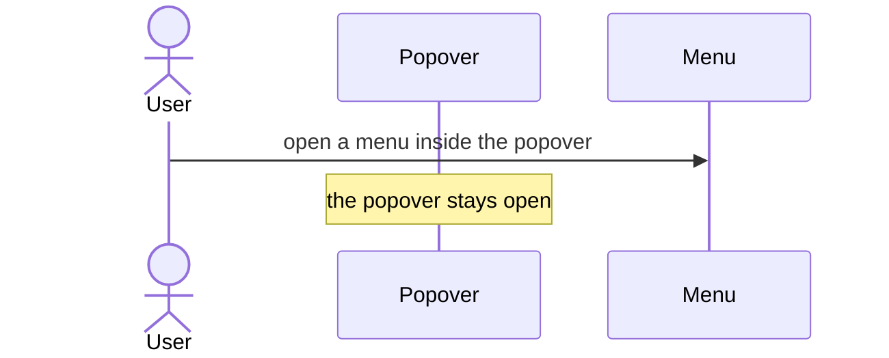

# pixel-popover — design

This page explains **pixel-popover** in plain language. The exact input and output names live in [README.md](./README.md). This page does not copy that table.

**Walk through every flow:** open [orchestration.html](./orchestration.html) in a browser (serve the `src/lib` folder so the shared player script can load).

## 1. What this does, and what it does not

A small panel tied to a trigger. It is not a modal: there is no focus trap and no scrim. Escape returns focus to the trigger. A click outside closes it without moving focus. A nested menu does not close the popover.

| This piece does | It does not |
| --- | --- |
| Opens a panel next to a trigger | Trap focus or dim the page |
| Closes on Escape, outside click, or Tab away | Close when a nested menu opens |

## 2. Who talks to whom

A popover is not modal. There is no focus trap and no scrim. Escape closes it and returns focus to the trigger. A click outside closes it and leaves focus where the user clicked. Tabbing out closes it. A nested menu does not close the popover.

**How to read the picture**

- **Do not trap focus.** The rest of the page stays usable.
- **Escape** restores the trigger. An outside press does not.
- **Nested menu.** Opening it must not dismiss the popover.

## 3. Flows

### Open

1. The user clicks the trigger, or the page calls open. The panel is a dialog in name only. Focus is not trapped.
2. The page can also call close or toggle.

### Dismiss

1. Escape closes the panel and puts focus back on the trigger.
2. A pointer click outside closes it and does not move focus. Tabbing out also closes it.

### Nested menu

1. A menu inside the popover can open. That does not dismiss the popover.
2. Closing the nested menu leaves the popover open until Escape, an outside click, or Tab away.

## 4. Step by step

Section 3 is the short list. Each picture here is one of those flows, with the branch that changes what the developer must do. Read the note under the picture before copying the pattern.

### Open

Call open, close, or toggle. Do not treat this like a dialog that locks the page.

### Dismiss

These three dismissals are different. Do not restore focus on an outside click, or you will steal the click the user just made.

### Nested menu

The menu handles its own Escape. That should not be treated as “click outside the popover”.

## 5. States

- Closed or open.
- Nested overlay open, popover still open.
- Dismissed by Escape, outside pointer, or Tab.

## 6. Easy to get wrong

- Do not add a scrim or a focus trap. This is not a dialog.
- Do not close the popover just because a menu inside it opened.
- An outside click closes the panel but does not steal focus.

## 7. Files

- `pixel-popover-trigger.ts`
- `pixel-popover.scss`
- `pixel-popover.ts`

The behavior contract stays in [README.md](./README.md). If this page and the README disagree, the README wins. Fix this page.
