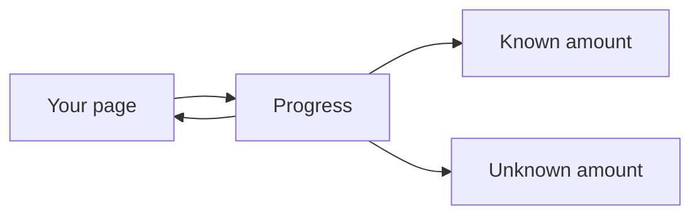
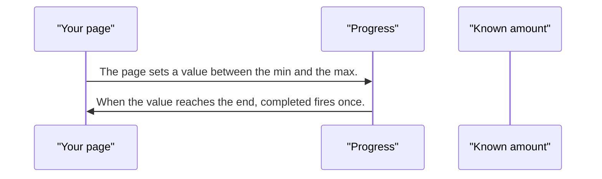
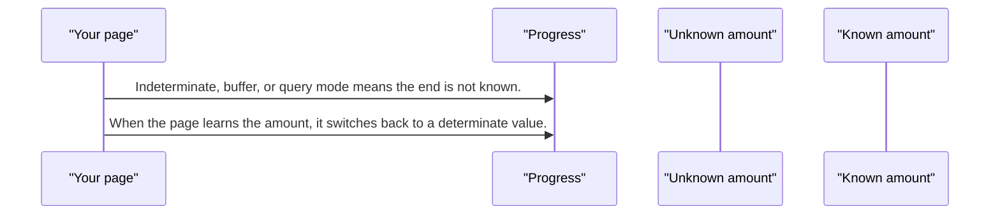

# pixel-progress — design

This page explains **pixel-progress** in plain language. The exact input and output names live in [README.md](./README.md). This page does not copy that table.

**Walk through every flow:** open [orchestration.html](./orchestration.html) in a browser (serve the `src/lib` folder so the shared player script can load).

## 1. What this does, and what it does not

A bar for a known amount, an unknown amount, a buffer, or a query. At 100 percent it emits completed once. It is not a stepper. Indeterminate mode drops the numeric value and marks itself busy.

| This piece does | It does not |
| --- | --- |
| Shows how far a job has gone | Step through a wizard (use pixel-stepper) |
| Emits completed once at the end | Keep announcing a number while the amount is unknown |

## 2. Who talks to whom

## 3. Flows

### Known amount

1. The page sets a value between the min and the max. The bar exposes that value.
2. When the value reaches the end, completed fires once. Later updates do not fire it again until the job restarts.

### Unknown amount

1. Indeterminate, buffer, or query mode means the end is not known. The numeric value is removed and the bar is busy.
2. When the page learns the amount, it switches back to a determinate value.

## 4. Step by step

### Known amount

### Unknown amount

## 5. States

- Determinate with a value.
- Indeterminate, buffer, or query: busy, no current number.
- Complete: the completed event has fired once.

## 6. Easy to get wrong

- This is not a stepper and not a loader overlay.
- Do not leave aria-valuenow on an indeterminate bar.
- Do not treat completed as a repeating tick. It fires once per run to 100 percent.

## 7. Files

- `_pixel-progress-shared.scss`
- `pixel-progress-bar.html`
- `pixel-progress-bar.scss`
- `pixel-progress-bar.ts`
- `pixel-progress-circle.html`
- `pixel-progress-circle.scss`
- `pixel-progress-circle.ts`
- `pixel-progress-container.html`
- `pixel-progress-container.scss`
- `pixel-progress-container.ts`
- `pixel-progress.types.ts`

The behavior contract stays in [README.md](./README.md). If this page and the README disagree, the README wins. Fix this page.
